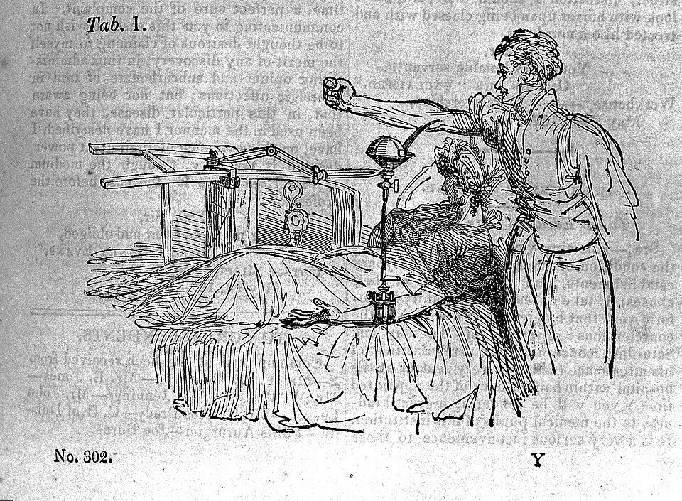

In 1817 **[James Blundell](kloom:e/james-blundell-physician)**, a young physician who lectured on physiology and midwifery at **[Guy's Hospital](kloom:e/guys-hospital)** in London, was called to a woman "sinking under uterine hemorrhagy". The bleeding had stopped before he came, but she died within two hours. He could not stop thinking that she might have been saved by [transfusion](kloom:e/blood-transfusion), and that a syringe would have made it quick. Bleeding after childbirth, **[postpartum hemorrhage](kloom:e/postpartum-bleeding)**, was the emergency he had in mind for the next decade. The transfusions of the 1660s, from animals, had been all but forgotten for a century and a half. Blundell made two changes: the blood would come from a person, and it would be moved by an instrument.

## Why only human blood

His first paper, read to the Medico-Chirurgical Society on 3 February 1818, was a run of dog experiments. A dog bled from the femoral artery lost eight ounces in two minutes and fell into what looked like death; six ounces from another dog's artery, pushed into its vein by syringe, brought it back "so sudden and complete" that it seemed "rather to awake from sleep". To show that the syringe did blood no harm, he drew blood from a dog's artery into a cup and syringed it straight back into its vein for twenty-four minutes. His own arithmetic: a full stream gives about half a pint in two minutes, so some twelve pints had passed through the syringe, in a dog that weighed less than twelve pounds. The same blood had gone round and round, and the dog "sustained but little injury".

Then the test that mattered. Three dogs were drained and refilled with human blood, syringed in at once. All three revived for a time, and all three died: one in minutes, one in hours, one after several days. A dog of a colleague's survived the same treatment, which Blundell took to mean that foreign blood might endanger life, not that it always would. Dr. Leacock, also from Barbados, had found that dogs revived with sheep's blood generally died within days. In 1825 Blundell drew the conclusion: "in performing the operation of transfusion on the human body, the human blood should alone be employed".

## The first patients

The first was not a mother. In September 1818 a man named Brazier lay dying at Guy's of a cancer that blocked his stomach. With the surgeon Henry Cline, Blundell laid bare a vein above the elbow and gave him blood from gentlemen present, an ounce and a half to a syringeful, ten times over thirty or forty minutes: twelve to fourteen ounces. The man was warmer and stronger that evening and asked for food the next morning, then sank, and died about fifty-six hours later. Blundell's 1825 book lists six attempts on people, all of them dying or already dead, and none saved.

A recovery of his own was reported in **[_The Lancet_](kloom:e/the-lancet)** in January 1829. A woman of twenty-five at Walworth collapsed after a normal delivery, blanched and nearly pulseless, and brandy did little. About eight ounces from the arm of Mr. Davies, one of the attending surgeons, were injected a little at a time over more than three hours. Only when all of it was in did she rally. Eleven days later she was well, and said she "felt as if life were infused into her body". Others had already reported successes, among them Charles Waller in 1825.

## The Gravitator

His first instrument, the Impellor, described in his 1825 book, was a syringe sunk in a cup of warm water, worked in short, sharp strokes so that the blood barely entered its barrel. In 1829 he described in _The Lancet_ an instrument that let gravity do the work. The drawing gives its plan; the engraving shows it at the bedside.

| Part                       | What it did                                                                                   |
| -------------------------- | --------------------------------------------------------------------------------------------- |
| Coniform receiver and hood | a cone held above the patient, into which the donor's opened vein bled                        |
| Line inside the receiver   | marked two fluid ounces; the blood was never to stand above it                                |
| Stop-cock                  | below the cone; opened to start the stream, partly closed to slow it                          |
| Flexible canula            | carried the blood down to the patient                                                         |
| Silver tubule              | soft enough to bend to the vein's course, laid in through a cut about a tenth of an inch long |
| Flexible arm and armlet    | clamped to a chair; held the receiver at a chosen height and the tubule steady on the arm     |

The operator first ran an ounce of water through to drive out the air, raised or lowered the cone to set the speed, and then had three duties: never let the cone run empty, or air would follow the blood; refuse blood that dribbled down the donor's arm; and watch the patient's face, checking the flow at any twitching, because a weak heart might be "arrested by too rapid an influx". Even so, he advised keeping transfusion for patients with no other hope. Why one transfusion passed quietly and another went badly, nobody in his lifetime could say.
