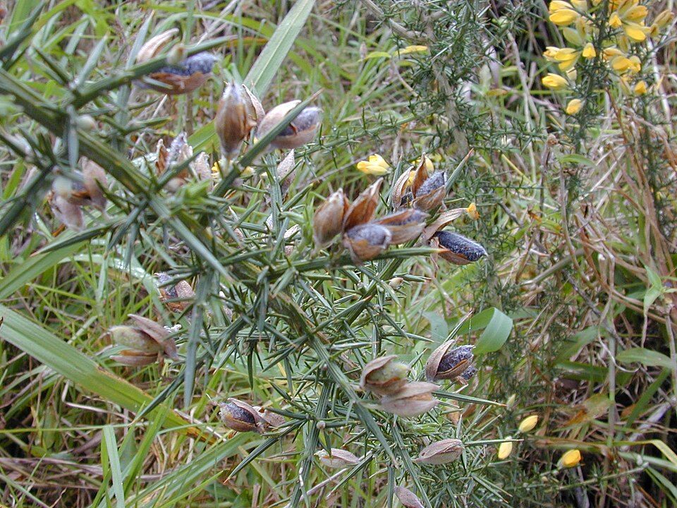

In May 1952 the _Lancet_ carried a short paper from [Bombay](kloom:e/mumbai) with a cautious title: "A 'new' blood group character related to the [ABO system](kloom:e/abo-blood-group-system)". Its authors were Y. M. Bhende, C. K. Deshpande and H. M. Bhatia in Bombay, with **[Ruth Sanger](kloom:e/ruth-sanger)** and Rob Race of the Medical Research Council's Blood Group Unit in London and the biochemists Walter Morgan and **[Winifred Watkins](kloom:e/winifred-watkins)** of the Lister Institute. They had found blood that typed as group O by every ordinary test, and whose serum nonetheless clumped group O cells, which no group O serum does. The blood type they described is now the **[Bombay phenotype](kloom:e/hh-blood-group)**, and its people can be given blood only from others like them.

## A group O that was not

The 1952 paper is not openly available, and the account of it here follows the National Library of Medicine's guide to the blood groups and later papers that cite it. Its finding is still how the type is recognised. A blood is typed twice. The forward type tests the red cells with anti-A and anti-B; the reverse type tests the plasma against known A and B cells, and should find the antibodies the cells' own type lacks. Bombay blood passes the forward type as O. In the reverse type its plasma clumps A and B cells, as group O plasma does, but it also clumps the group O cells that a careful laboratory adds as a control. A case reported from India in 2025, a woman of 49 who had already reacted to a unit of group O blood, shows the whole workup in the standard tube technique:

| Test                     | What it tests               | Ordinary group O | The 2025 patient                 |
| ------------------------ | --------------------------- | ---------------- | -------------------------------- |
| Anti-A, anti-B, anti-A,B | A and B on the red cells    | no reaction      | no reaction                      |
| Anti-H lectin            | H on the red cells          | strong reaction  | no reaction                      |
| A₁ cells and B cells     | anti-A and anti-B in plasma | clumped          | clumped, 4+                      |
| Group O cells            | anti-H in plasma            | not clumped      | clumped, 4+, at all temperatures |
| Own cells (autocontrol)  | an autoantibody             | not clumped      | not clumped                      |
| Saliva                   | A, B and H substances       | H, in a secretor | none                             |

The middle column is what the textbooks lead one to expect, not a measurement. The O-cell row and the anti-H row are the ones that matter. The plasma attacks cells that carry H, and the patient's own cells, which carry none, are left alone. The anti-H reagent is a lectin, a protein from plant seeds that binds a particular sugar: here the seeds of gorse, **[_Ulex europaeus_](kloom:e/ulex-europaeus)**, a spiny yellow shrub whose lectin is the standard way to find H on red cells. Saliva is the final check, because most people also secrete their blood group substances in it, and Bombay people secrete none.

## The sugar beneath A and B

The H antigen is the building block of the ABO groups. It is a chain of sugars on the red cell ending in galactose, to which an enzyme made by the _FUT1_ gene has added a fucose. The A gene's enzyme then adds a further sugar, N-acetylgalactosamine, to make A; the B gene's adds galactose to make B; group O adds nothing and leaves H as it is, which is why group O cells carry the most H. Watkins and Morgan went on to work out this pathway. A person with two broken copies of _FUT1_, genotype _hh_, makes no H on the red cells, and so no A or B either, whatever ABO genes they carry; in the classic Bombay type a second gene, _FUT2_, is broken too, and there is none in the secretions. Their plasma holds anti-A, anti-B and anti-H, and anti-H can destroy transfused cells in the circulation itself. Because Bombay blood types as O, a laboratory that misses it issues group O blood, the blood richest in H.

The trait is recessive, so it appears where both parents carry it, more often where cousins marry. The guide gives about 1 in 10,000 people in India and 1 in a million in Europe. Surveys in Bombay itself found 1 in 13,000 and later 1 in 7,600, and a 2007 survey found three among some 600 Bhuyan, a tribal people of Orissa. The Hh blood group has one antigen and one gene, and it is one of the rarest types a blood bank meets.

## Finding a donor

As of October 2026, finding blood for such a patient still depends on knowing in advance who has it. The International Society of Blood Transfusion counts a donor as rare when their type, lacking an antigen nearly everyone carries, turns up in fewer than one person in 1,000, names Bombay among its examples, and runs an International Rare Donor Panel through the International Blood Group Reference Laboratory of NHS Blood and Transplant, which keeps the lists of rare donors sent by its members. A patient's brothers and sisters are tested first, because they are far more likely than strangers to share the type. In India the Indian Institute of Immunohaematology in Mumbai had kept a registry of Bombay donors by a 2015 account, and the authors of the 2025 case called for a national one. Where no donor can be found, surgeons have taken a unit of the patient's own blood at the start of an operation and given it back at the end, and the 2025 patient's anaemia was treated with iron rather than blood. Wikipedia records that in 2017 blood for the only Colombian then known to have the type had to be brought from Brazil.

The trail's last frame turns from the red cells to the white.
