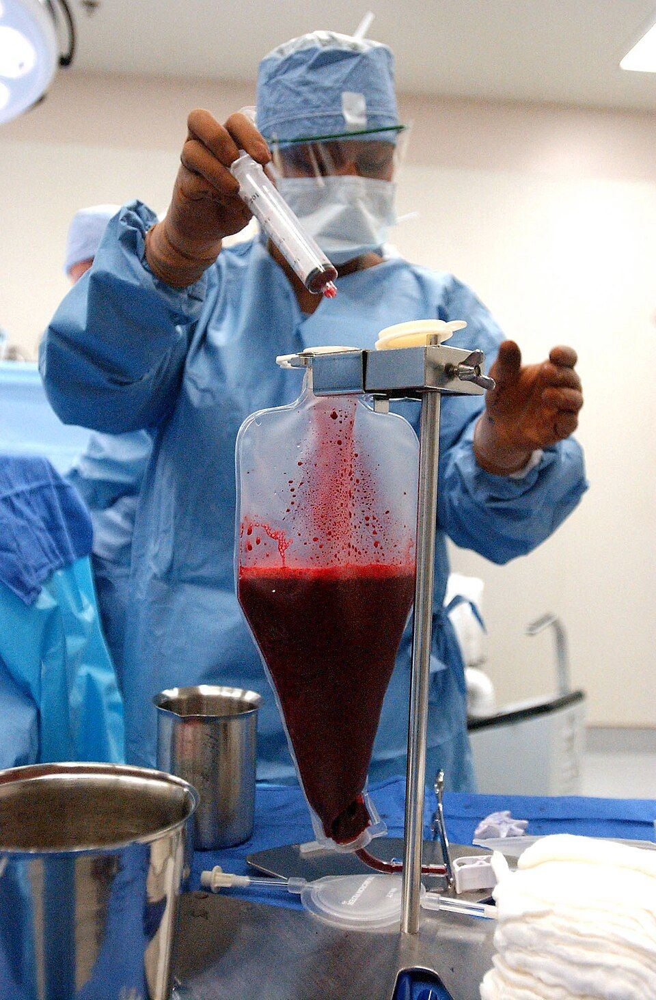

Blood is made in the **[bone marrow](kloom:e/bone-marrow)**, the soft tissue inside the large bones, and the cells that make it are among the first to die after a large dose of radiation. In 1949 Jacobson's group found that mice survived an otherwise lethal dose if their spleens were shielded with lead, and soon afterwards Lorenz's group showed that an infusion of marrow from a mouse of the same strain did as well. In the summer of 1955 a young physician from Texas, **[E. Donnall Thomas](kloom:e/e-donnall-thomas)**, moved to the Mary Imogene Bassett Hospital in Cooperstown, New York, where Joseph Ferrebee had been following those experiments, and the two set out to do the same for people. What they began is now called **[hematopoietic stem cell transplantation](kloom:e/hematopoietic-stem-cell-transplantation)**, and for decades it began with a needle in a donor's hip.

## A drip of marrow

Their first paper, in 1957, was cautious even in its title: "intravenous infusion" of marrow, because only one of the patients had even a passing graft. It showed that large amounts of human marrow could be collected, stored and run into a vein without harm. The money came through the United States Atomic Energy Commission, because of the radiation. "In an atomic age, with reactor accidents not to mention stupidities with bombs, somebody is going to get more radiation than is good for him," the paper said, as Thomas quoted it in his Nobel lecture.

The accident came in 1958, at a reactor in Yugoslavia. **[Georges Mathé](kloom:e/georges-mathe)** in Paris gave marrow infusions to several of the irradiated physicists. Wikipedia counts this the first successful marrow transplant, with four of five surviving; Thomas, in 1990, cited a later review that suggested the marrow had been of little benefit.

## The twins

An identical twin's marrow carries no foreign tissue type, so it isolates the question of whether marrow can rescue a person from lethal radiation. In 1959 Thomas's group reported two patients with [leukemia](kloom:e/leukemia), each with an identical twin, given whole-body radiation of 850 and 1,140 roentgens. The paper gives the procedure for one collection:

| Step     | Cooperstown, October 1958                                                          |
| -------- | ---------------------------------------------------------------------------------- |
| Donor    | the identical twin, judged so by appearance, a single placenta and one blood type  |
| Aspirate | under general anesthesia, 25 aspirations from the sternum, tibiae and iliac crests |
| Collect  | into Hanks' solution with 0.1 mg of heparin per mL                                 |
| Filter   | through stainless steel screens                                                    |
| Count    | 0.92 × 10⁹ nucleated marrow cells                                                  |
| Store    | frozen in 15 per cent glycerol at −80 °C, then thawed and the glycerol removed     |
| Give     | into a vein, like a transfusion                                                    |

A second harvest of 20 aspirations six days later gave 0.35 × 10⁹ cells, infused fresh. Both patients' blood recovered promptly, which showed that infused marrow could replace marrow destroyed by radiation. The leukemia came back within months. Radiation alone would not cure it.

## Graft against host

Marrow from anyone but a twin either failed to take or took and turned on its host. The donor's immune cells, carried in the graft, attacked the patient's skin, gut and liver: **[graft-versus-host disease](kloom:e/graft-versus-host-disease)**, which the 1959 paper, after the mouse work, called "delayed foreign marrow disease". Through the 1960s, while most groups gave up, Thomas and his colleagues worked in dogs. Methotrexate after the graft eased the reaction, and grafts between littermates matched for the dogs' tissue antigens almost always succeeded. In people the matching depended on the **[human leukocyte antigens](kloom:e/human-leukocyte-antigen)**, whose discovery is the frame _Dausset and the HLA antigens_ on the trail _Beyond ABO_. Thomas moved to Seattle in 1963.

In November 1968 **[Robert A. Good](kloom:e/robert-a-good)** in Minnesota transplanted marrow from a matched sibling into an infant with an inherited immune deficiency. Thomas's team in Seattle gave its first matched-sibling graft for advanced leukemia in March 1969, and in time a plateau in the survival curves let the team use the word cure. Thomas shared the 1990 Nobel Prize in Physiology or Medicine with Joseph Murray. His work there has a shadow too: Wikipedia's article records that trials he led at the Fred Hutchinson Cancer Research Center in Seattle from 1981 to 1993 did not tell patients of researchers' financial interests or properly of the risks, and that 84 of the 85 participants died.

## The harvest today

The _EBMT Handbook_ of 2019, from the European Society for Blood and Marrow Transplantation, describes the operation much as Cooperstown did it, refined. Marrow comes from the back of the pelvis, the posterior iliac crests, usually under general anesthesia, in aspirations of under 5 mL each so that blood does not dilute it, into a bag of ACD anticoagulant. The target is at least 3 × 10⁸ nucleated cells per kilogram of the recipient, and the harvest should not exceed 20 mL per kilogram of the donor. For a 70-kg adult that is 2.1 × 10¹⁰ cells, by our arithmetic, some sixteen times what the twins gave in 1958. The donor in the photograph, a Navy sailor, was matched to an unknown patient through the Defense Department's marrow donor program.

Graft-versus-host disease reaches the blood bank too: a transfusion's living white cells can cause it, more often when donor and recipient are closely related, so blood for patients at risk is irradiated or its white cells removed first. And most stem cells are no longer taken from bone: the handbook puts peripheral blood at 70 to 95 per cent of transplants, collected by the machine the frame after next describes.
