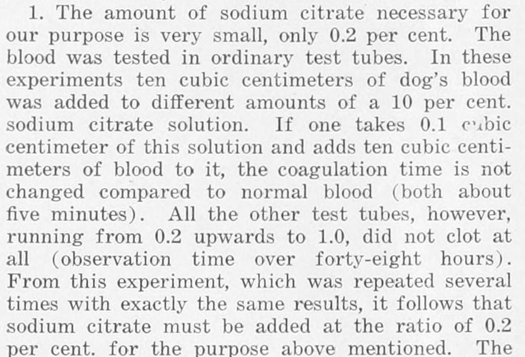

Blood drawn from the body clots in three to five minutes, and until 1914 every transfusion was a race against it. A surgeon joined a donor's artery to a patient's vein, or a team of four passed syringes from one arm to the other before the blood could set in the glass. Within a single year, in Brussels, Buenos Aires and New York, four physicians found the same way round it: a salt, **[sodium citrate](kloom:e/trisodium-citrate)**, mixed with the blood as it was drawn. By 1915 blood could be caught in a jar, carried across a room and poured into a vein through a funnel, or kept in an ice box for days.

## What citrate does

Clotting needs calcium. Citrate holds it. "Blood mixed in proper proportions with a solution of sodium citrate does not clot," the New York physician **[Richard Weil](kloom:e/richard-weil-physician)** wrote in January 1915, "owing to the well-known fact that the calcium salts are no longer available for coagulation." Laboratories had long used citrate to keep blood samples liquid, at around 1 per cent, a concentration assumed to be too poisonous to put into a person. In 1869 the obstetrician John Braxton Hicks had tried it in transfusion and given it up after deaths. The salt in question is trisodium citrate, the sodium salt of the acid in lemons.

## Four at once

The order of the four is still argued over, and Argentina, Belgium and the United States each have a claimant:

- **[Albert Hustin](kloom:e/albert-hustin)**, in Brussels, transfused a patient with blood mixed with sodium citrate and glucose in the spring of 1914: on 27 March, by Wikipedia's articles on Agote (its article on Lewisohn says April). His paper came out that May.
- **[Luis Agote](kloom:e/luis-agote)**, at the Rawson Hospital in Buenos Aires, gave 300 c.c. of citrated blood, drawn from a hospital employee, to a patient who had lost much blood, before an audience that included the rector of the university, on 9 November 1914. The patient went home three days later.
- Weil reported his cases to the New York Academy of Medicine on 17 December 1914. He used 1 c.c. of a 10 per cent solution for every 10 c.c. of blood, and gave patients up to 350 c.c. of blood kept in the ice box for three to five days.
- **[Richard Lewisohn](kloom:e/richard-lewisohn)**, a surgeon at **[Mount Sinai Hospital](kloom:e/mount-sinai-hospital-manhattan)** in New York, published "a new and greatly simplified method" on 23 January 1915. In 1958 he put the coincidence down to an idea being ripe: it occurs to several people at once.

## Finding the dose

Lewisohn's contribution was the dose. He asked three questions: what is the least citrate that keeps blood liquid for twenty to thirty minutes, does it slow the recipient's own clotting, and is it toxic in that amount? His first experiment was a rack of test tubes:

| 10% citrate solution in 10 c.c. of dog's blood | Citrate in the blood, by our arithmetic | Result                     |
| ---------------------------------------------- | --------------------------------------- | -------------------------- |
| 0.1 c.c.                                       | 0.1%                                    | clotted in about 5 minutes |
| 0.2 c.c.                                       | 0.2%                                    | no clot in over 48 hours   |
| 0.3 to 1.0 c.c.                                | 0.3 to 1.0%                             | no clot in over 48 hours   |

The step between clotting and not clotting lay between 0.1 and 0.2 per cent, and human blood behaved the same. Then he drew 300 c.c. from a dog's artery into 5 c.c. of the 10 per cent solution and put it back into the dog's vein. Far from bleeding, the dog's blood afterwards clotted in ten seconds instead of five minutes. Citrate given this way did not thin the recipient's blood. He gave transfusions of 300 and 500 c.c. to two patients without trouble, with "the simplest outfit imaginable": a glass jar of citrate solution, a glass rod to stir the blood as it ran in, a funnel and a rubber tube. Later he put the safe amount for an adult at up to 5 grams of citrate.

Weil's proportion carried, by our arithmetic, about 0.9 per cent citrate, four or five times Lewisohn's. In the 1,200 c.c. that Lewisohn took for an average transfusion it would mean 11 or 12 grams, and in a letter a week after his paper he warned that it "might prove to be a toxic dose".

| Recipe, 1915–16 | Proportion                                                   | Citrate per 500 c.c. of blood, by our arithmetic |
| --------------- | ------------------------------------------------------------ | ------------------------------------------------ |
| Weil            | 1 c.c. of 10% to 10 c.c. of blood                            | 5 g                                              |
| Lewisohn        | 0.2% of the blood                                            | 1 g                                              |
| Rous and Turner | 2 parts of 3.8% citrate and 5 of 5.4% dextrose to 3 of blood | about 13 g, poured off before transfusion        |

## What sugar added

Citrate stops clotting; it does not keep cells alive. At the Rockefeller Institute, **[Peyton Rous](kloom:e/francis-peyton-rous)** and J. R. Turner found that human blood kept with citrate alone began to break down in about a week, the damage hidden among the settled cells. Dextrose held it off: cells kept in their citrate and sugar mixture stayed whole for four weeks. Their recipe needed more citrate than any patient should receive, so the fluid was poured off and the cells given alone. The plate draws Lewisohn's rack of tubes, and beside it citrate holding the calcium a clot needs.

For a while the method seemed to fail on another count: patients given citrated blood often had chills. In 1933 Lewisohn and N. Rosenthal showed that the chills came from impurities left in carelessly cleaned equipment, not from the citrate, and once a department of its own was given the cleaning, they fell from 12 per cent of transfusions to 1. Rous and Turner's recipe went to France within two years, in the bottles of the next frame, Robertson's blood depot.
