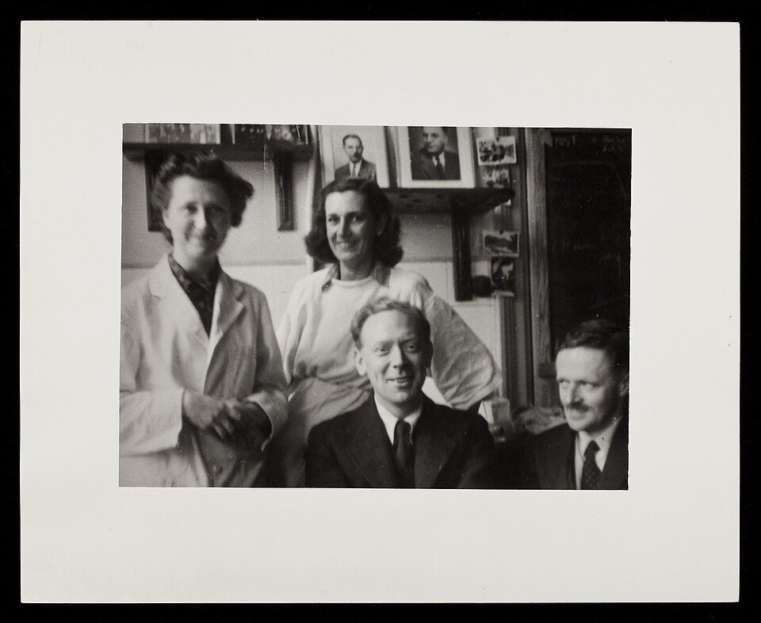

By 1944 the doctors who typed blood for [Rh](kloom:e/rh-blood-group-system) knew that some antibodies were missing from their tests. A mother could lose a baby to hemolytic disease, or a patient react to a transfusion, and yet her serum would not clump Rh-positive cells in a tube. **[Robert Race](kloom:e/robert-russell-race)** in Britain and **[Alexander Wiener](kloom:e/alexander-s-wiener)** in New York had found one reason. Some antibodies stuck to the cells that carried their antigen without clumping them. They were called _incomplete_ or _blocking_ antibodies, because the only sign of them was that the coated cells would no longer clump when a complete antibody was added. In 1945 **[Robin Coombs](kloom:e/robin-coombs)**, a 24-year-old veterinary graduate working for his doctorate at the **[University of Cambridge](kloom:e/university-of-cambridge)**, published with **[Arthur Mourant](kloom:e/arthur-mourant)** and Race a test that made them visible. Their paper came from the university's Department of Pathology and the Medical Research Council's Emergency Blood Transfusion Service, and the test has been the **[Coombs test](kloom:e/coombs-test)**, or antiglobulin test, ever since.

The photograph shows Race with Ruth Sanger, his colleague and wife, and Mourant, far right. Race directed the Medical Research Council's Blood Group Unit in London from 1946.

## A rabbit's serum

Their idea is in a single sentence of the paper: to see whether the antibody globulin on the coated cells "would react specifically with a rabbit anti-human-globulin serum in some observable way, such as causing the cells to agglutinate". An antibody is itself a protein of the blood, a globulin. A rabbit injected with human globulin makes antibodies against it, and each of those can grip two human antibodies at once. If the human antibodies are sitting on red cells, the rabbit's antibody ties the cells together. The plate draws that bridge: human anti-D too short to span the gap between two cells, and one rabbit molecule holding the tails of two of them. Uncoated cells are left alone, because, as the authors noted, no protein of human serum sticks firmly to a red cell unless it is an antibody against it. Legend has it that Coombs thought of the test on a train.

## The test in the tube

The paper sets the method out exactly, and the antiglobulin tests that came after it kept its order:

| Stage     | Coombs, Mourant and Race, 1945                                                                                                                                                                                                            |
| --------- | ----------------------------------------------------------------------------------------------------------------------------------------------------------------------------------------------------------------------------------------- |
| Sensitize | Two drops of a 2 per cent suspension of washed red cells of a chosen Rh type and two drops of the serum under test, in a 50 × 7 mm tube, with controls of inert serum and of saline; cap the tubes and incubate at 37 °C for half an hour |
| Look      | Draw a little of the settled cells onto a slide; if they are already clumped, the serum holds an ordinary antibody and the test stops                                                                                                     |
| Wash      | Wash the cells three times in saline and make them up again to 2 per cent in two drops                                                                                                                                                    |
| Add       | An equal volume of rabbit anti-human-globulin serum, absorbed with A, B and O cells and diluted, usually 1 in 8                                                                                                                           |
| Read      | Incubate at 37 °C for half an hour to an hour, until the cells have settled, and read the clumping by eye and under the microscope, graded from +++ to none                                                                               |

The clumping often appeared within minutes of adding the rabbit serum. The three sera they tried worked up to a dilution of 1 in 64; serum from six rabbits that had never been immunized clumped nothing. A sensitized cell, they found, clumped more strongly in the second stage the weaker its reaction in the first. They thanked Mrs M. E. Adair, who made the rabbit antisera.

## Why wash

The washing is the step on which the test turns, and the paper says why. Serum is full of free globulin. "If most of the human serum is not removed it will neutralize some of the rabbit anti-human-globulin serum, leaving perhaps insufficient antibody to react with the sensitized cells." Three washes were "desirable", although two often seemed enough; more than three risked washing off a weakly bound antibody. The pipette had to be rinsed between tubes, since the test was sensitive enough to pick up a trace carried over. Laboratories still guard against an unwashed tube. A negative result is checked by adding cells already coated with human antibody, _check cells_: they must clump, at least at grade 2 in one modern protocol, or the test is repeated, since a reagent used up by unwashed serum would leave them unclumped.

## Direct and indirect

The test of 1945 coats cells in the tube with the patient's serum. It is now the **indirect antiglobulin test**, used to screen pregnant women and patients for antibodies, and in the crossmatch before a transfusion. The authors foresaw the other form: the rabbit serum should show "the actual sensitization in vivo" of a baby's red cells, even when no free antibody was left in its serum. Applied straight to a patient's washed cells, it became the direct test, and in 1946 Boorman and colleagues used it to find antibody on the cells of people with idiopathic hemolytic anemia. The test let serologists find antibodies that had been invisible before; the blood groups found with it after the war are on the trail _Beyond ABO_.

## Moreschi's version

Before the paper went to press the authors learned that it had been done before. In an addendum they cite a 1908 paper by the Italian physician Carlo Moreschi, who had coated rabbit red cells with a goat serum too weak to clump them, washed them, and clumped them with the serum of a rabbit immunized against goat serum. The principle was the same, but nobody yet knew of incomplete antibodies, and Moreschi's test was forgotten for thirty-seven years. The same paper also took issue with Wiener, who had just published a test for incomplete antibodies of his own in undiluted serum, over his name for it, _conglutination_.

The frame on typing and crossmatch by hand shows the test as one step of a full crossmatch. The next frame on this spine takes the blood itself out of the glass bottle.
