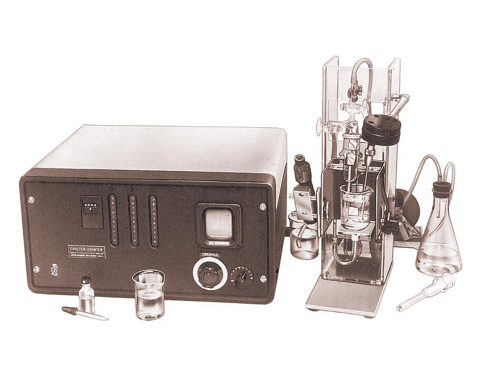

On 3 October 1956, at the National Electronics Conference in Chicago, an electrical engineer named **[Wallace H. Coulter](kloom:e/wallace-h-coulter)** read the only technical paper he ever published. It began with a complaint every hospital laboratory could have made: "Best practice limits the number of sample counts per day per average technician to no more than 20 or 30 counts." The red-cell count was still made by eye on the **[hemocytometer](kloom:e/hemocytometer)**, cell by cell, as the frame on the counting chamber shows. Coulter's machine counted fifty thousand cells in about fifteen seconds without anyone looking at them, and the device, the **[Coulter counter](kloom:e/coulter-counter)**, is the reason a blood count is now a number on a printout.

## A hole in a wall

The idea is in **US patent 2,656,508**, which Coulter filed on 27 August 1949 and was granted on 20 October 1953. Blood cells are poor conductors of electricity, and the salt solution they are diluted in is a good one. Put a wall with a very small hole between two electrodes in that solution, pass a current through the hole, and draw the suspension through it. Each cell that enters the hole displaces its own volume of conducting liquid, and for a fifty-thousandth of a second or less the resistance of the path rises. With the current held steady, by **[Ohm's law](kloom:e/ohms-law)** the voltage across the hole jumps, and the jump is a pulse that a counter can count. For red cells, the patent says, the bore should be "of the order of a thousandth of an inch or less in diameter".

The standard orifice of 1956 was a tenth of a millimetre across and about a fifteenth of a millimetre long, cut later in a ruby jewel; the plate draws it in section, to scale, with red cells approaching it; blood cells, Coulter wrote, are a twentieth to a fifth of the orifice's width. A pulse's height grows with the size of the cell. Coulter's paper calls it "a measure of relative size"; his company's historian, Marshall Don Graham, writes that the pulse is proportional to the cell's volume. A threshold dial set the smallest pulse that would count, so debris below that size was ignored, and stepping the threshold up through six or eight settings gave the distribution of cell sizes, a measurement no hand count could make.

## The procedure

Coulter's paper gives the whole routine for a red-cell count:

| Step     | What was done                                                                 |
| -------- | ----------------------------------------------------------------------------- |
| Dilute   | 2 mm³ of blood in a self-filling pipette, into 100 mL of saline: 1 in 50,000  |
| Set up   | the beaker raised round the aperture tube; the stopcock opened to start flow  |
| Meter    | a mercury syphon counts only while 0.5 mL passes through the orifice          |
| Count    | 10 to 15 seconds; a duplicate takes about 20 seconds more                     |
| Correct  | the register read against a printed chart for cells that passed two at a time |
| Multiply | by 100, to give cells per cubic millimetre                                    |

His worked example: the counter registers 44,821; the chart gives a corrected 50,100 in the half millilitre; times 100, a count of 5,010,000 red cells per mm³. The factor of 100 is the dilution, 50,000, divided by the 500 mm³ that were counted.

The correction is the cost of counting by pulses. When two cells are in the orifice together they make one pulse, about as tall as the two added together, so the counter misses one. At 50,000 cells in the half millilitre the loss through a 0.1 mm orifice was 5,250 cells, about a tenth of the count by our arithmetic, and Coulter calibrated it by counting a series of dilutions of one sample whose ratios were known. Debris in the orifice, shown by a change in the pulses on the screen, was cleared with a fingertip.

## What it bought

| Count                 | Cells counted | Error, as Coulter gave it                  |
| --------------------- | ------------- | ------------------------------------------ |
| Chamber, by eye       | about 500     | standard deviation slightly more than 4%   |
| Coulter counter, 1956 | about 50,000  | over 90% of counts within 1% of their mean |

Counting a hundred times as many cells cuts the random error about tenfold, since sampling error falls with the square root of the number counted. Coulter added that successive hand counts on one sample "can easily differ by 10 or 20 percent". When Carl Mattern and his colleagues at the **[National Institutes of Health](kloom:e/national-institutes-of-health)** tested the prototypes, they found the chamber had a systematic error of its own: filling it carried more cells to the ruled area than the sample held. Both that group and George Brecher's at the NIH's Clinical Center, as Graham summarises them, found the counter took a third of the time of a hand count and was three times as accurate.

## From a basement to every laboratory

Coulter and his brother Joseph worked in the basement of a house in Chicago. By Graham's reading of their papers, Wallace wrote down the principle in July 1948 and first counted diluted blood that October, through a hole burned in a scrap of cellophane, "from a cigarette package" in his own later telling. He proposed the counter to the **[Office of Naval Research](kloom:e/office-of-naval-research)** as a way to count the blood of many casualties quickly after an atomic attack, and an experimental model was built under its contract. Prototypes reached the Navy and the NIH in 1953; the Model A was announced with the 1956 paper.

| Date          | Model A counters placed |
| ------------- | ----------------------- |
| June 1957     | 20                      |
| December 1958 | more than 150           |
| January 1960  | more than 700           |
| February 1961 | more than 1,500         |

The figures are the company's own, from its advertisements, and leave out the counters a separate firm sold to industry. Coulter Electronics was incorporated in 1958, and in late 1968 its Model S gave seven results from one sample in under a minute, the start of the automated blood count. Counting was the first of the bench's hand work that a machine took over, and not the last: the next frame follows a chemist who put the colour tests of the blood into a flowing stream.
