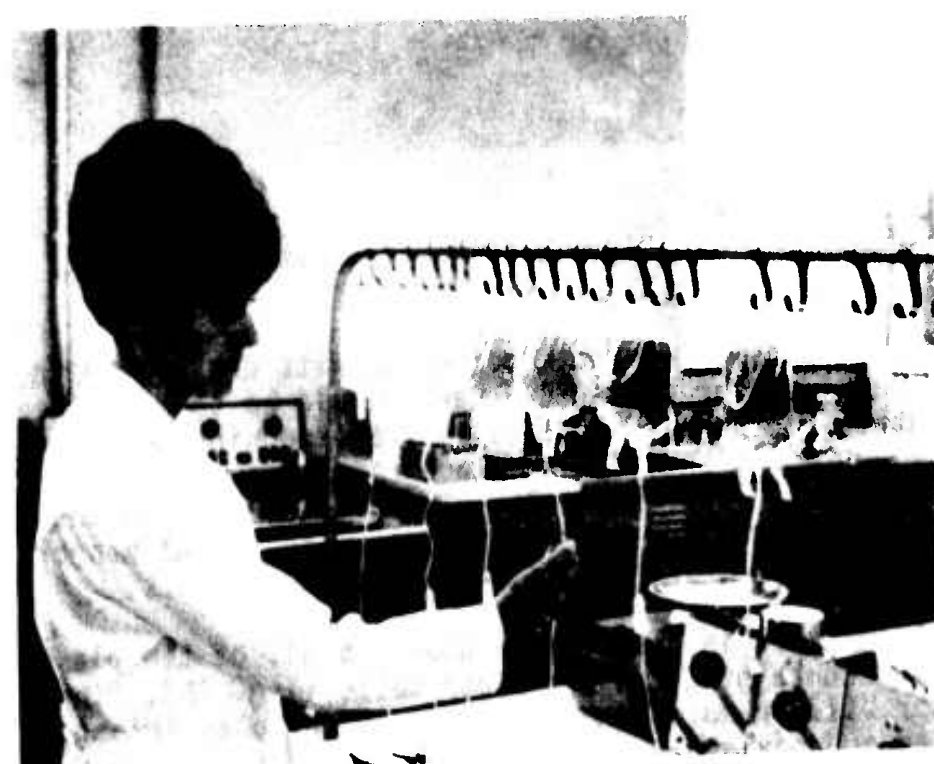

In July 1964 three researchers wrote to _Nature_ to say that the factor that people with hemophilia lack had been going down the drain. **[Hemophilia](kloom:e/haemophilia)** is an inherited disorder in which the blood fails to clot because one clotting protein is missing or faulty; in the commonest form, hemophilia A, that protein is **[factor VIII](kloom:e/factor-viii)**, then called the antihemophilic factor (AHF) or globulin (AHG). The letter's first author was **[Judith Graham Pool](kloom:e/judith-graham-pool)** of the **[Stanford University](kloom:e/stanford-university)** School of Medicine, a physiologist who had turned to blood coagulation in 1953. What she found, and then turned into something any blood bank could make, was **[cryoprecipitate](kloom:e/cryoprecipitate)**: the cold, gluey residue left when frozen plasma thaws slowly. The story of hemophilia itself, from Queen Victoria's family to recombinant factor, is the trail from here, _Clotting_.

## Half the factor in the waste

Pool was working with **[Cutter Laboratories](kloom:e/cutter-laboratories)** in Berkeley on a factor VIII concentrate made by a Swedish method, the Blombäck process, which began from Fraction I of the **[Cohn process](kloom:e/cohn-process)**, the wartime scheme for splitting plasma into its proteins. The product was poor: as a 2 per cent solution it carried no more factor VIII than ordinary plasma. Cutter's plasma came frozen, and everyone blamed the freezing. Then the team noticed that their "starting sample" had been taken after a preliminary step, _clarification_. The frozen plasma was thawed at 10–12 °C, pooled, cooled again to 1–2 °C and spun to throw out whatever had failed to dissolve. In six new batches of about 1,000 litres each, samples taken before that spin averaged 90 per cent of normal factor VIII activity, and samples taken after it 46 per cent. Almost half the factor was being thrown away in the residue.

That should not have surprised them, the letter admits: Pool and J. Robinson had reported in 1959 that the cold-insoluble proteins of plasma carry much of the factor. The residue was a gelatinous paste, about 2 kg from a 1,000-litre pool. It held only about 0.4 per cent of the plasma's protein but some 20 per cent of its factor VIII, a fifty-fold concentration on a protein basis in one step. Purified further, it went to four men with severe hemophilia, whose plasma volumes had first been measured with chromium-51:

| Patient | Plasma volume | Concentrate given | Factor VIII afterwards |
| ------- | ------------: | ----------------: | ---------------------: |
| T. T.   |      2,500 mL |            375 mg |                  16.5% |
| R. P.   |      2,300 mL |            750 mg |                    40% |
| J. G.   |      2,360 mL |            750 mg |                    35% |
| S. F.   |      2,100 mL |            750 mg |                    30% |

Pool, Hershgold and Pappenhagen pointed to R. P.: a solution small enough for a 50-mL syringe had lifted him to 40 per cent of normal.

## Why the volume mattered

Pool set out the problem in the _New England Journal of Medicine_ in December 1965. A severely affected patient has less than 1 per cent of the normal level of factor VIII. To stop a bleed, a level of 10 to 35 per cent has to be reached and held for one to twelve days, and frozen plasma carries on average only 65 per cent of the factor in fresh. By our arithmetic, raising R. P. from nothing to 40 per cent needs the factor in about 920 mL of normal plasma, or some 1.4 litres of frozen plasma at once, more than half his own plasma volume, and the factor begins to leave the blood within hours; Wikipedia gives its half-life as about 12 hours. Plasma by the litre risked overloading the heart before it stopped the bleeding.

Her 1965 paper, written with Angela Shannon, took the step out of the factory. In a _closed-bag system_, the plastic double bags blood banks already used, one donor's plasma could be frozen, thawed in the cold, spun and drained off, leaving the precipitate in a small volume of plasma in a sealed bag: 10 to 15 mL in a unit made today. It needed no pooling and no special equipment. By 1972 it was routine. The Army's Blood Bank Center at Fort Knox, Kentucky, wrote down its method:

| Step        | Fort Knox, 1972                                                               |
| ----------- | ----------------------------------------------------------------------------- |
| Collect     | one unit into a double ACD blood pack                                         |
| First spin  | 4,200 rpm (4,900 g) at 4–8 °C for 10 minutes                                  |
| Express     | as much plasma as possible into the satellite bag, without red cells          |
| Freeze      | satellite bag in 95 per cent ethanol and dry ice, about −60 °C, 15–30 minutes |
| Thaw        | overnight in the walk-in refrigerator at 2–4 °C                               |
| Second spin | 4,200 rpm (4,900 g) at 4–8 °C for 10 minutes                                  |
| Drain       | hang the bag upside down; the liquid plasma runs back to the red cells        |
| Store       | the precipitate left in the bag, at −60 °C, for one year                      |

Fort Knox charged $10 for a bag of cryoprecipitate of about 100 units, when a commercial vial of 500 units cost $80. The same report warns where it failed: a request for 300 bags had to be cut to 200, because each bag needs one donor's **[fresh frozen plasma](kloom:e/fresh-frozen-plasma)**, and a hemophiliac having surgery needs support that goes on for days.

## Credit, and what came after

Pool was not the first. In 2021 Albert Farrugia and Cees Smit Sibinga recalled that Emile Rémigy, a physician at Nancy, had described cryoprecipitate and treated hemophilia A with it in a 1955 thesis written in French; he died in 1961, and it went unread. They proposed that the two be named co-discoverers. Pool, they wrote, rediscovered it without knowing his work and published it where the world read it.

As of October 2026, US rules for cryoprecipitated AHF still follow her outline: plasma frozen within eight hours, held at −18 °C or colder, and an average of at least 80 units of factor VIII a bag, checked on four bags a month. Cryoprecipitate made home treatment and surgery possible for people with hemophilia, and the freeze-dried concentrates built on it soon passed it by. Those concentrates came from pools of thousands of donors and carried viruses with them; that, too, is on the trail. A 2014 review found cryoprecipitate's main use had become something else entirely, replacing fibrinogen in massive bleeding. The main spine goes on to the machines that took one component from a donor and gave back the rest.
