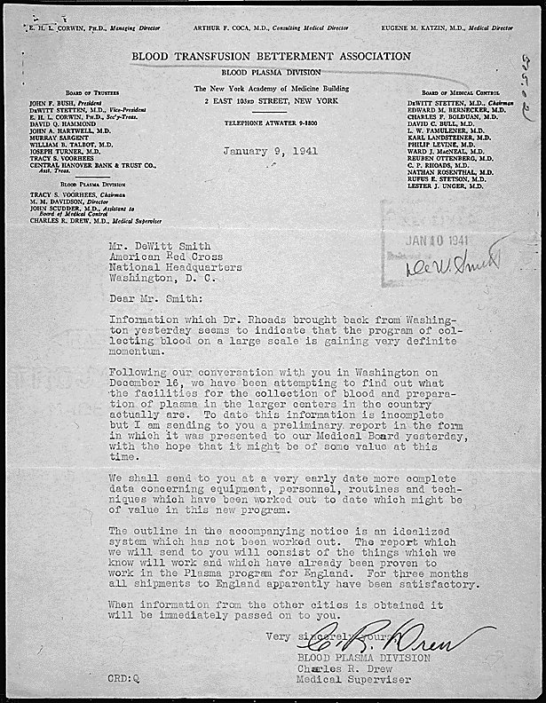

On 9 January 1941 the medical supervisor of a New York association's Blood Plasma Division wrote to the **[American Red Cross](kloom:e/american-red-cross)** in Washington. "For three months," he reported, "all shipments to England apparently have been satisfactory." He was **[Charles R. Drew](kloom:e/charles-r-drew)**, a surgeon from **[Howard University](kloom:e/howard-university)**, and the shipments were the project known as **Blood for Britain**: [plasma](kloom:e/blood-plasma) from American donors, collected in New York hospitals from August 1940 to January 1941 and sent across the Atlantic for Britain's wounded. It took 14,556 donations and shipped more than 5,000 litres of plasma in salt solution. What it learned, much of it the hard way, became the plan for the American wartime blood supply.

## Banked blood

Drew had come to [Columbia University](kloom:e/columbia-university)'s [Presbyterian Hospital](kloom:e/newyork-presbyterian-hospital) in 1938 to train in surgery and to work in John Scudder's laboratory on shock and transfusion. In August 1939 the two set up an experimental blood bank there, and for seven months Drew studied what happened to stored blood: its potassium leaking from the cells into the plasma, its white cells and platelets failing, its red cells breaking down. His doctoral thesis, _Banked Blood: A Study in Blood Preservation_, earned him a doctorate in medical science from Columbia in June 1940. Its advice was practical. Store whole blood for about a week; after that, take the plasma off the cells and keep it in saline. "Banked blood is safe when its limitations are known," he wrote, and the blood bank "should become a part of the hospital".

## Why plasma

Plasma is blood without its cells: the straw-coloured fluid that carries proteins and salts, and that restores the volume a person in shock has lost. For a war across an ocean it had every advantage over whole blood. A study Drew and Scudder took part in had found that whole blood could not safely be used after two weeks, and it had to be typed and crossmatched for each patient. Plasma kept far longer, did not spoil when shaken in transport, and could be given to anyone, because pooling the plasma of several donors diluted each one's anti-A and anti-B antibodies until they did no harm. Dried, it would keep longer still, weigh less and need no refrigerator, but in 1940 drying machines were costly and their product untested in quantity, so Blood for Britain sent it liquid.

## The procedure

Drew's report of 31 January 1941 sets out the routine he standardised across the hospitals:

| Step     | What was done                                                                                                                                                                                               |
| -------- | ----------------------------------------------------------------------------------------------------------------------------------------------------------------------------------------------------------- |
| Collect  | Donors aged 21 to 60, with a systolic pressure of at least 110 and haemoglobin of 80%; blood into a closed bottle, refrigerated at once at 4 °C; a sample tested for syphilis, any positive blood discarded |
| Separate | Centrifuged at 2,000 revolutions per minute for half an hour, or left to settle for at least a week                                                                                                         |
| Pool     | Plasma from about eight bottles siphoned into a two-litre flask under a hood, in a dust-proof room lit by ultraviolet lamps, through a stainless-steel filter and a three-way stopcock                      |
| Culture  | 10 c.c. of each pool grown in two broths, one for bacteria that need air and one for those that do not, at 37 °C, examined at 3, 7 and 14 days                                                              |
| Preserve | Merthiolate, a mercury antiseptic, added to 1 part in 10,000; the pool held in the refrigerator for a week until its cultures were clean                                                                    |
| Dispense | 500 c.c. of plasma run into a Baxter bottle already holding 500 c.c. of sterile saline under vacuum; the last 35 c.c. into a control bottle for the central laboratory                                      |
| Check    | The central laboratory re-cultured each control bottle and injected a mouse; England cultured a sample from every carton before use                                                                         |

The plate draws the line from the bottle to the pool to the final container. Every flask, pool and carton was numbered, so that any bottle could be traced back to its donors.

## What went wrong

Sterility was the hard part. Pools that grew nothing at three days grew bacteria later, and on 14 November 1940 a cable from England reported eight contaminated bottles, all from August, before the rules were tightened. The Blood Transfusion Betterment Association had called Drew back from Howard in September as its full-time medical supervisor, and under him the central laboratory at Presbyterian rechecked every pool: of 836 control bottles tested from October to December, 16 were contaminated. Of the 6,151 litres made, 521 were lost to contamination, 8.5 per cent, and 151 donations were discarded for syphilis. The Army's later history drew the lesson that blood must be collected in a completely closed system.

## Dried plasma

In February 1941 the Red Cross opened its first blood donor centre in New York, in a three-month pilot to make dried plasma for the Army and the Navy, which had asked for 15,000 pints of blood. As the Army's history describes the process, commercial laboratories separated and pooled the plasma, froze it in its bottle and dried it from the frozen state under high vacuum. Drew was its assistant director, by the National Library of Medicine's account (Wikipedia's article says director), and brought in mobile collection units, later called bloodmobiles. He returned to Howard in April. The pilot excluded Black donors at the armed forces' insistence, a policy Drew said had no basis in science; the trail frame _Segregated blood_ tells that story. On the main spine, the next frame finds a second blood group that typing had missed: Rh.
