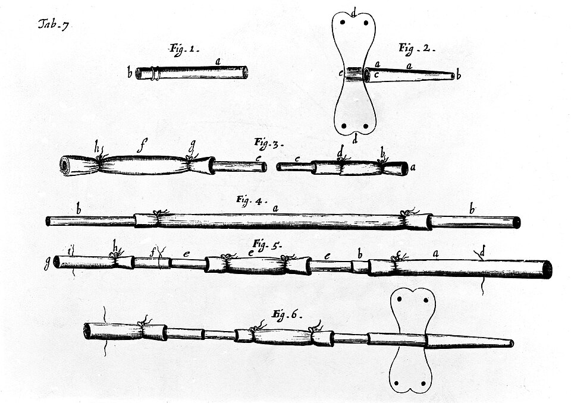

Once William Harvey had shown in 1628 that the blood goes round, a vein became a way in. From 1657 the young astronomer Christopher Wren injected wine, opium and other liquids into the veins of dogs, and, as Thomas Sprat put it in 1667 (quoted by A. D. Farr), "hence arose many new Experiments, and chiefly that of Transfusing Blood". **[Blood transfusion](kloom:e/blood-transfusion)** was first done well at Oxford by the physician **[Richard Lower](kloom:e/richard-lower-physician)**, who dated it February 1665: February 1666 by our reckoning, since the English year then began in March. He sent his method to **[Robert Boyle](kloom:e/robert-boyle)**, who passed it to the **[Royal Society](kloom:e/royal-society)**, and its journal, the **[_Philosophical Transactions_](kloom:e/philosophical-transactions-of-the-royal-society)**, printed it on 17 December 1666.

## Lower's method

Lower wrote it as a set of instructions, so that "you may better direct anyone to doe it". In order:

| Step | Donor dog                                                                                                                                             | Recipient dog                                                                                                                                      |
| ---- | ----------------------------------------------------------------------------------------------------------------------------------------------------- | -------------------------------------------------------------------------------------------------------------------------------------------------- |
| 1    | Lay bare the carotid artery for an inch; tie it fast on the side towards the head; an inch nearer the heart, a running knot that can be loosened      |                                                                                                                                                    |
| 2    | Open the artery between the knots, tie a quill into it, stop the quill with a stick                                                                   | Lay bare an inch and a half of the jugular vein, with a running knot at each end                                                                   |
| 3    |                                                                                                                                                       | Open the vein and tie in two quills: one pointing to the heart, to take the donor's blood; one from the head, to let its own blood out into dishes |
| 4    | Tie the dogs on their sides facing each other; join the quills with "two or three several Quills more" pushed into each other; slip the running knots | Let its own blood run out as fast as the other's runs in                                                                                           |
| 5    | It bleeds "till the other Dog begin to cry, and faint, and fall into Convulsions, and at last dye by his side"                                        | Tie and cut the vein, sew up the skin: the dog "will leap from the Table and shake himself, and run away"                                          |

The blood ran "very impetuously". Lower's cautions are the practical ones: keep the dogs close enough that the vessels are not stretched, and feel the vein for the pulse beyond the quill, because when it fails the quill has clotted and must be drawn out and cleared with a probe. To make it certain, bleed a great dog into a little one, a mastiff into a cur. The Society's editor added that a small curved pipe of silver or brass would serve better than a straight quill. The drawing shows the arrangement; the engraving shows the pipes Lower published in his _Tractatus de corde_ of 1669.

The plan was then to exchange the blood "of Old and Young, Sick and Healthy, Hot and Cold, Fierce and Fearful". At supper on 14 November 1666 the diarist **[Samuel Pepys](kloom:e/samuel-pepys)** was told of a dog bled into another at Gresham College that evening, which "did give occasion to many pretty wishes, as of the blood of a Quaker to be let into an Archbishop".

## Denis in Paris

The first transfusions into people were made in Paris, by **[Jean-Baptiste Denis](kloom:e/jean-baptiste-denys)**, a young physician and professor of philosophy and mathematics, with the surgeon Paul Emmerez. In June 1667 they took about three ounces from a youth of fifteen who had been bled twenty times for a fever, and gave him about three times as much blood from a lamb's artery. He felt "a very great heat along his arm" and recovered. Denis chose animals because their blood, unspoiled by "debauchedness", would be purer than a man's.

A later case shows what he believed blood was. Antoine Mauroy, about thirty-four, ran naked through the streets in fits of madness. Denis gave him calf's blood, he wrote, because "the blood of a Calf by its mildness and freshness might possibly allay the heat and ebullition of his blood". On 19 December 1667 Mauroy received five or six ounces; at the second transfusion, more than a pound. He felt the heat again, then "great pains in his Kidneys", sweated, vomited, and the next morning passed urine "as black, as if it had been mixed with the soot of Chimneys". He was calm for about two months. To Farr, a transfusion scientist writing in 1980, the heat, the back pain and the black urine are the signs of a hemolytic reaction: the patient's blood destroying the calf's cells.

Mauroy relapsed, and his wife pressed for a third transfusion. It was begun, no calf's blood passed, and he died the next night. Three physicians urged her to accuse Denis; witnesses said she had put powders in his broth, and others later that she had told them it was arsenic. The sentence of the Châtelet on 17 April 1668 sent her for examination, and ruled that in future no transfusion was to be made on a human body without the approval of the physicians of the Paris Faculty, who opposed it. Some accounts call this a ban; it was a condition. Wikipedia's article on Lower adds that the Parlement banned transfusion outright on 10 January 1670, a decree we have not seen.

## Arthur Coga's ten ounces

In London, on 23 November 1667 at Arundel House, Lower and [Edmund King](kloom:e/edmund-king-physician) let six or seven ounces out of Arthur Coga, a Cambridge graduate whom Pepys heard called "a little frantic" and who was paid twenty shillings, and ran in a sheep's blood. They could not weigh what went in, so they reasoned it, as King reported:

| What they knew                                                         | What they inferred               |
| ---------------------------------------------------------------------- | -------------------------------- |
| 12 oz ran through the sheep's pipe into a porringer in about a minute  | the pipe's rate when free        |
| The pipe used in the man's vein was about a third smaller at its end   | a slower stream                  |
| A pulse was felt in his vein for two minutes                           | blood ran all that time          |
| Two minutes through the smaller pipe, the stream slackening as it went | the dose: "about 9 or 10 ounces" |

A week later Pepys met him: "he finds himself much better since, and as a new man, but he is cracked a little in his head". After Mauroy, transfusion was all but abandoned for a century and a half, until an obstetrician in London tried again, with human blood.
