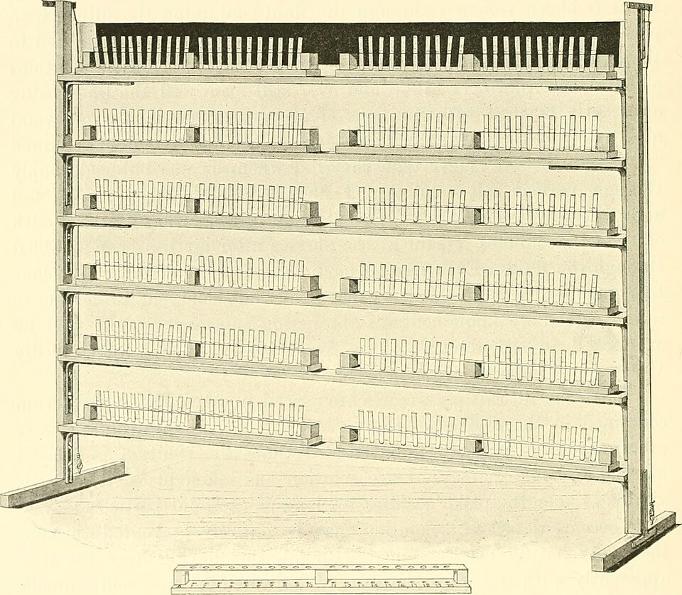

In February 1915 a fifty-year-old workman brought a linen shirt to the Institute of Forensic Medicine of the **[University of Turin](kloom:e/university-of-turin)**. For three months his wife had read the bloodstains on it as proof that he had been with another woman, and a fortune-teller had agreed with her. He wanted the blood identified. The lecturer who took the case, **Leone Lattes**, twenty-eight, was a great-nephew and former pupil of the criminologist **[Cesare Lombroso](kloom:e/cesare-lombroso)**, and had spent years on a question every court met: a stain could be proved human, but not whose. His reports of that case and a murder inquiry began **[forensic serology](kloom:e/forensic-serology)**, the typing of blood and other body fluids for the law.

## Human first, then whose

Two tests came before his. From 1901 Paul Uhlenhuth's **[precipitin](kloom:e/precipitin)** test showed whether a stain was human: an extract of it, mixed with serum from a rabbit immunised against human serum, turns cloudy if the blood is human. In 1903 **[Karl Landsteiner](kloom:e/karl-landsteiner)** and Max Richter showed that dried blood keeps its agglutinins, the antibodies that clump red cells of another group, and proposed testing a stain against a suspect's cells: if it clumps them, it is not that person's blood. Lattes went a step further and typed the stain itself, against cells of known group.

For the shirt he did it the slow way. He counted the threads in the smallest patch of linen holding the densest stain, 180 one way and 65 the other, cut ten clean patches with the same count, and weighed them: 0.0895 g on average. The stained patch weighed 0.0944 g, so it held about 0.0049 g of dried blood. Taking dried blood to be a fifth of the fresh, he steeped the patch for twelve hours in an ice box in 0.02 mL of water and 0.03 mL of saline, and pressed out an extract two or three times weaker than the blood had been. Two loops of extract went with one loop of a 5% suspension of washed cells into a hanging drop under the microscope. The tests ran from 23 to 25 February:

| Tested                                         | Result      | Reading                            |
| ---------------------------------------------- | ----------- | ---------------------------------- |
| Stain extract with A cells of two donors       | no clumping | no anti-A in the stain             |
| Stain extract with B cells of two donors       | clumping    | anti-B present: the stain is A     |
| Stain extract with husband's, wife's, friend's | no clumping | none excluded this way             |
| Husband's and the wife's friend's blood        | group A     | either could have left it          |
| The wife's blood                               | group O     | she could not have made the stains |

That left the husband and a friend of the wife who had been alone in the bedroom. Hers could only have been menstrual, which carries vaginal cells rich in glycogen that Lugol's iodine stains; Lattes looked and found none. The blood was the husband's own; examining him, Lattes found an enlarged prostate, a source nobody had thought of. "This result restored the peace to family G.," he wrote. Popular retellings give the man a full name and the stain group O; Lattes's paper gives only initials, and group A.

The second case went to court. A man suspected of murder said the blood on his overcoat came from a nosebleed. The victim's serum, taken at the autopsy, typed A; the suspect typed O; the stain's extract clumped both A and B cells, as O blood does. The stains were not the victim's, and in Lattes's later list of his cases the accused was released. Lattes published both cases in 1916, the year Alexander Wiener's manual gives for the first criminal case.

## The cover-slip test

Weighing needed a large stain. Lattes's answer, which Fritz Schiff named the "Lattes cover-slide method", is the crust test still called by his name. Wiener's _Blood Groups and Transfusion_ (third edition, 1943) sets it out:

| Step | What is done                                                                                      |
| ---- | ------------------------------------------------------------------------------------------------- |
| 1    | Show the stain is blood by chemical tests, and human by the precipitin test                       |
| 2    | Put equal flakes of crust, 1 or 2 mg can be enough, on three slides                               |
| 3    | Add a drop of fresh 2% suspension of known O, A₁ or B cells to each, and cover at once            |
| 4    | Keep in a moist chamber for about 30 minutes, looking under low power from time to time           |
| 5    | Clumps form first at the crust's edge; press the cover slip gently to break false stacks of cells |
| 6    | The O cells must stay free                                                                        |

The plate draws the three slides for an invented group-B stain, whose anti-A clumps the A cells only. Lattes himself lifted the cover slip and stirred the drop before reading: true clumps survive dilution, while the false clumping of over-strong serum, which he named _pseudoagglutination_, falls apart. Only a positive result counts. Agglutinins fade as a stain ages, so a stain that clumps A cells and not B may be B or a weakened O, but cannot be A or AB. Animal blood clumps human cells of every group, which is why the precipitin test comes first. The engraving shows the racks on which George Nuttall ran 16,000 precipitin tests for his book of 1904.

## Exclusion, never identity

A group can clear a person, never name one. Wiener's odds: with groups at about 0.40, 0.40, 0.15 and 0.05, two people taken at random differ with a chance of 1 − (0.40² + 0.40² + 0.15² + 0.05²), about 65.5%. Paternity worked the same way, through inheritance. In Germany Fritz Schiff and Georg Strassmann reported the first court paternity cases in 1924, and the first public exclusion of a putative father came in 1926; by ABO alone Schiff put a wrongly named man's chance of exclusion at about 17%. Italy approved blood grouping as forensic evidence in 1931, with Lattes's help; the United States followed in 1935, starting with New York, and England in 1939. In 1938 **[Erik Essen-Möller](kloom:e/erik-essen-moller)** turned exclusion into a probability of paternity: the chance of the child's types if the man is the father, against their chance for a man at random, from even odds at the start. It is **[Bayes' theorem](kloom:e/bayes-theorem)**. DNA replaced it all in the 1980s.

Lattes was forced from his chair at Pavia by Fascist Italy's racial laws in 1938, worked in Argentina, and taught at Pavia again after 1948. He died in 1954. The rules for which children two parents can have, on which every paternity case relied, rested until 1924 on the wrong genetics, as the next frame shows.
