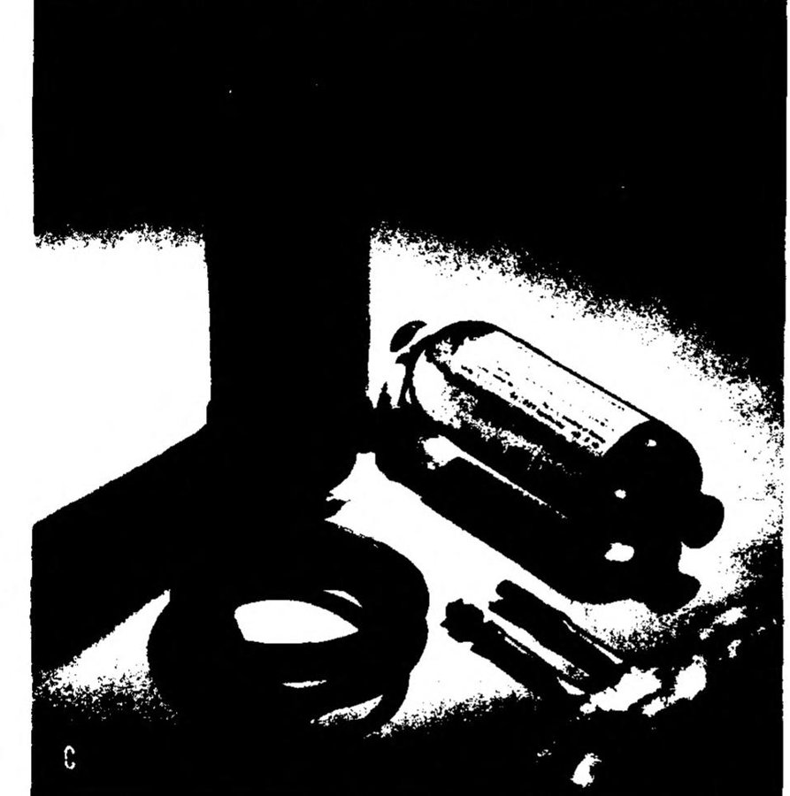

In the spring of 1940, with German armies moving through the Low Countries, the US National Research Council asked a protein chemist at [Harvard Medical School](kloom:e/harvard-medical-school) whether the plasma of cattle could be made safe to transfuse into men. **[Edwin Joseph Cohn](kloom:e/edwin-joseph-cohn)** had spent most of two decades on the physical chemistry of proteins. Cattle plasma never was made safe: after serious reactions and two deaths from serum sickness among the volunteers who tested a protein from cattle plasma, the program was stopped in March 1943. But the method Cohn built to try split human plasma into its proteins, one at a time, by turning five dials. The **[Cohn process](kloom:e/cohn-process)**, cold ethanol fractionation, gave the armed forces a concentrated, stable **[albumin](kloom:e/human-serum-albumin)** for shock, and a by-product, **[gamma globulin](kloom:e/gamma-globulin)**, full of the donors' antibodies. Plasma is still split by his scheme or by methods built on it.

## Five dials

Salt had been the chemist's way to throw a protein out of solution. Cohn replaced it with ethanol, which could be boiled off afterwards, and kept everything cold so the alcohol would not wreck the proteins. He controlled five variables at once: ethanol concentration, pH, ionic strength, protein concentration and temperature. Each protein is least soluble at its own pH and ethanol strength, so setting the dials one way precipitates one group of proteins and leaves the rest dissolved; the precipitate is spun off and the dials are moved again. In Cohn's own account of the method recommended in the Navy's contracts of 1945, "Method 6", the plasma was brought to 0 °C and ethanol and buffer were dripped in through capillary tubes, slowly, so that no part of the liquid met too much of either:

| Fraction | Ethanol |  pH | Temperature | What came down                                                                |
| -------- | ------: | --: | ----------: | ----------------------------------------------------------------------------- |
| I        |      8% | 7.2 |       −3 °C | fibrinogen and the antihemophilic globulin                                    |
| II + III |     25% | 6.8 |       −5 °C | the antibodies (gamma globulins), the blood-group isoagglutinins, prothrombin |
| IV-1     |     18% | 5.2 |       −5 °C | lipid-rich alpha globulins                                                    |
| IV-4     |     40% | 5.8 |       −5 °C | the remaining alpha and beta globulins                                        |
| V        |     40% | 4.8 |       −5 °C | albumin, near its isoelectric point                                           |

Fraction IV-1 was taken out after II + III by lowering the ethanol again, a later refinement. The figures for the first four come from Cohn's 1948 history, which quotes his 1946 paper; for Fraction V he wrote only "near its isoelectric point", and the pH 4.8 is Wikipedia's and his 1940 report's range of 4.4 to 4.8. The ethanol is percent by volume and the pH as measured at 25 °C, as Cohn specified.

| Fraction    | Grams per liter of plasma |
| ----------- | ------------------------: |
| I           |                       3.4 |
| II + III    |                      19.0 |
| IV-1        |                       5.1 |
| IV-4        |                       5.8 |
| V           |                      31.5 |
| VI          |                       1.0 |
| All, summed |                      65.8 |

More than half the protein of plasma is albumin, and most of it ends in Fraction V: 29.9 of the 32.6 grams of albumin recovered, by Cohn's 1946 table.

## Why albumin

Albumin carries about 80 percent of the osmotic pull that holds water in the blood vessels, Cohn wrote, and it is the most soluble, least viscous and most stable of the plasma proteins. That made it small to carry. By his measurements a gram of albumin held 18 mL of fluid in the circulation, so 100 mL of a 25 percent solution was recommended as the equal of 500 mL of plasma. The Army-Navy package held three cans, each with 100 mL of albumin and the tubing to give it by gravity; the box floated, which the Navy liked, and the can was a standard Navy can for the priming charge of explosives.

Human blood was first fractionated in the Harvard laboratory in August 1940. [Red Cross](kloom:e/american-red-cross) donors began giving blood for the purpose at the Peter Bent Brigham Hospital in February 1941, and a pilot plant beside the Harvard Medical School was making 500 to 800 grams of albumin a week by that July. On 8 December 1941 the chairman of the Committee on Medical Research telephoned Cohn to ask whether any albumin could be flown to **[Pearl Harbor](kloom:e/attack-on-pearl-harbor)**. Every bottle in Boston went that night. The surgeon Isidor Ravdin gave it to seven badly burned men ten days after the attack, swollen and still losing plasma from their burns, and reported that all improved. By the end of the war, of some thirteen and a half million Red Cross donations, about two and a half million had gone to albumin.

## The by-product

What came down in Fraction II was a concentrate of the antibodies of thousands of donors. Joseph Stokes of Philadelphia offered in 1941 to test it against measles, and Cohn reported that the gamma globulin of Fraction II proved effective against measles and infectious hepatitis. Albumin had one more advantage, found during the war: heated in its final container for ten hours at 60 °C, it no longer carried the virus of serum hepatitis. A pool of plasma could not be heated so, and the hepatitis it carried is a later frame's story.

Cohn died in 1953. Eleven years later the frozen plasma bound for his Fraction I gave up half its factor VIII in a cold paste at Cutter Laboratories, and Judith Pool made that paste the next frame but one.
