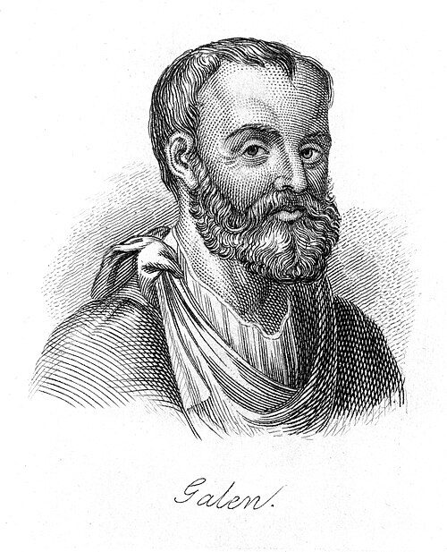

**[Galen](kloom:e/galen)** was born in **[Pergamon](kloom:e/pergamon)**, in what is now western Turkey, in AD 129, and trained there, at Smyrna and at Alexandria. He served as surgeon to Pergamon's gladiators, moved to Rome at about thirty-one, made his name as a physician and a public demonstrator of anatomy, and counted the emperor **[Marcus Aurelius](kloom:e/marcus-aurelius)** among his patients. He may have written more than any other author of antiquity, and for more than thirteen hundred years what he wrote about blood was what educated physicians believed about it. The humours of the frame before this one reached the Middle Ages largely through him.

Human dissection was forbidden in Rome, so Galen learned anatomy from Barbary apes and pigs, and argued that their bodies were close enough to ours. His physiology of the blood was built from those dissections, from experiments on living animals, and from one principle he stated again and again: nothing is done by Nature in vain.

## Blood made, sent out, and used up

In Galen's scheme, food was "concocted" in the stomach and carried by the veins of the gut to the liver, which turned it into blood. The veins, branching from the liver, carried that blood out to every part of the body, and each part drew to itself what suited it and used it up as nourishment. The liver made more from the next meal. Nothing came back to be used again: flow could reverse locally, as when an empty stomach drew nutriment back from the liver, but there was no circuit. The arteries were a second system, rooted in the heart and carrying the _vital spirit_ (**[pneuma](kloom:e/pneuma)**, from the lungs) together with a thin, vaporous blood. The plate draws the two systems: veins from the liver ending where their blood is spent, and arteries from the left side of the heart.

## Arteries full of blood

Galen was arguing against the followers of **[Erasistratus](kloom:e/erasistratus)**, the Alexandrian anatomist of the third century BC, who held that the arteries carried only pneuma and that blood spurted from a cut artery only because the wound drew it in from neighbouring veins. Galen insisted that arteries carry blood in life, and that veins and arteries are joined by fine connections, _anastomoses_. His proof in _On the Natural Faculties_ is an experiment: "If you will kill an animal by cutting through a number of its large arteries, you will find the veins becoming empty along with the arteries." That, he wrote, "could never occur if there were not anastomoses between them." The observation is sound. The connections he imagined were not the ones that exist.

## The pits in the septum

The heart's two lower chambers, the ventricles, are divided by a muscular wall, the septum. In Galen's scheme some blood had to cross it, from right to left, to meet the pneuma, and he looked for the way through. He found pits in the septum "with wide mouths", which "get constantly narrower", and admitted that "it is not possible, however, actually to observe their extreme terminations", because they are so small and a dead animal's parts are "chilled and shrunken". Since Nature does nothing in vain, the pits must go through.

He also argued from the size of the vessels, a kind of bookkeeping:

| Ventricle | Vessel in                        | Vessel out                          | Galen's conclusion             |
| --------- | -------------------------------- | ----------------------------------- | ------------------------------ |
| Right     | the vena cava, large             | the vessel to the lungs, smaller    | some blood leaves another way  |
| Left      | the vessel from the lungs, small | the great artery, the aorta, larger | some blood arrives another way |

If more goes into the right ventricle than leaves it for the lungs, and more leaves the left than comes into it from the lungs, then something passes from right to left. It was too much, he reasoned, to be the heart's own nourishment, so "it is, therefore, clear that something is taken over into the left ventricle." His translator in 1916, the physician Arthur John Brock, noted that the conclusion was correct so far as it went: blood does pass from the right side to the left. But Galen supplied an imaginary passage through the septum for the real route, which goes the long way round, through the lungs. Brock added that one of the size comparisons misleads anyway, because the aorta's round opening looks larger than the slit-like valve between the left chambers.

## The longest authority

Galen's writings were translated into Arabic and from Arabic into Latin, and became the core of university medicine in both worlds. Anatomists who found something he had not described sometimes concluded that the human body had changed since his day. The pores in the septum were taught, and searched for, for more than a thousand years. The first physician known to have said in writing that they do not exist did so around 1242, in Cairo, and his name was **[Ibn al-Nafis](kloom:e/ibn-al-nafis)**.
