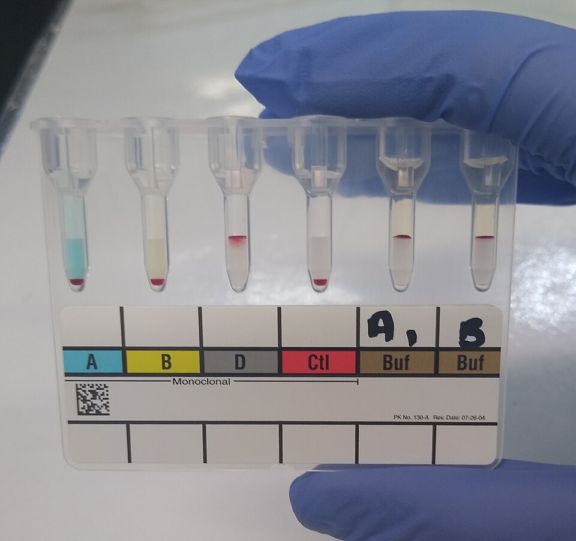

For most of a century a blood bank read **[agglutination](kloom:e/agglutination-biology)** the same way: a technologist spun a tube, shook the button of cells gently loose and judged by eye how big the clumps were. The frame on typing and crossmatch by hand shows how much skill that took, and how much depended on the shake. In 1990 a group at the regional blood transfusion center in Lyon, led by **Yves Lapierre**, published a way to make the centrifuge do the judging. Their "gel test" puts each reaction in a microtube of gel. Clumped cells are too big to pass through it and stay high; single cells go to the bottom. The result is a picture that stays put, and cards like it came to be widely used to type blood and screen it for antibodies.

## The card

Lapierre later wrote that the gel test was born in 1984. The paper in _Transfusion_ in 1990 describes "special microtubes filled with a mixture of gel, buffer, and reagent". A neutral gel holds no reagent, and serum is added on top of it; a specific gel has the reagent mixed in: antiglobulin serum, or anti-A, anti-B or anti-D. A plastic card carries six such microtubes in a row, each with a wider reaction chamber at the top, sealed with foil. The Swiss company DiaMed made it a product, and gel cards were later sold by **[Bio-Rad](kloom:e/bio-rad-laboratories)** and by **[Ortho Clinical Diagnostics](kloom:e/ortho-clinical-diagnostics)**, which also made a card with tiny glass beads in place of gel.

The card pictured is a typing card. Its first three tubes hold anti-A, anti-B and anti-D, and the fourth is a control; the patient's cells clumped only in anti-D. The last two hold buffer, and reagent A and B cells were added to them with the patient's plasma, which clumped both. The person is group O, RhD positive, read forward and in reverse on one card.

## The procedure

The manufacturers' instructions give the antibody screen in the antiglobulin card as a short list. These numbers are from a DiaMed insert of 2010 and a recent Ortho insert, which agree on them:

| Step     | What is done                                                                                    |
| -------- | ----------------------------------------------------------------------------------------------- |
| Cells    | reagent red cells at about 0.8% in a low-ionic-strength diluent (10 µL of packed cells in 1 mL) |
| Pipette  | 50 µL of the cells, then 25 µL of the patient's plasma or serum, into the reaction chamber      |
| Incubate | 15 minutes at 37 °C, in the card's own incubator                                                |
| Spin     | 10 minutes in the card's own centrifuge, at speeds set by the maker                             |
| Read     | each tube, front and back, and record a grade                                                   |

There is no washing. In a tube **[Coombs test](kloom:e/coombs-test)** the cells must be washed before antiglobulin is added, because free globulin left in the serum would use it up. In the card the antiglobulin is held in the gel, and, as Ortho's instructions put it, the gel restricts the unbound globulin from moving through it in the spin, so it cannot neutralize the reagent. Lapierre's paper made the point in one line: the antiglobulin tests "can be performed without washing of the RBCs".

The reading is a position in the column, and the plate draws the scale as the instructions word it. A 4+ is a "solid band of red blood cell agglutinates on top of the gel"; 3+ most agglutinates in the upper half; 2+ agglutinates through the whole length; 1+ mostly in the lower half with a button below; 0 a "well-defined button at the bottom". A band on top with a button at the bottom is mixed field: two populations of cells, one that reacts and one that does not.

## What changed, and what it cost

Two things changed at once. The reading no longer depended on how hard a tube was shaken, and the result could be kept: Lapierre wrote that a positive "may be read for hours afterwards", and Ortho's insert says cards kept upright in a refrigerator could still be read after more than fourteen days. The card itself is the record. And because a card is a fixed geometry, a machine can read it: automated analyzers pipette the cells and plasma onto the cards, spin them, and scan and read the reactions. In one hospital's trial in India, published in 2019, a fully automated analyzer had its first blood-group result 71 minutes earlier than the semi-automated card system on a batch of 42 samples.

Sensitivity is the cost. The gel finds weak antibodies, some that matter and some that do not. In a German study of 2018, the gel card and the glass-bead card agreed on fresh samples, but among 202 stored sera with known antibodies the gel found 36 antibodies, in 33 sera, that the glass missed, and the glass found antibodies in 9 sera that the gel missed, most of them weak. In an Indian study of direct antiglobulin tests, 17 of 96 samples were positive by gel card and negative by every tube method, put down to raised sedimentation rate, large cells and high white counts; the authors warned that a positive gel result must be weighed against the patient. Ortho's instructions add that some antibodies, anti-E and anti-K among them, have been reported unreactive in some low-ionic systems, that rouleaux and fibrin can trap cells on top of the gel, and that "no single test method will detect all antibodies". Beside the gel, solid-phase tests bind antigen or antibody to the wells of a plate and read cells that stick, and they also lend themselves to machines.

The bench segment ends here, with the reading of a reaction become a record. The spine moves on to where blood stands today.
