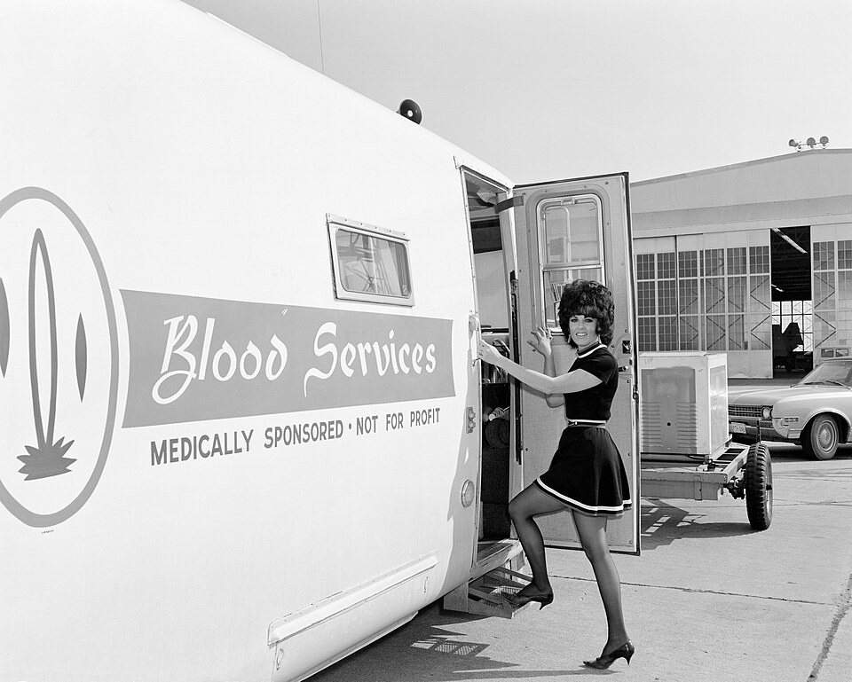

In 1970 **[Richard Titmuss](kloom:e/richard-titmuss)**, professor of social administration at the London School of Economics, published a book about blood that was really a book about society: _The Gift Relationship: From Human Blood to Social Policy_. He set two systems side by side. In England and Wales, every pint came from a voluntary donor, who was given, as the economist [Robert Solow](kloom:e/robert-solow) put it in his review, "no reward but a cup of tea", and hospitals and patients paid nothing for what they used. In the United States blood was bought, sold, borrowed against and repaid. Titmuss argued that the gift was better on every count that could be measured, and on one that could not.

## What he counted

The American figures were hard to assemble, because no one collected them on a uniform basis, and Titmuss built them from many partial sources. His picture of where America's blood came from in 1965–67, in the summary Solow gave of it:

| Source of blood, United States, 1965–67                                 | Share             |
| ----------------------------------------------------------------------- | ----------------- |
| Paid donors, occasional and regular                                     | about 1/3         |
| Donors exchanging blood for blood: replacements and "insurance" credits | a little over 1/2 |
| "Captive" donors, mostly servicemen and prisoners                       | about 5%          |
| Voluntary donors, the only kind in Britain                              | about 10%         |

Counting plasma bought by plasmapheresis, about half of all American blood was paid for. Hospitals charged patients $30 to $100 a pint in the 1960s, and many asked for two pints back for every one used. Titmuss also ran his own survey of British donors, asking who they were and why they gave; slightly over a quarter said that they or a member of their immediate family had once received blood.

Then he compared performance. Both countries collected roughly three donations per hundred people a year. Britain wasted only one or two per cent of what it collected, while in the United States, on estimates Solow called guesses but not far off, at least ten per cent went out of date unused. Titmuss found no significant, prolonged shortage in England and Wales since 1948, against many American reports of operations put off for want of blood, though a small British survey Solow cited had over a third of the surgeons who replied sometimes postponing too. And there was hepatitis. Reports gave 3.6 per cent of transfused American hospital patients as later catching serum hepatitis; no British study found more than one per cent. Most blood was still untested for the virus, whose first marker was only then being found, so the main protection was the donor's own honesty about jaundice, and a man selling blood to eat had every reason to keep quiet.

## Arrow and the economists

Economists answered. Solow, in the _Yale Law Journal_ in 1971, accepted the facts and the conclusion about hepatitis but not the explanation. Titmuss believed that a market in blood drove out altruism, that a gift loses meaning where others sell the same thing. Solow thought the cause might as easily be the National Health Service, or a "trace of Dunkirk" in British donor sessions, and noted that no one he knew had skipped a bloodmobile because blood was also sold. **[Kenneth Arrow](kloom:e/kenneth-arrow)**, in "Gifts and Exchanges" (1972), made the economist's case more carefully: he doubted that paying some donors would make others less willing, said the book did not show it, and located the real fault in information. Payment does not spoil giving, he argued; it rewards a donor for hiding an infection. The philosopher Peter Singer replied in Titmuss's defense in 1973. The argument over whether incentives "crowd out" generosity has not ended; a 2013 review of the experiments found that small incentives did not raise the amount of blood given, and too little evidence to judge what they did to its safety.

## What changed

The facts moved faster than the argument. In March 1972 President Nixon asked the Department of Health, Education, and Welfare to study the blood system, and the National Blood Policy of March 1974 set an all-volunteer supply as a national goal. The **[Food and Drug Administration](kloom:e/food-and-drug-administration)**'s 1975 proposal to label paid blood collected the evidence, and by our arithmetic its figures for [hepatitis B surface antigen](kloom:e/hbsag) run like this:

| Donors    | Units tested | Reactive | Per 1,000 |
| --------- | -----------: | -------: | --------: |
| Paid      |       48,502 |      685 |      14.1 |
| Volunteer |       83,196 |      182 |       2.2 |

At the Hines Veterans Administration Hospital near Chicago, 20.8 per cent of transfused patients caught hepatitis in 1968–70, when 92 per cent of its blood was bought; with 96 per cent from volunteers, the rate fell to 7.9 per cent. The final rule, published on 13 January 1978 and in force from 15 May, required every unit of whole blood and its components for transfusion to be labeled "paid donor" or "volunteer donor". By then, comments to the agency said, 95 per cent of the supply already came from volunteers, and the paid whole-blood bank faded. Plasma collected for manufacture was exempt, and stayed paid. In 1975 the World Health Assembly urged its members to build blood services on unpaid donation.

The antigen on the chart, and the test that found it, are the next frame's story.
