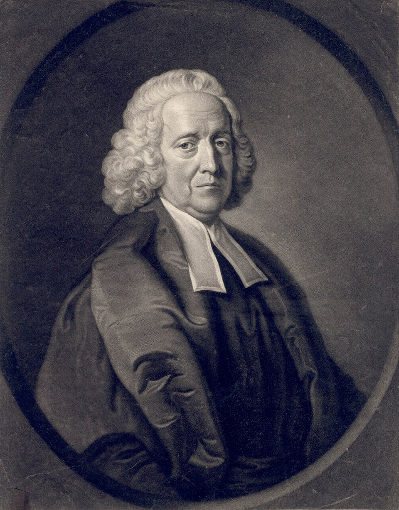

In a December in the early eighteenth century, a country parson had a mare tied down alive on her back and opened an artery in her thigh. He fixed a glass tube nine feet long to the artery and watched the blood climb it. The parson was **[Stephen Hales](kloom:e/stephen-hales)**, perpetual curate of **[Teddington](kloom:e/teddington)**, a village on the Thames above London, and the number he wrote down, eight feet three inches, was the first measurement of **[blood pressure](kloom:e/blood-pressure)**: the force with which the heart drives blood into the arteries, which every clinic now takes in millimeters of mercury.

## A parson's experiments

Hales was born in Kent in 1677, studied at Corpus Christi College, Cambridge, where he and the medical student William Stukeley dissected animals together, and went to Teddington in 1709. He stayed there for the rest of his life. He was elected to the **[Royal Society](kloom:e/royal-society)** in 1718, and in 1727 published _Vegetable Staticks_, measurements of how plants drink, sweat and push up their sap, with a long section on the "airs" that heat drives out of solids. Joseph Black would later call one gas "fixed air" after him: carbon dioxide. Its preface says where the plant work began. "About 20 years since," he wrote, "I made several hæmastatical Experiments on Dogs, and 6 years afterwards repeated the same on Horses and other Animals, in order to find out the real force of the blood in the Arteries." By his own account, then, the work on dogs dates from around 1707 and on horses from around 1713. The full account waited for a second volume, _Haemastaticks_, in 1733, and some histories date the first measurement to that year. Booth's history of 1977 does; Hales's preface says it was some twenty years older.

## The tube on the artery

Experiment I of _Haemastaticks_ is his procedure, and he gives it with a farmer's care for the animal's particulars. The mare was fourteen hands high, about fourteen years old, "neither very lean, nor yet lusty", with a fistula on her withers. Step by step:

| Step                                                                     | Hales's numbers                        |
| ------------------------------------------------------------------------ | -------------------------------------- |
| Open the left crural (femoral) artery, about three inches from the belly |                                        |
| Tie it, and insert a brass pipe into it                                  | bore one sixth of an inch              |
| Join a glass tube to the pipe with a second brass pipe                   | about the same bore, nine feet long    |
| Untie the ligature and watch the column                                  | half way at once, then inches per beat |
| Read the height above the level of the left ventricle of the heart       | eight feet three inches                |
| Note the beat                                                            | rising and falling two to four inches  |
| Take the tube off and let the blood spurt freely                         | the jet no higher than two feet        |

The column was not steady. It rose by "twelve, eight, six, four, two, and sometimes one Inch" with each pulse until it stopped, then rose and fell with every beat, and sometimes dropped a foot and climbed back after forty or fifty beats. A healthy horse's pulse, Hales noted, is about thirty-six a minute; this mare's was about fifty-five, "and sometimes sixty or a hundred, she being in pain". In another experiment, on a white mare, he put a goose's windpipe between the artery and the tube, so that her struggling would not break the glass, and the blood in her neck artery stood nine feet six inches high.

Mercury is 13.6 times as dense as water, and blood about 1.05 times, so by our arithmetic a column of blood stands about 13 times as tall as one of mercury pressing as hard:

| Where the tube was fixed   | Hales's height of blood         | In millimeters of mercury, by our arithmetic |
| -------------------------- | ------------------------------- | -------------------------------------------: |
| First mare, crural artery  | 8 ft 3 in                       |                                    about 194 |
| White mare, carotid artery | 9 ft 6 in                       |                                    about 224 |
| White mare, jugular vein   | about 1 ft, before she strained |                                     about 24 |

These were frightened animals in pain, tied down and struggling, and Hales saw the column rise whenever they strained, so the numbers are not a horse at rest.

## Where the force goes

Hales also put a tube into the white mare's jugular vein. The blood rose in it only about a foot, climbed a yard when she strained, and overflowed the top when she struggled. The difference between artery and vein he measured again in dogs and sheep, and he put it at "10 or 12 to 1". The heart's force, he concluded, was spent in the smallest vessels. Pouring water through the arteries of dead animals, he found how much the "capillary Arteries", so fine "that only single Globules of Blood can pass them", held the flow back, and wrote that to this resistance "is owing the great Difference of the Force of the Blood in the Arteries to that in the Veins". The drawing sets the two columns side by side, artery and vein, against a scale in feet and in millimeters of mercury.

He measured the cost as well. He let the mare bleed a quart at a time, refitted the tube after each, and recorded the height: four feet eight inches after seven quarts. After fourteen or fifteen quarts she fell into "cold clammy Sweats", and after about seventeen she died. Opening her, he reckoned some twenty quarts of blood in all, about forty-four pounds. He drew a lesson for bleeding patients, that blood should be let at intervals and not all at once. The experiments troubled others: the poet Thomas Twining wrote of the good pastor who would "To lingering death put Mares and Dogs", and Alexander Pope objected to them. Hales himself wrote that "the disagreeableness of the Work did long discourage me from engaging in it".

## From a glass tube to a cuff

Nobody could put a nine-foot tube into a patient. A century later, in 1828, **[Jean Léonard Marie Poiseuille](kloom:e/jean-leonard-marie-poiseuille)** replaced the column of blood with a column of mercury, thirteen times shorter, and the millimeter of mercury became the unit. In 1896 **[Scipione Riva-Rocci](kloom:e/scipione-riva-rocci)** squeezed the artery from outside, with an inflatable cuff around the arm read against a mercury gauge, the form of the modern **[sphygmomanometer](kloom:e/sphygmomanometer)**, and in 1905 the Russian surgeon Nikolai Korotkov added a stethoscope below the cuff to hear when the blood broke through. The next frame turns from the blood's force to its color, and to the molecule that carries its oxygen.
