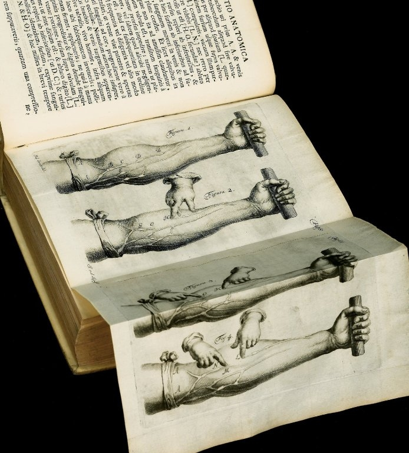

In 1628 a short Latin book printed in Frankfurt argued that the blood goes round. Its author was **[William Harvey](kloom:e/william-harvey)**, a London physician at St Bartholomew's Hospital and Physician Extraordinary to the late King James I, and its title, shortened, is **[_De motu cordis_](kloom:e/exercitatio-anatomica-de-motu-cordis-et-sanguinis-in-animalibus)**, _On the Motion of the Heart_. It was dedicated to the new king, **[Charles I](kloom:e/charles-i-of-england)**, and Harvey had taught its idea in lectures since about 1616. The book put it in print with three kinds of proof: a sum, an experiment anyone could make on an arm, and the valves in the veins.

## Where he started

Harvey studied medicine at the **[University of Padua](kloom:e/university-of-padua)** and took his degree there in April 1602. His teacher in anatomy was **[Hieronymus Fabricius](kloom:e/hieronymus-fabricius)** of Aquapendente, who had been showing small folds inside the veins since 1574 and published a book on them, _De venarum ostiolis_, "on the little doors of the veins", in 1603. The explanations taught for them were that they kept the blood from all running down into the legs by its weight, or slowed it. Harvey's chapter on the valves opens with praise for "a most skilful anatomist, and venerable old man", and then says that "the discoverer of these valves did not rightly understand their use". In the veins of the neck they hang the other way, so they are not there against gravity. In every vein, Harvey wrote, they face the heart.

## The sum

His first proof was a sum built so that any reasonable numbers would do. "Let us assume either arbitrarily or from experiment," he wrote, that the left ventricle holds two ounces, or three, or one and a half; in a dead man he had found it held more than two. (Chauncey Leake's 1928 translation says three, but the Latin of 1628 says two.) Some part of that, a quarter, a sixth, "or even but the eighth part", is thrown into the aorta at each beat, and the valves at the root of the aorta let none of it back. In half an hour the heart beats "more than one thousand" times, in some people two, three or four thousand. His worked figures, in Robert Willis's 1847 translation, use apothecaries' weights: three scruples to a drachm, eight drachms to an ounce, twelve ounces to a pound.

| Thrown out at each beat | Harvey's total in 1,000 beats | In kilograms, by our arithmetic |
| ----------------------- | ----------------------------- | ------------------------------: |
| one drachm              | 10 pounds 5 ounces            |                             3.9 |
| two drachms             | 20 pounds 10 ounces           |                             7.8 |
| half an ounce           | 41 pounds 8 ounces            |                            15.6 |
| one ounce               | 83 pounds 4 ounces            |                            31.1 |

Every line comes to "a larger quantity in every case than is contained in the whole body". He checked the other side of the sum in animals. A sheep or a dog sending out a single scruple a beat would pass a thousand scruples, about three and a half pounds, in half an hour, and he had found that a sheep holds no more than four pounds of blood in all. Stretch the half-hour to a day and the conclusion stands: the liver could not make so much blood from food, as [Galen's](kloom:e/galen) physiology required, and the veins could not hold it, so the same blood must come back. His figures were loose (an eighth of two ounces is two drachms, not the one he wrote) and modest. By today's textbook figures a resting adult heart sends out about 70 milliliters a beat and 5 liters a minute, some 150 liters in half an hour by our arithmetic, from a body that holds about five. The argument never needed his numbers to be right, only to be no larger than the truth.

## The arm

The experiment is in chapter XI. Tie a cord round the upper arm "as tightly as can be borne": the pulse at the wrist stops, the artery above the cord swells and throbs, and the hand stays pale and cools. Then slacken it to the "middling tightness" a surgeon used for bloodletting. The hand and arm "become deeply suffused and distended", and the veins swell below the cord, never above it. The tight cord stops the deep arteries; the medium one stops only the veins near the skin. Blood therefore goes into a limb by the arteries and comes out by the veins.

Chapter XIII uses the same cord to show the valves. With the arm tied, the swollen veins show knots, each a valve. Press the blood out of a stretch of vein with one finger, from the point marked H up to the knot O, and keep the finger there: the stretch stays empty, because no blood comes back down past the valve. Push down on the full vein above O with a finger of the other hand and the blood will not go past it, however hard you press. The figures are Harvey's own, here in a 1737 edition.

## What he could not see

Harvey's circuit ran through the lungs, by the route [Ibn al-Nafis](kloom:e/ibn-al-nafis) had described, and through the whole body. One link he never saw: how blood crossed from the smallest arteries to the smallest veins. In chapter XI he left both answers open, "either an anastomosis of the two orders of vessels, or pores in the flesh and solid parts generally that are permeable to the blood". The book was attacked. The Paris anatomist **[Jean Riolan](kloom:e/jean-riolan-the-younger)**, a Galenist, granted at most that the blood went round two or three times a day, and Harvey answered him in two essays in 1649. Acceptance took about twenty years. Harvey died in 1657; four years later, in Bologna, Marcello Malpighi looked at a frog's lung through a microscope and saw the missing vessels.
