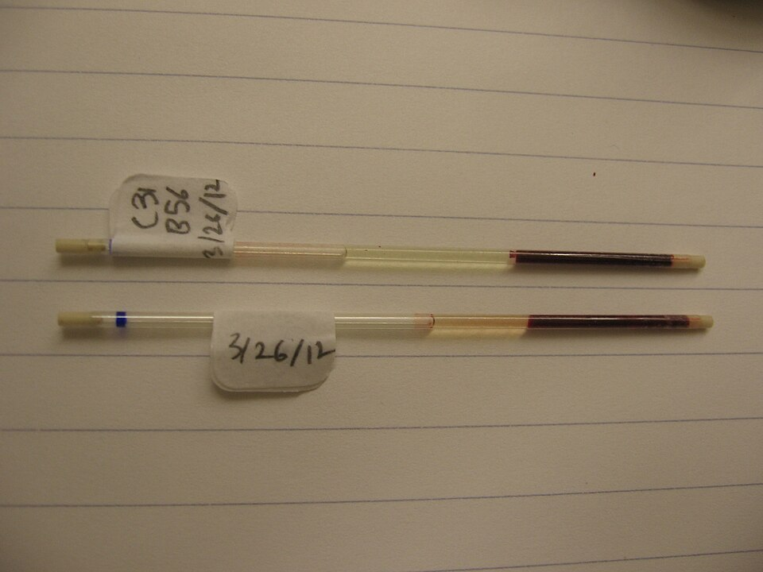

Blood that stands in a glass separates, and [Robin Fåhræus](kloom:e/robin-fahraeus) thought the four humors came from watching it do so. Spun in a centrifuge it separates faster and further, into a column of packed red cells, a thin gray-white layer of white cells and platelets, and clear plasma. The Swedish physiologist Magnus Blix named an instrument for measuring that column the _haematokrit_ in 1891, from the Greek for blood and judge. What made the **[hematocrit](kloom:e/hematocrit)** a routine test was a glass tube that **[Maxwell Wintrobe](kloom:e/maxwell-wintrobe)** introduced in 1929, as a young physician at Tulane University in New Orleans, and the arithmetic he built on it.

## The tube and the spin

The US Army's _Methods for Medical Laboratory Technicians_ (TM 8-227, 1951) gave the procedure, with Wintrobe's own figures used by his courtesy. The Wintrobe tube is a glass tube sealed at one end, about 11 cm long, with a bore of 2.5 mm, etched with a scale in millimeters. One scale reads down from 0 to 10 cm, for the [sedimentation rate](kloom:e/erythrocyte-sedimentation-rate); the other reads up from 0 to 10, for the packed cells. The plate draws the tube after its spin.

| Step   | What was done                                                                                                                                  |
| ------ | ---------------------------------------------------------------------------------------------------------------------------------------------- |
| Bottle | Dry 0.5 ml of oxalate solution (ammonium oxalate 1.2 g and potassium oxalate 0.8 g in 100 ml) in a small bottle, at room temperature           |
| Blood  | Draw 5 ml of venous blood into it with a dry syringe and needle; invert gently to mix                                                          |
| Fill   | Mix again for 30 seconds or more; fill the tube from the bottom with a long pipette, raising it as it empties, to the 10 mark, with no bubbles |
| Stand  | Optionally let it stand upright for 1 hour and read the sedimentation rate on the left-hand scale                                              |
| Spin   | Centrifuge at 2,800 rpm or more until the cells pack no further: 30 minutes at 3,000 rpm in a head of 9 cm radius                              |
| Read   | The top of the red column, in centimeters, times 10 is the percentage of packed cells                                                          |

At 3,000 revolutions a minute on a 9 cm radius, the blood is pulled at about 900 times gravity, by our arithmetic. The oxalate was dried at room temperature, not in an oven, because above 80 °C, the manual warned, oxalate turns to carbonate, which does not stop clotting. The gray layer of white cells and platelets, normally 0.7 to 1.0 mm thick, gave a rough check on their numbers, and the color of the plasma above was compared with standards for the icterus index, the yellowness of jaundice. One tube of venous blood therefore gave four answers, and the Army offered it as a "screen test" that needed less highly trained staff than counts by hand. Wintrobe's illustrations of tubes from different patients show how much it shows at a glance: very pale plasma in [anemia](kloom:e/anemia) after chronic bleeding, a thick white layer in chronic myeloid leukemia.

## Wintrobe's indices

Wintrobe's larger idea was to combine the three measurements of the red cells, the count, the hemoglobin and the hematocrit, into averages for a single cell. In papers of the early 1930s he set out what are now called the Wintrobe indices, or the **[red blood cell indices](kloom:e/red-blood-cell-indices)**, and classified the anemias by them. The Army manual gave the formulas:

- mean corpuscular volume (MCV) = packed cells in ml per liter of blood ÷ red cells in millions per µL, in cubic microns (now femtoliters);
- mean corpuscular hemoglobin (MCH) = hemoglobin in g per liter ÷ red cells in millions, in micromicrograms (now picograms);
- mean corpuscular hemoglobin concentration (MCHC) = hemoglobin in g per 100 ml ÷ packed cells in ml per 100 ml × 100, in percent.

Its normal ranges were 82–92, 27–31 and 32–36. Two invented patients, worked by our arithmetic:

| Measurement          | Patient 1         | Patient 2         |
| -------------------- | ----------------- | ----------------- |
| Red cells            | 4.0 million/µL    | 2.0 million/µL    |
| Hemoglobin           | 9.0 g/100 ml      | 8.0 g/100 ml      |
| Hematocrit           | 30%               | 24%               |
| MCV                  | 300 ÷ 4.0 = 75    | 240 ÷ 2.0 = 120   |
| MCH                  | 90 ÷ 4.0 = 22.5   | 80 ÷ 2.0 = 40     |
| MCHC                 | 9 ÷ 30 = 30%      | 8 ÷ 24 = 33%      |
| What the indices say | small, pale cells | large, full cells |

Both are anemic, and the indices say they are anemic in different ways. Small cells short of hemoglobin, low MCV and MCH, point to iron deficiency or thalassemia; large cells, a high MCV, to a shortage of vitamin B₁₂ or folate. That distinction decides the treatment, and Wintrobe drew it from three tests that any laboratory could do.

The manual added a warning that the indices are only as good as the measurements under them. "An error in red-cell count of 500,000 can obviously give a misleading value for mean corpuscular volume," it said, and "unless the technical work is of high quality it is better not to attempt to calculate" them. The hand count, the frame before last, was good to about ±8 percent, and by our arithmetic a count 8 percent too low makes the MCV about 9 percent too high.

## Smaller and faster

Later laboratories spun the blood in thin capillary tubes, as in the photograph. In the Air Force's laboratory course of 1978 the microhematocrit was the everyday method, with its own errors: a badly sealed tube, and the packed column slanting if the tube lay flat for more than half an hour before it was read. A capillary tube in a high-speed centrifuge packs in about five minutes at 10,000 rpm. Then the machines reversed the order of things. An electronic counter measures each red cell's volume directly, so it reports the MCV first and calculates the hematocrit from it, the opposite of Wintrobe's arithmetic. His indices survived the change, printed on every blood count, and the next frame on the bench goes to the blood bank and the typing tubes.
