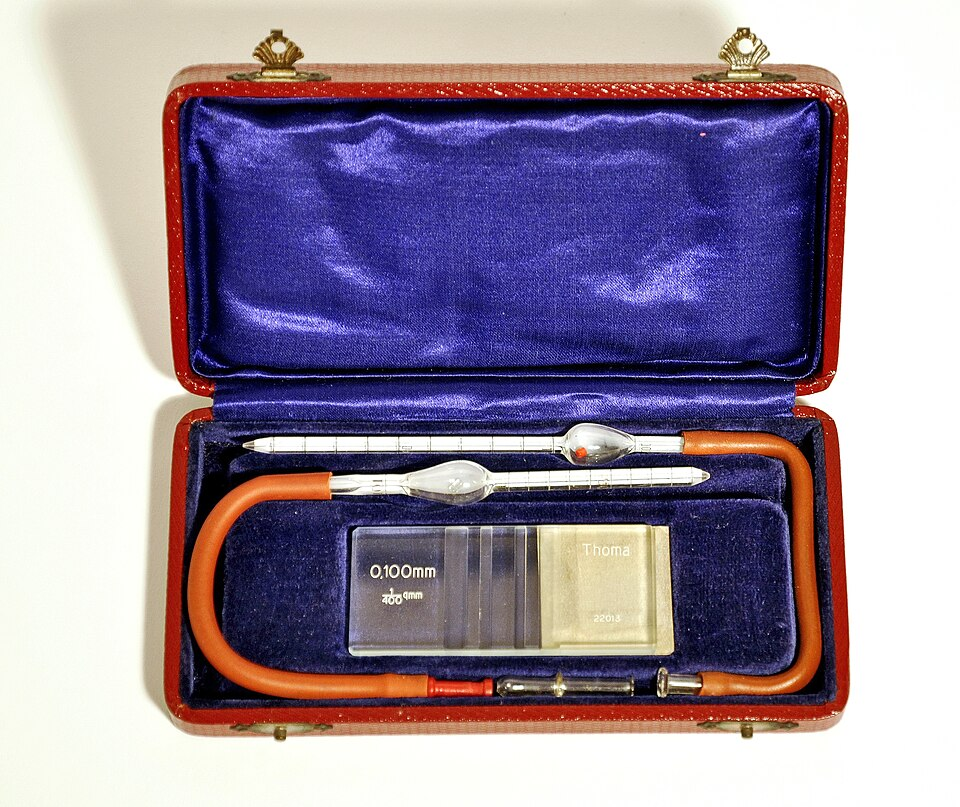

For most of a century, the number on a blood report was not measured but counted, cell by cell, by a person at a microscope. The first to do it was **[Karl von Vierordt](kloom:e/karl-von-vierordt)**, physiologist at Tübingen, in 1852. He drew blood into a glass capillary of known bore (a tenth of a millimeter, for instance), measured the length of the column under the microscope to know its volume, blew it out into a diluting fluid of gum water or thinned egg white, spread the mixture in narrow lines on a slide, let it dry, and counted the dried corpuscles against a micrometer. The method worked. It was also, as the French histologist **[Louis-Charles Malassez](kloom:e/louis-charles-malassez)** wrote in his thesis of 1873, impractical: by the physiologist Rollett's account, a single observation meant counting two or three thousand corpuscles, and took an hour.

## From a tube to a ruled floor

What followed was forty years of instrument-making, which the Australian physician M. L. Verso traced in 1964. In 1855 the Dutch physiologist Cramer counted diluted blood in a thin space of known depth between two glass plates. Pierre Potain gave Malassez a mixing pipette, the _mélangeur_, which measured blood and diluent in one tube, and Malassez counted the cells in a length of flattened capillary tubing. **[Georges Hayem](kloom:e/georges-hayem)** in Paris, whose diluting fluid was still the US Army's for red-cell counts in 1951, cemented a pierced glass plate to a slide to make a shallow well. In 1877 William Gowers ruled the floor of such a well in squares a tenth of a millimeter across, so the counter no longer needed a squared eyepiece.

The form that lasted came in 1881 from Richard Thoma at Heidelberg, writing with J. F. Lyon, and was made by Zeiss: a platform surrounded by a moat, standing exactly 0.1 mm below the cover glass, with one square millimeter ruled into 400 small squares in 25 groups of 16. Thoma's diluting pipette, built on Potain's, is the pattern still in use, and he soon added a smaller one for white cells, diluted in acetic acid to burst the red cells. Malassez built a chamber of his own on the same plan. Others re-ruled the platform for white-cell counts around 1900, Neubauer among them, and the **[hemocytometer](kloom:e/hemocytometer)** the US Army issued in 1951 was a Levy chamber with "the improved Neubauer ruling". Where Wikipedia credits Malassez with inventing the hemocytometer, Verso's history gives his 1870s method as the flattened tube, and the ruled chamber to Thoma.

## The count, step by step

The Army's _Methods for Medical Laboratory Technicians_ (TM 8-227, 1951) gave the procedure every laboratory officer's technicians followed. The plate draws the ruling it describes: nine square millimeters, the four corner squares divided into 16, the center into 25 squares by triple lines, each of those into 16 again.

| Step | Red cells                                                          | White cells                                   |
| ---- | ------------------------------------------------------------------ | --------------------------------------------- |
| 1    | Blood to the 0.5 mark of the red-bead pipette                      | Blood to 0.5 in the white-bead pipette        |
| 2    | Hayem's solution to the 101 mark: a dilution of 1 in 200           | 3% acetic acid to the 11 mark: 1 in 20        |
| 3    | Shake in a figure of eight for 2 minutes                           | The same                                      |
| 4    | Discard 3 or more drops; touch the tip to the edge of the platform | Discard 3 or 4 drops; fill                    |
| 5    | Let the cells settle 2 minutes; check the spread at low power      | Let the cells settle                          |
| 6    | Count squares A–E: the four corners and center of the middle       | Count the four large corner squares, 1–4      |
| 7    | Count cells touching the top and right lines, not left or bottom   | The four counts may differ by no more than 10 |

The arithmetic follows from the geometry. Five of the 25 middle squares hold 80 of the 400 small squares, so they cover a fifth of a square millimeter; under a cover 0.1 mm high, that is a fiftieth of a cubic millimeter, and a cubic millimeter is a microliter. Take an invented count of 92, 101, 87, 110 and 95 cells, 485 in all. Then 485 × 5 (for area) × 10 (for depth) × 200 (for dilution) gives 4,850,000 red cells per microliter. The manual's short method was to add four zeros to the total. For white cells, four squares of one square millimeter each hold 0.4 µL, so the total is multiplied by 50: an invented 150 cells gives 7,500. The manual's normal red counts were 4,600,000 to 6,200,000 for men and 4,200,000 to 5,400,000 for women.

## How wrong it could be

The manual listed thirteen sources of error, from missing the 0.5 mark and a bubble in the pipette to a dirty chamber, clumping and rouleaux, yeast growing in old diluting fluid, tissue juice squeezed from the finger, and "a visual error in counting the cells", which it called "unexpected but frequent". Even perfect technique left one error that could not be removed: the cells settle at random on the squares, and the error in the estimate is about the square root of the number counted. For our invented 485 cells that is about 22, or 4.5 percent, by our arithmetic. In routine work, the manual estimated, a count of 5,000,000 was good to ±8 percent, so that 95 repeats in 100 would fall between 4,200,000 and 5,800,000; more accuracy meant more pipettes and more squares. Vierordt's own errors, as Malassez reported them, rarely passed 8 percent either. A study the Air Force cited in 1978 put the coefficient of variation of hand white-cell counts at 6.5 percent, against 2.3 percent for the electronic counters that replaced them.

The count said how many cells; it said nothing of what kind. That needed a stained film, and the next frame is Paul Ehrlich's. The machine that ended the hand count has its own frame further along the bench, the Coulter principle.
