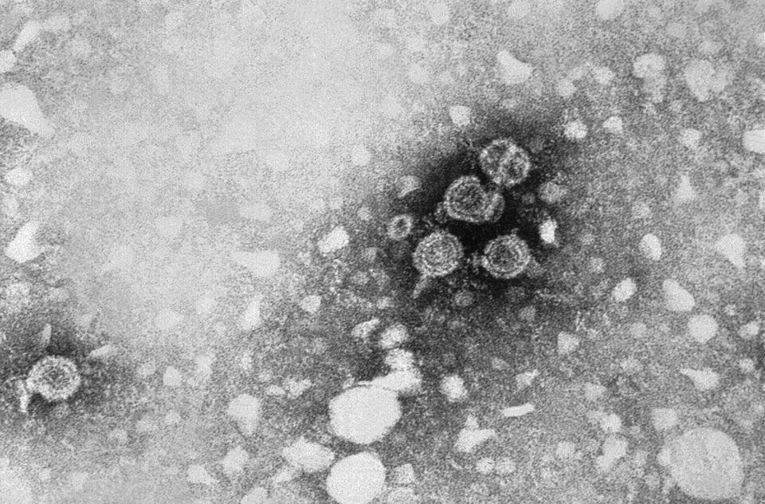

Since the wounded of the Second World War it had been plain that a transfusion could give a patient jaundice weeks or months later, "serum hepatitis", and no one could see what caused it or test a donor for it. The test, when it came, was found by a man who was not looking for hepatitis at all. **[Baruch Blumberg](kloom:e/baruch-samuel-blumberg)**, a physician and geneticist at the **[National Institutes of Health](kloom:e/national-institutes-of-health)** in Bethesda, was studying how human blood proteins vary from one population to another, and the line that led him to the virus was the wrong colour.

## Wells in agar

Blumberg's idea, tested from 1960, was that patients given many transfusions might make antibodies against the inherited variants of serum proteins carried by their donors. To look for them he used the method of **[Ouchterlony double immunodiffusion](kloom:e/ouchterlony-double-immunodiffusion)**, named after the Swedish bacteriologist **[Örjan Ouchterlony](kloom:e/orjan-ouchterlony)**. As Blumberg and **[Harvey Alter](kloom:e/harvey-j-alter)** described it in 1966, it took little more than a glass lantern slide coated with agar:

| Step  | What was done                                                                                              |
| ----- | ---------------------------------------------------------------------------------------------------------- |
| Gel   | Coat a glass lantern slide with 0.9% agar                                                                  |
| Wells | Cut a "7 cup" pattern: one well in the centre, six around it                                               |
| Fill  | The suspect antiserum, from a much-transfused patient, in the centre; serum from six people in the ring    |
| Wait  | Leave at room temperature while both diffuse outward through the gel                                       |
| Read  | Where an antigen meets its antibody in proportion, a white line of precipitate forms between the two wells |
| Stain | Dry the gel; stain with Sudan black, which colours lipid, then counterstain with azocarmine for protein    |

Each slide tested one antiserum against six people at once. Among the sera of 13 much-transfused patients, the first find was a family of antibodies against variants of the low-density lipoproteins, whose lines stained blue-black for their fat. Then, in 1963, the serum of a hemophilia patient from New York, transfused many times, made a line that would not take the lipid stain but turned red with azocarmine. It formed against only one of the 24 sera in that panel, and that one came from an Aboriginal Australian, sent by Robert Kirk in Australia. The team called the unknown protein the **[Australia antigen](kloom:e/hbsag)**. The plate draws the pattern, with the one line among six wells. Accounts date the find differently: Blumberg's Nobel lecture and Alter's review give 1963 for the line, the first paper came in 1965, and Wikipedia's article on hepatitis B says 1966.

## From leukemia to the liver

The first paper, in 1965, reported the antigen in about one American in a thousand but in about one in ten patients with leukemia, and Blumberg thought it might mark an inherited susceptibility. Patients with Down syndrome, who are prone to leukemia, carried it often: some 30% of those living in a large institution, far fewer at home, which pointed to infection rather than inheritance. In 1966 one of them, James Bair, turned positive, and tests showed he had developed hepatitis. In April 1967 a technician, Barbara Werner, felt unwell, set up her own serum one evening, and found a faint line the next morning: by Blumberg's telling, the first case of viral hepatitis diagnosed by the test. She went on to jaundice, and recovered.

Others closed the case. In Tokyo, Kazuo Okochi had found the same antibody independently; he showed that transfused blood carrying the antigen gave recipients hepatitis. In 1968 Alfred Prince found it in patients in the incubation period of serum hepatitis. The antigen was the coat of the virus, later named hepatitis B surface antigen, **HBsAg**, and in 1970 an electron microscope showed the whole particle.

## Screening donors

From the autumn of 1969 Philadelphia General Hospital tested its donor blood and threw out positive units. Before, 18% of its transfused patients developed hepatitis; a year later, 6%. In 1970 the NIH blood bank both turned to volunteer donors and began screening by agar gel, and its rate of post-transfusion hepatitis, over 30%, fell by about 70% to some 10%. The AABB's timeline dates donor testing across the country to 1971, and by August 1972 the federal Bureau of Biologics was mailing coded panels to every licensed blood bank to check how well they tested.

The tests improved by "generations", each more sensitive than the last. Gel diffusion was the first; counter-electrophoresis, the second, used an electric field across the gel to drive antigen and antibody toward each other; radioimmunoassay, the third, measured the binding with a radioactive label. Even the third, the FDA noted in 1975, missed the lowest levels of the antigen. On the federal panels of 1972–74, banks using counter-electrophoresis reported 63–83% of detectable samples correctly, those using radioimmunoassay 98–100%, and by January 1974 152 of 247 banks had switched.

| Period      | Recipients with hepatitis | What had changed                           |
| ----------- | ------------------------: | ------------------------------------------ |
| 1967–70     |                  over 30% | paid donors, no test                       |
| 1970s–1980s |                 about 10% | volunteers and HBsAg screening             |
| 1989        |                        4% | surrogate tests, more careful use of blood |
| 1990–91     |                      1.5% | first test for hepatitis C antibody        |
| From 1992   |                 near zero | second-generation hepatitis C test         |

Screening removed hepatitis B, but Alter's NIH studies found that only a quarter of the remaining cases had been B. When hepatitis A was identified in 1975, none of them was A either, and the cause, "non-A, non-B", was not cloned until 1989, as the [hepatitis C](kloom:e/hepatitis-c) virus. Blumberg shared the Nobel Prize in 1976; Alter shared his in 2020, for hepatitis C. The next crisis in the blood supply, HIV, arrived before that second test did.
