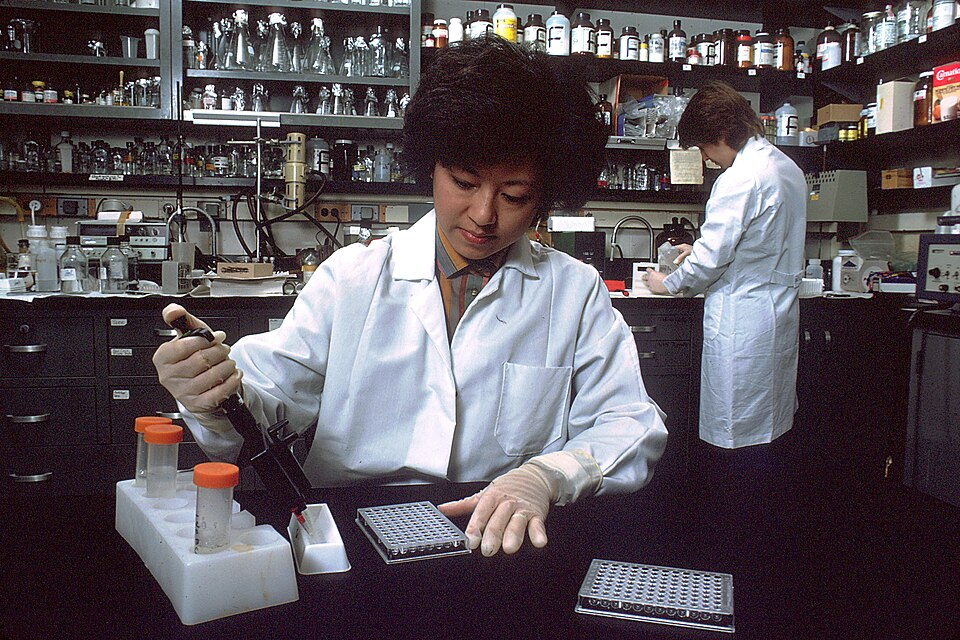

On 10 December 1982 the _Morbidity and Mortality Weekly Report_ of the US **[Centers for Disease Control](kloom:e/centers-for-disease-control-and-prevention)** described a 20-month-old boy in San Francisco with an unexplained collapse of his immune system. Born at 33 weeks with Rh disease of the newborn, he had been given six exchange transfusions and blood from 19 donors in his first month. One donor, a man of 48 who gave blood on 10 March 1981 in apparently good health, later fell ill and died in August 1982 of **[AIDS](kloom:e/hiv-aids)**. The same bulletin had reported in July that three men with hemophilia, who injected clotting factor made from plasma pooled from a thousand or more donors, had the same immune failure; their story, and that of hemophilia's concentrates, is told on the _Clotting_ trail. The agent, whatever it was, could travel in blood, and in blood from a donor who did not yet know he was sick.

## Atlanta, January 1983

On 4 January 1983 the CDC called a public meeting in Atlanta to tell blood bankers, plasma companies, hemophilia doctors and federal agencies what it had found. The CDC's Donald Francis proposed two measures: ask donors directly about their sexual behaviour, and test every donation for antibody to the hepatitis B core, a marker that, by the CDC's figures, showed an 88 per cent correlation with AIDS patients. The meeting reached no consensus. Some opposed the tests for their cost, gay activist groups objected that screening would discriminate against them, and many present were not convinced that blood carried the disease at all. A week later the American Association of Blood Banks (AABB), the American Red Cross and the Council of Community Blood Centers said in a joint statement that "direct or indirect questions about a donor's sexual preference are inappropriate". Some plasma companies moved sooner: Alpha Therapeutics had begun turning away donors in the risk groups on 17 December 1982. On 4 March 1983 the Public Health Service recommended that members of groups at increased risk should not give blood or plasma.

Twelve years later a committee of the **[Institute of Medicine](kloom:e/national-academy-of-medicine)** reviewed those decisions. It found that blood bank officials and federal authorities, faced with a range of options, "consistently chose the least aggressive option that was justifiable", and that asking male donors about sex with men and testing for the hepatitis B core antibody would have been reasonable from January 1983.

## The first test

Scientists at the Pasteur Institute in Paris isolated the virus, now called **[HIV](kloom:e/hiv)**, in 1983, and in 1984 a team at the National Institutes of Health showed that it caused AIDS and learned to grow it in quantity. Grown virus meant antigen for a test. The test was an **[ELISA](kloom:e/elisa)**, an enzyme-linked immunosorbent assay, and in March 1985 the Food and Drug Administration licensed two of them for screening blood.

| Step         | What is done                                                                                | What it means                                |
| ------------ | ------------------------------------------------------------------------------------------- | -------------------------------------------- |
| 1. Coat      | the wells of a plastic plate are coated with proteins of HIV grown in the laboratory        | the antigen, fixed to the plastic            |
| 2. Serum     | each donor's serum, much diluted, goes into its own well and is left to incubate            | any antibody to HIV binds the antigen        |
| 3. Wash      | the well is emptied and rinsed                                                              | everything unbound goes                      |
| 4. Conjugate | an anti-human antibody carrying an enzyme is added, incubated and washed off                | it sticks only where human antibody is bound |
| 5. Substrate | a colourless substrate is added; the enzyme turns it coloured                               | colour in proportion to the antibody         |
| 6. Read      | a photometer reads each well's colour against a cut-off set from controls on the same plate | above the cut-off is "reactive"              |

The plate draws a well in section and a strip read against its cut-off. In the ELISA article's description the serum is diluted 400 times. The hard part is the cut-off. In a 1985 study of one HTLV-III ELISA, as HIV was then called, 82 per cent of 88 AIDS patients were positive and 16 per cent borderline, while 1 per cent of 297 blood donors were positive and 6 per cent borderline. A reactive ELISA was therefore checked with a Western blot, in the Institute of Medicine's words a "more costly, less sensitive, but more specific" test, which confirmed or refuted it. Neither test could see an infection in its first weeks, before the body has made antibody: the **[window period](kloom:e/window-period)**, put at six to eight weeks by the Institute of Medicine, and at 45 days on average, for the tests then in use, by a 1994 study of donors whose earlier, antibody-negative gift had infected a recipient.

## The toll

The Institute of Medicine counted the American cost: HIV through blood reached more than half of the country's 16,000 people with hemophilia and over 12,000 people who had been transfused. In Canada, where about 2,000 people were infected with HIV through blood and some 30,000 with hepatitis C, the **[Krever Commission](kloom:e/royal-commission-of-inquiry-on-the-blood-system-in-canada)** reported in 1997 that the government had failed to take precautionary screening measures, and in 1998 new agencies, Canadian Blood Services and, in Quebec, Héma-Québec, took over the country's blood system. In the United Kingdom the **[Infected Blood Inquiry](kloom:e/infected-blood-scandal-in-the-united-kingdom)**, reporting in May 2024, found that besides some 1,250 people with bleeding disorders, between 80 and 100 people had been infected with HIV by transfusion, about 85 per cent of whom have died, and about 26,800 with hepatitis C, often after childbirth or surgery. It attributed more than 3,000 deaths to infected blood, blood products and tissue. The antibody test closed most of the door; the frame on nucleic acid testing follows the narrowing of the window that stayed open.
