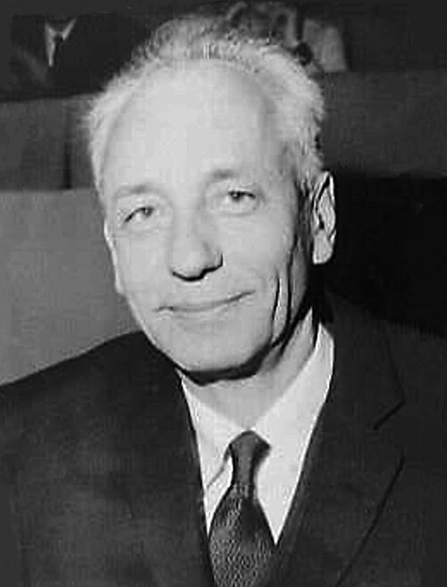

A transfusion carries white cells as well as red, and patients who had been transfused many times sometimes answered with fever and chills. In 1958, at France's National Blood Transfusion Centre in [Paris](kloom:e/paris), the haematologist **[Jean Dausset](kloom:e/jean-dausset)** studied the sera of such patients against the white cells, the leucocytes, of other people. He found seven sera that behaved alike: each clumped the leucocytes of 11 of the 19 people tested, and none clumped those of the patient it came from. He had found an antigen on white cells that some people carry and others lack. Dausset named it MAC, after three volunteers whose names began with M, A and C, and it was carried by about 60 per cent of the French. It is now called HLA-A2, the first antigen of the **[human leukocyte antigen](kloom:e/human-leukocyte-antigen)** system, and Dausset ended his paper by suggesting that such antigens might matter in transplanting tissue, particularly bone marrow.

## Mothers as well as patients

The same year two other laboratories found the same kind of antibody in women who had never been transfused. **[Jon van Rood](kloom:e/jon-van-rood)** and his colleagues in Leiden wrote in _Nature_ in June that attempts to find leucocyte antibodies in pregnant women had so far failed, but "from recent observations in our laboratory, we believe that they do occur". At [Stanford](kloom:e/stanford-university), **[Rose Payne](kloom:e/rose-payne)** and Mary Rolfs tested the sera of 144 pregnant women who had each had four or more pregnancies, and found leucocyte antibodies in 25 of them, 17 per cent. Eighteen of the 25 had never been transfused, and none of 20 women who had never been transfused or pregnant had them. The maternal sera clumped the white cells of 10 of the 12 newborns tested. A fetus, like a transfusion, could immunise a woman against the antigens it had inherited from its father, by the same route as the Rh antibodies of haemolytic disease.

Their test was leucoagglutination. Leucocytes were taken fresh each day from a panel of ten healthy group O donors, and each inactivated serum was tested against all ten. A serum was counted positive only if samples taken on two occasions clumped the cells of the same donor into compact clumps, and only if it clumped at least two of the ten; weak reactions were set aside, because leucocytes stick to debris and deteriorate with time. When a serum was tested against cells of another ABO group, its anti-A and anti-B were first absorbed out with washed red cells. Titres ran from 1 in 1 to 1 in 128, most no higher than 1 in 8.

## A drop under oil

Clumping white cells was, as **[Paul Terasaki](kloom:e/paul-terasaki)** of the University of California, Los Angeles, and J. D. McClelland put it in 1964, "capricious". They measured instead whether an antibody, with complement, killed lymphocytes, and they did it in microdroplets under oil. The test needed as few as 500 cells against the 50,000 or so of earlier cytotoxicity tests, a millilitre of serum served for 1,000 or more tests, and the lymphocytes from one finger-prick served for 100. Terasaki's microcytotoxicity test became the standard method of tissue typing. As a Serbian laboratory described the National Institutes of Health version in 2025:

| Step | What goes into the well                | Then                                             |
| ---- | -------------------------------------- | ------------------------------------------------ |
| 1    | 1 µL of serum                          |                                                  |
| 2    | 1 µL of lymphocytes at 2 × 10⁶ per mL  | 30 minutes at room temperature                   |
| 3    | 5 µL of rabbit complement              | 60 minutes at 22 °C                              |
| 4    | 5% eosin, then 37% formaldehyde to fix | read under an inverted phase-contrast microscope |

By our arithmetic, step 2 puts about 2,000 cells in the well. A lymphocyte killed by antibody and complement takes up the eosin and looks dark, flat and irregular; a living one stays round and bright. Each well is scored by the share of cells killed, on a scale of 1, 2, 4, 6 and 8, where 1 means fewer than 10 per cent dead and 8 more than 80 per cent. The plate draws a tray's well in section and the two kinds of cell.

## What matching does

Workshops from 1964 onwards, where laboratories tested one another's sera on shared panels of cells, showed that most of these antigens are made by a cluster of closely linked genes, now known to lie on chromosome 6. Grafts of skin between brothers and sisters who had inherited the same HLA genes from both parents survived longer than grafts between those who had not, and kidneys from HLA-identical siblings did better than any others. Before a kidney goes to a patient who has made HLA antibodies, the patient's serum is tested against the donor's lymphocytes, and it has long been agreed that this crossmatch must be negative. For a marrow transplant, where the graft can attack its new host, HLA matching is universal, and it is why there are registries of volunteer donors. A patient given many platelet transfusions can make HLA antibodies that destroy the next ones, and is then given platelets chosen for HLA, though whether that prevents bleeding has not been shown. Dausset called these molecules "the identity card of the entire organism", and shared the 1980 [Nobel Prize in Physiology or Medicine](kloom:e/nobel-prize-in-physiology-or-medicine) with George Snell and Baruj Benacerraf.

From here the trail returns to its anchor, Landsteiner's groups of 1901, where agglutination began; the main spine's marrow transplants depend on the matching this frame describes.
