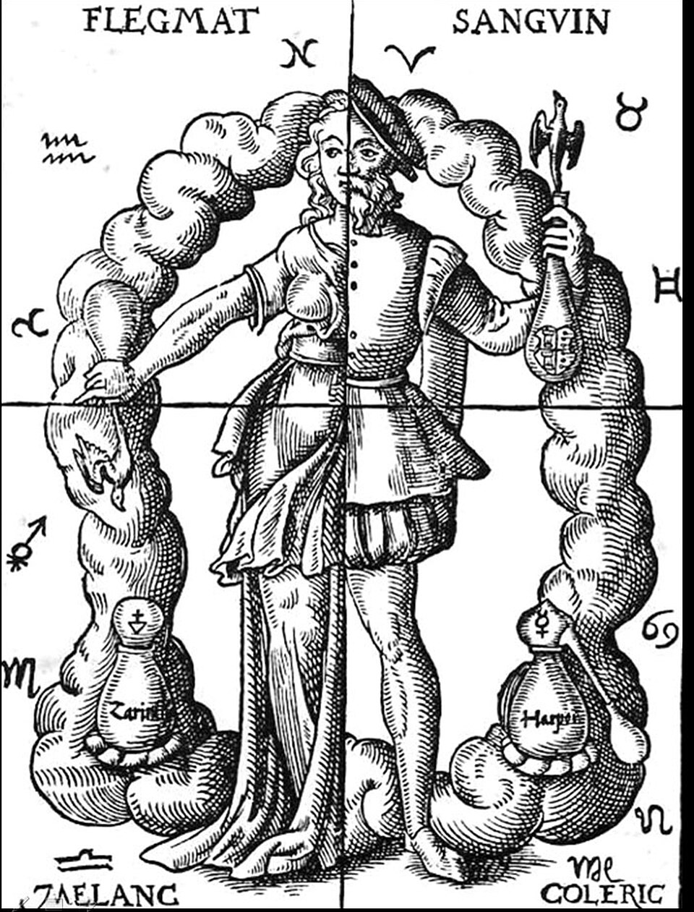

"The body of man has in itself blood, phlegm, yellow bile and black bile," begins the fourth chapter of a short Greek treatise written around 400 BC, "and through these he feels pain or enjoys health." The treatise is **[On the Nature of Man](kloom:e/on-the-nature-of-man)**, one of the sixty or so works gathered under the name of **[Hippocrates](kloom:e/hippocrates)** of [Kos](kloom:e/kos) in the **[Hippocratic Corpus](kloom:e/hippocratic-corpus)**. [Aristotle](kloom:e/aristotle), in his _History of Animals_, credited part of it to **[Polybus](kloom:e/polybus-physician)**, Hippocrates' pupil and son-in-law. Its authorship is still argued over, but its idea outlived every argument about it. For two thousand years, educated people in Europe and the Islamic world thought of blood as one of four juices, the **[humours](kloom:e/humorism)**, and of health as their balance.

## Four juices in proportion

The Greek word was _chymos_, a juice or sap, which Latin made _humor_. The treatise says a man "enjoys the most perfect health when these elements are duly proportioned to one another in respect of compounding, power and bulk, and when they are perfectly mingled". Pain comes when one of them is too little or too much, or is separated off in one place and not mixed with the rest.

Each humour had a pair of qualities, and so a season. Blood was hot and wet, and ruled the spring; yellow bile was hot and dry, the summer; black bile cold and dry, the autumn; phlegm cold and wet, the winter. The plate draws that square. The treatise ties each humour to its season with evidence of a kind: nosebleeds and dysentery come in spring and summer, "and they are then hottest and red"; bile is vomited without an emetic in summer and autumn; phlegm grows with "the abundance of rain and the length of the nights".

## The author's test

The treatise was written against rival physicians who said a person was made of one thing only, whether blood or bile or phlegm. Its author argued that the four were really four, and he argued from what a physician could do and see. First, they look and feel different: their colours are unlike, and they are not equally warm or cold, dry or moist, to the touch. Then he turned to the clinic. Give a man a drug that "withdraws phlegm" and he vomits phlegm; one that withdraws bile, and he vomits bile; wound him, and blood flows, on any day or night of the year. Last came a test spread across a year:

| Season | What the same drug brings up | The humour then strongest |
| ------ | ---------------------------- | ------------------------- |
| Winter | the most phlegmatic matter   | phlegm                    |
| Spring | the moistest                 | blood                     |
| Summer | the most bilious             | yellow bile               |
| Autumn | the blackest                 | black bile                |

"The clearest proof," he wrote, is to give the same man the same drug four times in the year. It is a real procedure, repeatable by anyone with a patient and an emetic, which is more than most rival theories offered. The treatise does not say how many patients were tried, or how a physician judged the moistest or the blackest of four lots of vomit.

## What they may have seen

Blood itself may have suggested the number. In 1921 the Swedish physician **[Robin Fåhræus](kloom:e/robin-fahraeus)**, who was then working out the test now called the erythrocyte sedimentation rate, suggested that the four humours came from watching drawn blood stand in a vessel. Left undisturbed for about an hour, blood separates into four layers: a dark clot at the bottom, a red layer of cells above it, a thin whitish layer, and clear yellow serum on top. Black bile, blood, phlegm and yellow bile could be four names for what a bowl of let blood shows. The heights in the plate's glass are a sketch, not a measurement. It is a modern guess, and a plausible one. Not everyone was persuaded the humours were there to see at all. In 1910 the physiologist **[Charles Richet](kloom:e/charles-richet)** asked of phlegm, "Who has ever seen it?", and called two of the four "absolutely imaginary".

## How long it lasted

The theory's treatment followed from its picture. "Diseases due to repletion are cured by evacuation," the treatise says, "and those due to evacuation are cured by repletion." A humour in excess was drawn off by emetics, purges, sweating and bleeding. Bleeding was the most direct of these, because the excess humour was blood or was carried in it. [Galen](kloom:e/galen), six centuries later, wrote a commentary on _On the Nature of Man_ that made it the founding text of Greek medicine, and through him the four humours became the [four temperaments](kloom:e/four-temperaments), sanguine, choleric, melancholic and phlegmatic, which still name kinds of character. The woodcut shows them as [Leonhard Thurneisser's](kloom:e/leonhard-thurneysser) _Quinta Essentia_ pictured them in 1574. [Bloodletting](kloom:e/bloodletting) on humoral grounds was practised into the nineteenth century, and the trail from here, _What we got wrong_, follows it and other beliefs about blood that lasted longer than the evidence for them. The main spine goes on to Galen himself, who gave blood a source, a route and a purpose.
