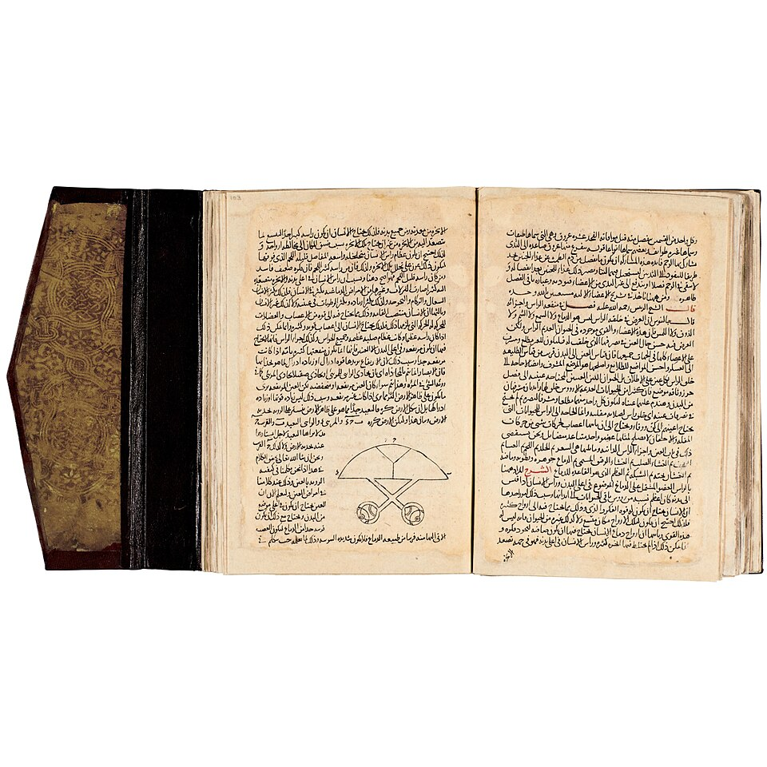

In the 1240s a young physician in [Cairo](kloom:e/cairo) wrote a commentary on the anatomy in **[Avicenna](kloom:e/avicenna)**'s [_Canon of Medicine_](kloom:e/the-canon-of-medicine), the most authoritative medical textbook of its age, and in it he contradicted [Galen](kloom:e/galen) flatly. "There is no passage between these two cavities," he wrote of the heart's ventricles, "for the substance of the heart is solid in this region and has neither a visible passage, as was thought by some persons, nor an invisible one which could have permitted the transmission of blood, as was alleged by Galen." The physician was **[Ibn al-Nafis](kloom:e/ibn-al-nafis)**, and the book was his _Commentary on Anatomy in Avicenna's Canon_. If the wall between the ventricles is solid, the blood of the right side can reach the left only one way: through the lungs.

## A physician of Damascus and Cairo

Ibn al-Nafis was born in or near **[Damascus](kloom:e/damascus)** in 1213 and trained at the city's great hospital, the Bimaristan al-Nuri. At about twenty-three he moved to Cairo, where he worked at the Nasiri Hospital and later became chief physician at the Mansuri. He was twenty-nine, by John West's account, when he wrote the _Commentary_, which puts it around 1242. He wrote on law, theology and philosophy as well as medicine, began a medical encyclopedia planned to run to three hundred volumes, and left it, with his library, to the hospital where he worked. Avicenna, whose _Canon_ he was explaining, had died two centuries before him, and the _Canon_ itself was Galen's physiology organized and extended.

## The argument

The _Commentary_ makes three claims that matter here, set out in the translations Max Meyerhof published in the 1930s.

1. **The septum is solid.** It is thicker than the rest of the heart's wall, Ibn al-Nafis says, precisely to stop blood passing through, and "the contention of some persons to say that this place is porous, is erroneous; it is based on the preconceived idea that the blood from the right ventricle had to pass through this porosity".
2. **The right ventricle's blood goes to the lungs.** It rises through the vessel we call the pulmonary artery, mixes in the lungs with air, and comes back through the pulmonary vein to the left ventricle. "For the penetration of the blood into the left ventricle is from the lung."
3. **There must be passages in the lung** between that artery and that vein, which he called _manafidh_, pores. Nobody saw them for four hundred years.

The plate draws the heart as he described it: a solid, thickened septum, Galen's route through it struck out, and the only way left, up through the lung and down again. It is the route of the [_pulmonary circulation_](kloom:e/pulmonary-circulation), sometimes called the lesser circulation, and it is still drawn this way.

His reasoning ran on both anatomy and argument. Galen's pores were invisible by Galen's own admission, so the question was whether anything required them. Ibn al-Nafis took away the requirement. Blood had a road through the lung, so the pores had no work to do, and a wall made thicker than its neighbors to keep blood out could not also be a sieve to let it in. Whether he dissected human hearts himself is argued. He wrote that his beliefs kept him from dissection, while some modern anatomists who have studied the _Commentary_ conclude that he must have seen hearts, in dissection or in surgery.

The copy shown was made in 1334, about fifty years after his death; its left-hand page carries one of the commentary's small anatomical diagrams.

## Lost and found

For centuries the _Commentary_ was copied and used in the Islamic world, but Europe did not know it. In 1924 an Egyptian doctor, Muhyo al-Deen al-Tatawi, came across a manuscript in the Prussian State Library in Berlin while writing a doctoral thesis at the University of Freiburg. Only five typewritten copies of his thesis were made, and it might have vanished had Meyerhof, a physician and orientalist in Cairo, not read it and published translations.

The obvious question is whether anyone in sixteenth-century Europe had read it. **[Michael Servetus](kloom:e/michael-servetus)** described the passage of blood through the lungs in 1553, in words close to Ibn al-Nafis's, and the Padua anatomist **[Realdo Colombo](kloom:e/realdo-colombo)** described it in 1559. The physician Andrea Alpago studied in Damascus, lived some thirty years in the East, and brought Arabic medicine back to Italy in Latin. West's paper and Wikipedia's article on Ibn al-Nafis say that what Alpago published in 1547 was part of Ibn al-Nafis's commentary on compound drugs, not the anatomy; Wikipedia's article on the _Commentary_ itself says Alpago translated the anatomy. No Latin copy of the anatomy commentary is known, and the question stays open.

The passages in the lung that he reasoned must exist were seen in 1661, by Marcello Malpighi with a microscope. Before that, the next frame shows William Harvey proving, by arithmetic, that the blood goes round the whole body and not only the lungs.
