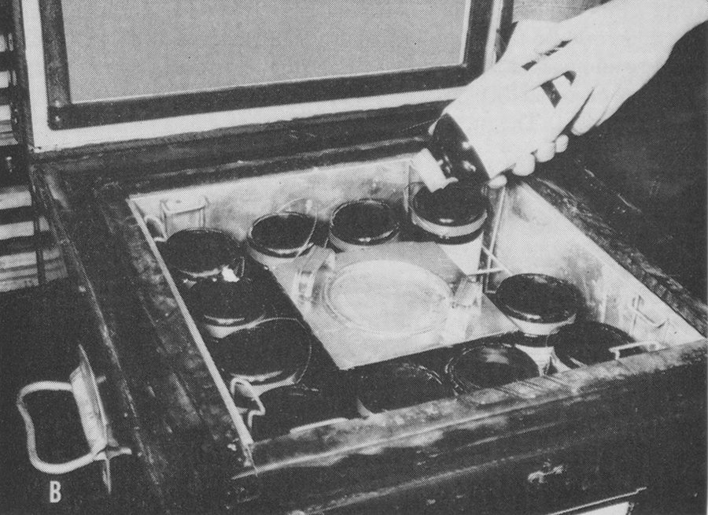

When the **[Korean War](kloom:e/korean-war)** began on 25 June 1950, the American military had no working blood program. The whole-blood service of the Second World War had been shut down in September 1945, and between the wars Army hospitals drew their own blood from their own donor lists. A Defense Department task group had written a plan in March 1950, and the Secretary of Defense had approved it on 5 May, but none of it was yet in place. Douglas Kendrick, who had run the Army's wartime program and chaired the Defense Department's blood group from 1950 to 1952, wrote in his history that casualties in Korea "never lacked the blood they needed," and that this was done again by improvisation.

## Japan first

The first blood came from Japan. Within days a blood bank was formed from the 406th Medical General Laboratory in Tokyo, with an advance depot at Fukuoka, and on the night of 7 July 1950 it sent 69 bottles to the 8054th Evacuation Hospital at Pusan. Its donors were non-combatant soldiers, sailors and airmen, Allied personnel, civilian employees and adult dependents, and they could give at most about 100 pints a day. From the end of 1950 the bank also took Japanese donors, with nurses and volunteers from the **[Japanese Red Cross Society](kloom:e/japanese-red-cross-society)**. Japanese practice was to take no more than 200 mL from a donor, so the bank worked out a table of the most it could take for each pound of body weight. In fiscal 1951 it bled more than 39,000 pints. Few were Rh-negative: 19 of the first 2,784.

## The airlift from Travis

On 15 August 1950 the Far East Command asked for blood from home. The **[American Red Cross](kloom:e/american-red-cross)**, which by then ran a civilian blood program, became the Defense Department's collecting agency, and blood went to a processing laboratory staffed by all three services, first at the naval hospital in Oakland and from 25 September at **[Travis Air Force Base](kloom:e/travis-air-force-base)** in California, from where the **[Military Air Transport Service](kloom:e/military-air-transport-service)** flew it to Tokyo. Its routine, from Kendrick's account:

| Step    | What was done                                                                                                                                             |
| ------- | --------------------------------------------------------------------------------------------------------------------------------------------------------- |
| Collect | group O donors only, about 45 percent of all comers; 500 mL into ACD solution in a sterile bottle, with pilot tubes for testing                           |
| Check   | two technicians typed each unit separately; errors stayed under 0.5 percent                                                                               |
| Ship in | chilled to 4–6 °C and sent in insulated cases with wet ice, usually arriving within 48 hours                                                              |
| Retest  | the pilot tube regrouped, Rh-typed and titered again at Travis                                                                                            |
| Label   | anti-A or anti-B titer above 1:256: "High Titer Group 'O' Blood — For Group 'O' Recipient Only"; below it, "Low Titer"; expiry 22 days, for the date line |
| Inspect | held 8 to 12 hours, when demand allowed, and looked at for hemolysis, clots and fat                                                                       |
| Fly     | by air, by way of Honolulu and Wake Island to Tokyo, re-iced on the way                                                                                   |

Group O blood went to Korea, mostly without a crossmatch, so the retyping at Travis served as a partial crossmatch; it caught 144 units that were not group O. Rh-negative blood was kept for the fixed hospitals in Japan. About a quarter of group O donors had titers above 1:64, and the trail's frame on low-titer O whole blood explains what a titer measures.

From October 1951 most blood flew in a plywood trunk made by the Hollinger company: two inches of Styrofoam, two racks of twelve 500-mL bottles stood upside down so the cells settled in the top, and about 20 pounds of wet ice in a central can. Some of the 1,500 trunks made twelve round trips. In Korea blood was flown to depots behind the front and carried forward by helicopter, which brought a casualty back on the return trip.

Between 26 August 1950 and 13 February 1954 the Travis laboratory received 397,711 pints and shipped 340,427 of them, about 85 percent, to Japan for Korea. Most of the rest went to [Cutter Laboratories](kloom:e/cutter-laboratories) to be fractionated, so little was wasted. The busiest day handled 1,881 pints; the average was 319 a day. Each pint cost about $17.83 to collect, test and fly.

## What the war taught

In Korea, blood was handled through ordinary medical supply channels, which Kendrick's history calls a mistake. A survey of October 1952 by Lieutenant Colonel Arthur Steer found that depots and hospitals together held 7.87 times the blood they used on an average day. The surplus aged on the shelves and was passed to South Korean units at an average age of 16.1 days, and no single officer had the authority to move blood from a quiet sector to a busy one. Steer's chief recommendation was a medical officer in the theater responsible for blood and nothing else.

The war also tried the plastic bag. Kendrick writes that bags were never formally used in the Korean blood program, because the Red Cross objected. An Army surgical research team reports that in the war's last eighteen months 250 units of blood came to Korea in Fenwal plastic bags with 75 mL of ACD, and about 200 were transfused. They did not break, but they could not be squeezed fast enough when eight or ten men needed blood under pressure at once, as about 30 percent of transfusions in a forward surgical hospital did. The alternative, pumping air into a glass bottle, killed at least four casualties by air embolism in the war's last year. The bag's later story belongs to the frame on the plastic blood bag. Meanwhile the Armed Forces Blood Donor Program, launched in September 1951, began collecting blood on military bases, the seed of the next frame.
