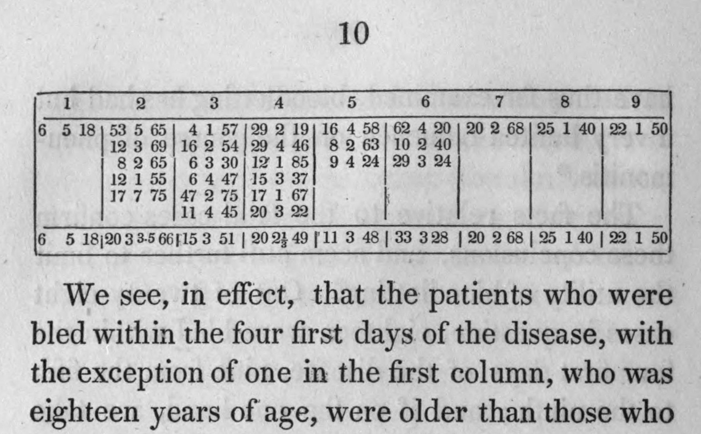

In [Paris](kloom:e/paris) in the 1820s the most fashionable doctrine in medicine was **[François Broussais](kloom:e/francois-joseph-victor-broussais)**'s: fevers were inflammations of the organs, and the cure was to draw blood, often by covering the inflamed part with leeches. France imported 42 million leeches in 1833 alone. At the hospital of La Charité, a physician who had given up a private practice in Russia to spend nearly seven years observing patients asked a plain question of it. If bleeding cures inflammation, then patients bled early in an illness should do better than those bled late. **[Pierre-Charles-Alexandre Louis](kloom:e/pierre-charles-alexandre-louis)** went through his case notes and counted.

He published the result in the _Archives générales de médecine_ in 1828, and in 1835 a revised book, _Recherches sur les effets de la saignée_, translated in Boston the next year. "The results of my researches", it begins, "are so little in accordance with the general opinion, that it is not without a degree of hesitation I have decided to publish them."

## Seventy-eight cases of pneumonia

Louis took every case of **[pneumonia](kloom:e/pneumonia)** he had followed at La Charité in people who had been in perfect health when it began: 78, of whom 28 died. He set aside 45 others in people already ill with a chest complaint, so that like would be compared with like. For each he fixed the day the illness began, by the onset of fever with pain in the side and rusty sputum, and the day of the first bleeding. Ten to fifteen ounces were taken each time. The page shows his table of the deaths, with each patient's days of illness, number of bleedings and age. Gathered by the day of the first bleeding, his two tables give:

| Day of first bleeding | Recovered |   Died | Patients |
| --------------------- | --------: | -----: | -------: |
| 1                     |         3 |      1 |        4 |
| 2                     |         3 |      5 |        8 |
| 3                     |         6 |      6 |       12 |
| 4                     |        11 |      6 |       17 |
| 5                     |         6 |      3 |        9 |
| 6                     |         5 |      3 |        8 |
| 7                     |         6 |      1 |        7 |
| 8                     |         6 |      1 |        7 |
| 9                     |         4 |      1 |        5 |
| **Days 1–4**          |    **23** | **18** |   **41** |
| **Days 5–9**          |    **27** |  **9** |   **36** |

Of those bled in the first four days, 18 of 41 died, "about three sevenths"; of those bled later, 9 of 36, "only one fourth". Louis called it "a startling and apparently absurd result". By our arithmetic the death rates are 44 and 25 percent, and the groups hold 77 patients: one of the 28 deaths is in neither table. Among those who recovered, early bleeding shortened the illness by about three days, 17 days against 20.

## Reading his own numbers

Louis did not conclude that early bleeding killed. He looked for differences between his groups, and found one: the fatal cases bled early were older, by 51 years against 43 on average, and "the number of patients bled on the first day, who had passed the age of fifty, was nearly twice as great". That, he wrote, "must have had great influence on the mortality." Weighing everything, he concluded that bleeding had "very little influence" on pneumonia, and that a disease could not be cut short by it "as is too often fondly imagined". He did not abandon it: it "should not be neglected" in severe inflammations, and he even proposed trying a first bleeding large enough to cause fainting. Wikipedia's article on bloodletting says he showed it "entirely ineffective"; his own book says limited.

His defense of counting is the part that lasted. Opponents said no two patients were alike. Louis answered that if five hundred patients "taken indiscriminately" were given one treatment and five hundred another, the unavoidable errors would fall alike on both groups and "mutually compensate each other". "Indeed I should like to know," he wrote, "how we should proceed to satisfy ourselves on this point without counting."

## What the numbers could not show

His groups were small, and they were not made by chance. A patient's day of first bleeding depended on when he came to hospital, and Louis himself noted that the poor, "whether it be from indifference, or dislike to hospitals", seldom came until late. In 1840 **[Jules Gavarret](kloom:e/louis-denis-jules-gavarret)**, who had learned probability from **[Siméon Denis Poisson](kloom:e/simeon-denis-poisson)**, applied Poisson's **[law of large numbers](kloom:e/law-of-large-numbers)** to Louis's figures. For 140 cases of typhoid with a death rate of 37 percent, he showed that the true rate could lie anywhere from about 26 to 49. Applying Gavarret's rule to the pneumonia groups, by our arithmetic, gives about 22 to 66 percent for the early group and 5 to 45 for the late: the ranges overlap widely. The epidemiologist Alfredo Morabia, re-analyzing the data, found the early group did worse, with _p_ = 0.07, which makes a benefit from early bleeding very unlikely without proving harm. The fair test Louis's argument needed, groups formed by chance, did not become usual in medicine until the second half of the twentieth century.

Bloodletting declined slowly through the century. In Edinburgh it was given up in practice before anyone disproved it, and it was still recommended in a 1923 edition of William Osler's textbook. It survives, as therapeutic phlebotomy, for a few conditions such as hemochromatosis and polycythemia. The trail goes on to the twentieth century, when blood groups gave "blood" something to measure, and race science seized on it.
