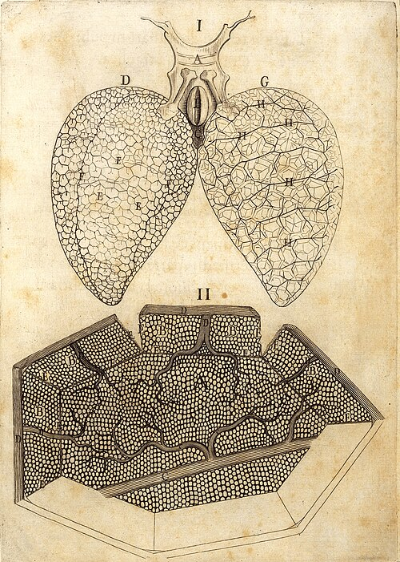

**[Marcello Malpighi](kloom:e/marcello-malpighi)** was born near Bologna in March 1628, the year [Harvey's](kloom:e/william-harvey) book appeared, and in 1661 he finished its argument. He was then a professor of medicine at the **[University of Bologna](kloom:e/university-of-bologna)**, after three years at Pisa, where he had become a friend of the mathematician and physiologist **[Giovanni Alfonso Borelli](kloom:e/giovanni-alfonso-borelli)**. That year a Bologna printer, Giovanni Battista Ferroni, published two letters Malpighi had written to Borelli about the lungs, _De pulmonibus observationes anatomicae_. The second says how he saw the vessels that carry the blood from the smallest arteries to the smallest veins, which Harvey had needed and never seen. We call them **[capillaries](kloom:e/capillary)**. The quotations here are our own translations of the Latin of 1661.

## A lung of little bladders

The first letter overturned the old picture of the lung as solid flesh. Malpighi found it made of countless thin, membranous bladders opening off the branches of the windpipe, the air sacs we call **[alveoli](kloom:e/pulmonary-alveolus)**, with the branches of the vessels laid among them. How the blood got from the artery to the vein he could not settle. In the lung of a dog he forced black water, ink, into the pulmonary artery with a syringe. It sweated out of the lung's surface, pooled between the bladders, came out of the pulmonary vein mixed with blood, and even foamed up out of the windpipe. Quicksilver did much the same. Fluid forced in that way makes roads of its own, he wrote, so the question "still torments my mind".

## The frog

So he turned to frogs, whose lungs are simple, thin and nearly transparent, and in pursuit of the answer, he told Borelli, "I have destroyed almost the whole race of frogs". With his colleague Carlo Fracassati he cut a frog's belly open lengthwise. The lungs sprang out, still filled with air, and under the microscope, while the heart still beat, he could see the blood running in opposite directions in the vessels, so that "the circulation of the blood is clearly revealed". He could follow the blood only so far in the living animal. Past that point he had supposed that it poured out into open spaces and was gathered up again.

A dried lung changed his mind. In one that had kept the red of its blood in the smallest vessels, under "a more perfect glass", he saw no longer a speckled skin but tiny vessels joined in rings, branching from the vein on one side and the artery on the other until no order of vessels could be told apart, only "a network made of the continuations of the two vessels". From that, he wrote, it was plain to the senses "that the blood flows away divided through winding vessels, and is not poured into spaces, but is always driven through tubules". He saw the same joining of vessels, with the blood moving fast through it, in the swollen bladder of a frog, and in the lung of a tortoise.

He told Borelli how to see it for himself:

| Step | What to do                                                                                                                      |
| ---- | ------------------------------------------------------------------------------------------------------------------------------- |
| 1    | Cut the frog open and let the lung swell out, full of blood                                                                     |
| 2    | Tie it with a thread where it joins the heart, so that the blood stays in its vessels                                           |
| 3    | Let it dry: the vessels stay filled and red                                                                                     |
| 4    | Hold it against the low sun and look through a single-lens microscope, a "flea glass"                                           |
| 5    | Or lay it on a plate of crystal, light it from below with a lamp shining up a tube, and look through a microscope of two lenses |

Tying the lung before it dried kept its vessels full, and the light from behind showed the thin, filled vessels against the clear walls of the air sacs. Malpighi also noticed that with the heart and its auricle tied off, the blood still crept along the veins towards the heart for hours.

## The circuit closed

The network joined Harvey's two systems, so that the blood never needed to leave its vessels. It was also, four centuries late, the thing **[Ibn al-Nafis](kloom:e/ibn-al-nafis)** had reasoned must exist in the lung when he made the wall of the heart solid: passages between the pulmonary artery and the pulmonary vein. Europe would not read his _Commentary_ until the twentieth century. Harvey, who had died four years before, had left the question open between joined vessels and pores in the flesh. Malpighi had seen the vessels.

His microscopes, and his letters, made him one of the founders of microscopic anatomy. In the late 1660s Henry Oldenburg, the secretary of the **[Royal Society](kloom:e/royal-society)** in London, invited him to correspond, and the Society later printed his books on the anatomy of plants. By then a draper in Delft had begun to look at blood with lenses of his own, and saw what it was made of.
