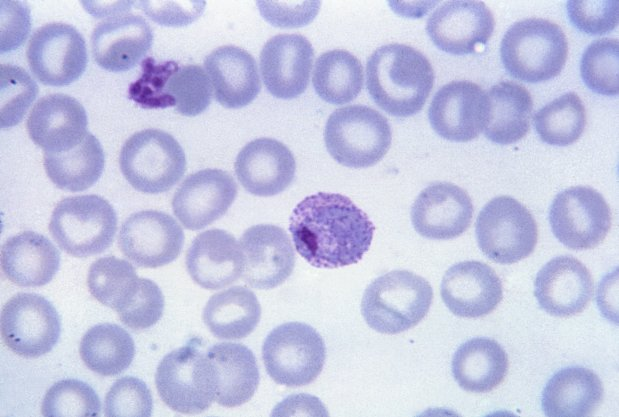

In 1945 Robin Coombs, Arthur Mourant and Rob Race published a way to see antibodies that coat red cells without clumping them: wash the cells, then add a serum raised against human globulin, which bridges the coated cells and makes them clump. The **[Coombs test](kloom:e/coombs-test)** was made to find weak Rh antibodies, but within six years it had turned up three new blood group systems. Each was named after the patient whose serum held its antibody.

## Three patients

The first was a mother, Mrs Kelleher, whose baby had hemolytic disease of the newborn. Her serum held an antibody to an antigen her baby's red cells carried and hers lacked, and Coombs, Mourant and Race reported it early in 1946. (Wikipedia dates the finding to 1945.) The **[Kell antigen system](kloom:e/kell-antigen-system)** it opened is, after ABO and Rh, the most likely to provoke an antibody, and anti-K does particular harm in pregnancy: it attacks the fetus's red-cell precursors as well as its red cells, so the fetus stops making blood as well as losing it.

The second was R. D., a man of 43 with **[hemophilia](kloom:e/haemophilia)**, admitted to hospital in July 1949; Marie Cutbush and Patrick Mollison of the Medical Research Council's transfusion unit set down what happened. He was group O, Rh negative. Three donors' cells, each in 20 per cent albumin with an equal volume of his serum, stood at 37 °C for an hour and showed under the microscope not "a trace of agglutination". He was given all three bloods, had a rigor during the transfusion, and was jaundiced the next day. By the indirect Coombs test, his serum reacted with the first and third donors' cells. The third donor's cells could be followed, because they were type N and his own type MN: 48 hours later only about 60,000 of them were left in each cubic millimeter of his blood, against about 400,000 expected. By our arithmetic, some 85 per cent had been destroyed. The antibody showed only by 30 minutes at 37 °C, three saline washes and antiglobulin serum. Its antigen, on 133 of 205 English adults' cells, was named for him: the **[Duffy antigen system](kloom:e/duffy-antigen-system)**, Fy*a*.

The third was Mrs Kidd of Boston, who had had five pregnancies and no transfusions. On 17 April 1950 she gave birth to a boy with erythroblastosis fetalis, whose cells gave a positive direct Coombs test, and Fred Allen, Louis Diamond and Bevely Niedziela found in her serum the antibody that defined the **[Kidd antigen system](kloom:e/kidd-antigen-system)**, Jk*a*.

## Reading a panel

Antibodies like these are why every patient who may need blood is screened: the plasma is tested against two or three group O reagent cells (group O, so that its own anti-A and anti-B cannot react) at 37 °C and then by the indirect antiglobulin test. A positive screen sends it to a panel of ten or eleven cells whose antigens are printed on a sheet, the antigram, with the patient's own cells as a control. A short panel, its results invented:

| Cell | D   | C   | E   | c   | e   | K   | k   | Fy*a* | Fy*b* | Jk*a* | Jk*b* | Antiglobulin phase |
| ---- | --- | --- | --- | --- | --- | --- | --- | ----- | ----- | ----- | ----- | ------------------ |
| 1    | +   | +   | 0   | 0   | +   | 0   | +   | +     | 0     | +     | 0     | 2+                 |
| 2    | +   | +   | 0   | +   | +   | 0   | +   | 0     | +     | 0     | +     | 0                  |
| 3    | +   | 0   | +   | +   | 0   | 0   | +   | +     | +     | +     | 0     | 2+                 |
| 4    | 0   | 0   | 0   | +   | +   | +   | +   | 0     | +     | +     | +     | weak               |
| 5    | 0   | 0   | 0   | +   | +   | 0   | +   | +     | 0     | 0     | +     | 0                  |
| 6    | 0   | 0   | 0   | +   | +   | 0   | +   | 0     | +     | +     | 0     | 2+                 |
| 7    | +   | +   | 0   | 0   | +   | 0   | +   | +     | +     | 0     | +     | 0                  |
| 8    | 0   | 0   | 0   | +   | +   | 0   | +   | +     | 0     | +     | +     | weak               |
| Auto |     |     |     |     |     |     |     |       |       |       |       | 0                  |

The reasoning is by exclusion: on each cell that did not react, cross out the antigens it carries, since an antibody to them would have reacted. For Rh antigens other than D, and for Duffy, Kidd and MNS, cross out only on a cell carrying a double dose, from both parents: antibodies to these can react so weakly with a single dose that they are missed. Cells 2, 5 and 7 leave E, K and Jk*a* standing. Only anti-Jk*a* explains cells 1 and 6, which carry neither E nor K. Every Jk*a*-positive cell reacted, every Jk*a*-negative one did not, and the two carrying a single dose reacted weakly: the Kidd antibodies' dosage effect. The usual rule asks for at least three positive cells that react and three negative cells that do not, which, as a teaching guide from the University of Utah puts it, gives a P value of 0.05. E and K must still be excluded with cells that carry them and lack Jk*a*, and the units given must be Jk*a*-negative and compatible by the antiglobulin crossmatch.

Kidd antibodies are feared because they can fall below detection within months of the transfusion or pregnancy that made them, and a later transfusion then brings them back within days, up to a week after it, destroying the donor's cells in a delayed hemolytic reaction.

## A gene and a parasite

In 1968 R. P. Donahue and three colleagues, among them the Johns Hopkins geneticist **[Victor A. McKusick](kloom:e/victor-a-mckusick)**, followed an unusual-looking chromosome 1 through a family alongside its Duffy types and found that the two were inherited together, a "probable assignment" in their title's words. Duffy is usually counted as the first human gene placed on a particular autosome, a chromosome other than X or Y; Wikipedia's article says, more narrowly, the first blood group gene to be placed. In 1975 Louis Miller and colleagues found that Duffy-negative red cells resist a monkey malaria parasite in the dish. In 1976 they typed 17 volunteers bitten by mosquitoes carrying **[_Plasmodium vivax_](kloom:e/plasmodium-vivax)**, the parasite shown; only the five who were Duffy negative, all Black, escaped infection. The parasite enters the red cell through the Duffy protein, and Duffy-negative blood is common in West Africa, where vivax malaria is rare.

The next frame is a blood that typed as O and was not.
