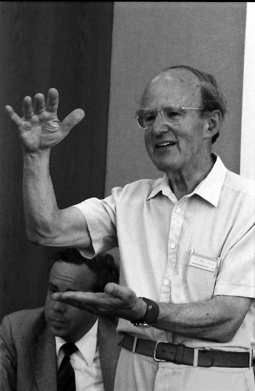

In 1937 a young chemist from Vienna began taking X-ray photographs of crystals of horse **[hemoglobin](kloom:e/hemoglobin)** in Cambridge. It took twenty-two years before he could see the molecule at all, and he spent the rest of his life finding out how it works. He was **[Max Perutz](kloom:e/max-perutz)**, and his model of 1959 was, with John Kendrew's myoglobin, one of the first two proteins whose shape anyone had seen.

He is shown here in 1986, at seventy-two, speaking at the opening of a meeting of chemists.

## The phase problem

Perutz came to the **[Cavendish Laboratory](kloom:e/cavendish-laboratory)** as a research student of J. D. Bernal, who had just shown with Dorothy Hodgkin that protein crystals can give sharp X-ray patterns. **[Lawrence Bragg](kloom:e/lawrence-bragg)**, who soon became Cavendish Professor, was fired by Perutz's pictures of hemoglobin, encouraged the application that won a Rockefeller Foundation grant in 1939, and backed him for decades. The war interrupted the work: Perutz, born an Austrian, was interned as an enemy alien and shipped across the Atlantic for some months.

The method was **[X-ray crystallography](kloom:e/x-ray-crystallography)**. A small crystal, mounted wet in a glass capillary about a millimeter wide, is turned in a narrow beam of X-rays, and a film behind it records a lattice of spots. Each spot is one wave scattered by the whole molecule, and its strength can be measured. Add all the waves together and the image of the molecule appears. But, as Perutz explained in his Nobel lecture, each wave must also be set at the right point in its cycle, its _phase_, and the film records only the strength. "Half the information needed for production of the image is missing." Hemoglobin has some 10,000 atoms.

## Mercury on the molecule

The answer, which Perutz found in 1953, is **[isomorphous replacement](kloom:e/isomorphous-replacement)**: change the crystal by one heavy atom and see what moves. In the paper he published with David Green and **[Vernon Ingram](kloom:e/vernon-ingram)** the next year, it went like this:

| Step              | What they did                                                                                |
| ----------------- | -------------------------------------------------------------------------------------------- |
| Find a handle     | horse hemoglobin carries free sulphydryl (SH) groups, which bind mercury                     |
| Label it          | combine it with _para_-mercuribenzoate, or with silver ions, on two of its four SH groups    |
| Grow the crystals | the labeled protein crystallizes in exactly the same lattice as the plain one: _isomorphous_ |
| Compare           | photograph both; many spots change in strength, though the protein is the same               |
| Place the metal   | from those changes, work out where the two heavy atoms sit                                   |
| Read the phase    | with the heavy atom as a known origin, each spot's change says which way its wave points     |

In the flat projection they measured first, each phase could only be plus or minus, and the mercury and silver crystals between them settled the sign of 87 of the 94 spots. In three dimensions a phase can take any value, and one heavy atom leaves two answers for each spot; a second, at another site, picks between them. The plate draws that choice for one spot, the circles crossing at the right phase. The horse oxyhemoglobin of 1959 used six heavy-atom crystals, the strengths of tens of thousands of spots, and the computers of the day: Perutz said that "the development of computers has always just kept in step with the expanding needs of our X-ray analyses". Ingram, who prepared the first heavy-atom crystals, went on to find the one changed amino acid of sickle cell hemoglobin.

## Four chains and four hemes

The map of 1959, at 5.5 ångströms, was too blurred to show single amino acids, but it showed the folds. Hemoglobin is four chains, alike in pairs, now called α and β. Each is folded much like Kendrew's myoglobin and holds one heme, a flat ring with an iron atom at its center that binds one molecule of oxygen. The four chains fit together in a compact, nearly spherical molecule of molecular weight 64,500.

It raised a question at once. Hemoglobin's four irons help each other: when one takes up oxygen, the others take it up more readily, which is why the blood loads fully in the lungs and unloads in the tissues. Yet the map put the four hemes far apart, in separate pockets on the surface. "The wide distances separating the haem groups was perhaps the greatest surprise," Perutz said. The first clue came in 1962, from comparing reduced human hemoglobin, without oxygen, with oxygenated horse hemoglobin: the two β chains had moved apart by more than 7 Å. "Please forgive me for presenting, on such a great occasion, results which are still in the making," he said in Stockholm. By 1970, from maps fine enough to show each amino acid, he could describe the molecule as a machine that switches between two shapes as it gains and loses oxygen. The same shapes explained the sickle molecule: it is normal while it carries oxygen and sticks to its neighbors when it lets go.

## The prize and the laboratory

Perutz and Kendrew shared the Nobel Prize in Chemistry in 1962. The unit the Medical Research Council had given him in 1947, to study the molecules of living things, became the **[MRC Laboratory of Molecular Biology](kloom:e/mrc-laboratory-of-molecular-biology)**, which he founded in 1962 and chaired until 1979. The main spine now turns from what blood is to what we did with it, beginning with the first attempts to put it into someone else.
