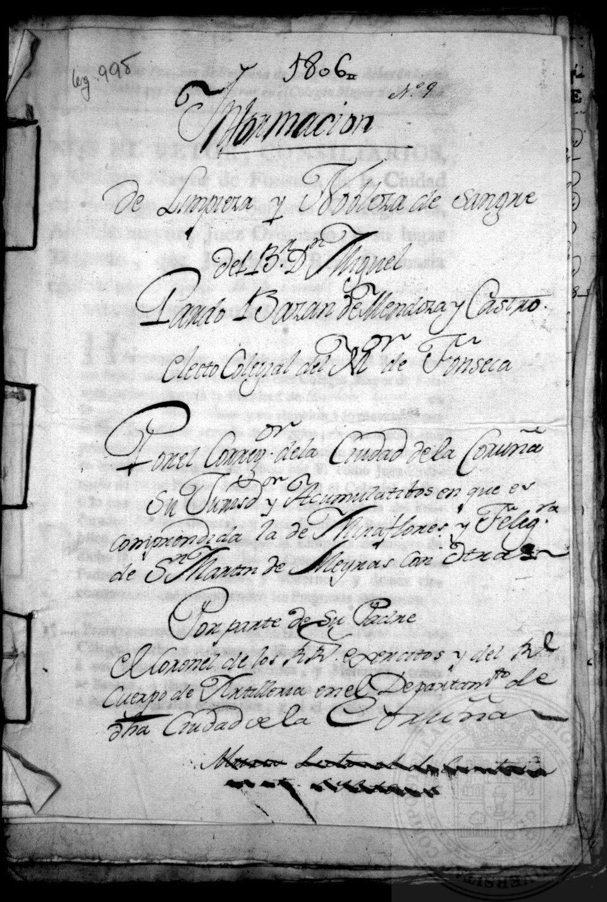

On 5 June 1449, in the council house of **[Toledo](kloom:e/toledo-spain)**, the king's governor of the city, Pedro Sarmiento, and the city's commune pronounced a sentence against their neighbors. It declared that **[conversos](kloom:e/converso)** "of the lineage of the Jews", Christians whose families had converted from Judaism, were suspect in the faith and could hold "neither public nor private offices" through which they might harm "the clean Old Christians", nor bear witness against them. It named fourteen men, stripped them of their posts as public notaries on pain of death and the loss of all their goods, and said it would apply to conversos "past, present and to come". The document is known as the _Sentencia-Estatuto_. It began a practice that lasted four hundred years, in which what was in a person's blood was decided by asking the neighbors.

The sentence came out of a riot over money. In January 1449 the king's favorite, Álvaro de Luna, demanded a forced loan of a million maravedís from the city. On the 27th a crowd rang the cathedral bell, burned the house of the tax collector, Alonso Cota, a converso, and sacked the houses of converso merchants. Sarmiento, the governor, took the rioters' side. The statute turned a quarrel over a tax into a rule about descent. The word it uses is still _lindos_, "clean" or "fine"; the scholars Ramón Menéndez Pidal and Antonio Domínguez Ortiz took it as the forerunner of _limpio_, the word that would give the practice its name, **[_limpieza de sangre_](kloom:e/limpieza-de-sangre)**, cleanliness of blood.

## Blood as lineage

Baptism was supposed to make a convert a Christian like any other, and many churchmen said so at once. Alonso de Cartagena, bishop of Burgos and himself the son of a converso, wrote a defense of the converts, and the pope, Nicholas V, condemned the exclusion. The statute's answer was blood. In the medicine of the day blood was one of the **[humors](kloom:e/humorism)**, and it was thought to carry a parent's qualities to a child; in ordinary speech "blood" meant lineage. A convert's baptism could not reach his blood, and so, his enemies argued, could not reach his descendants. Defending the statute that Toledo's cathedral adopted in the 1550s, the chronicler Prudencio de Sandoval later wrote that a man might descend from Old Christians on three sides, but "a single race infects and damages him".

The idea spread through institutions rather than law. The Colegio de San Bartolomé at Salamanca adopted a statute in 1482, the religious orders followed, Toledo's cathedral chapter voted for one by 24 to 10 in 1547, and the **[Spanish Inquisition](kloom:e/spanish-inquisition)** itself adopted one in 1572. The historian Henry Kamen stresses that the statutes never entered Spain's public law, and held only where an institution adopted them, chiefly the major colleges, some orders and cathedrals, and the military orders. Those were the doors to the church, the state and the nobility. After the forced conversions of Muslims, the bar fell on Moriscos too.

## How a proof was made

A candidate proved his blood with an _información_, a file of testimony. The historian Max Hering Torres follows one case, from the Inquisition's archive, step by step.

| Step        | What happened in the case of Francisco Fernández de Ribera, 1612                                                                                                  |
| ----------- | ----------------------------------------------------------------------------------------------------------------------------------------------------------------- |
| Application | On 11 August he applied to be the Inquisition's notary at Jódar, near Jaén, handed in his genealogy and paid 200 _reales_ for the inquiry                         |
| Inquiry     | Investigators traveled to where his family came from, with a fixed questionnaire of eleven questions                                                              |
| Witnesses   | Each was asked whether the candidate and every ancestor named were "Old Christians, clean, of clean blood, without race or stain", and commonly reputed so        |
| Testimony   | Of the first 26 witnesses, all but two spoke against him: ancestors in "vile" trades, a family house beside a chapel that had been a synagogue, a penitent's robe |
| Verdict     | The investigator found "public voice and fame" called the family conversos; the case was closed on 18 September                                                   |
| Appeal      | He said two hostile witnesses had been refused his daughter's hand, and produced 42 witnesses who called him clean; in 1630 a notary refused to reopen the case   |

Nothing in the procedure touched blood. The evidence was memory, rumor and reputation, and Hering Torres's point is that the same family could be clean to one set of neighbors and stained to another. The file in the picture is a late one, of 1806, from the Colegio de Fonseca at Santiago de Compostela, for a student elected to a place there: its title asks for "cleanliness and nobility of blood". The plate draws the arithmetic of the system: every generation back doubles the ancestors to be vouched for, and one stained one condemns the candidate.

## Blue blood

The same belief left a phrase. English writers began in the early nineteenth century to call noble birth "blue blood", translating the Spanish _sangre azul_, which was said of old families who claimed descent untouched by the Moors; the explanation usually given is that a pale nobleman's veins showed blue through his skin. The blood under a nobleman's skin was as red as a peasant's, and no test, then or since, has found a lineage in it.

The statutes faded slowly. In Portugal the **[Marquis of Pombal](kloom:e/sebastiao-jose-de-carvalho-e-melo-1st-marquis-of-pombal)** abolished the legal difference between Old and New Christians by a law of 25 May 1773 (English Wikipedia gives 1772). Spain abolished the proofs by a royal order of 31 January 1835, kept them for army officers until 1859, and removed the last of them, for public posts, in 1870. The trail goes on to a belief about blood that physicians acted on with the lancet, in George Washington's last illness.
