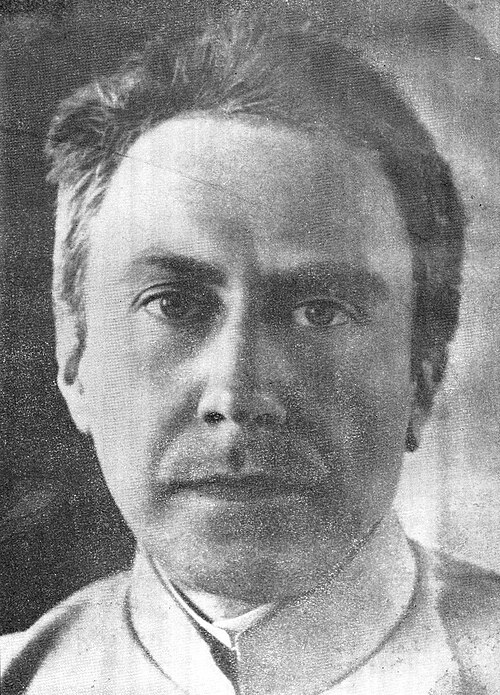
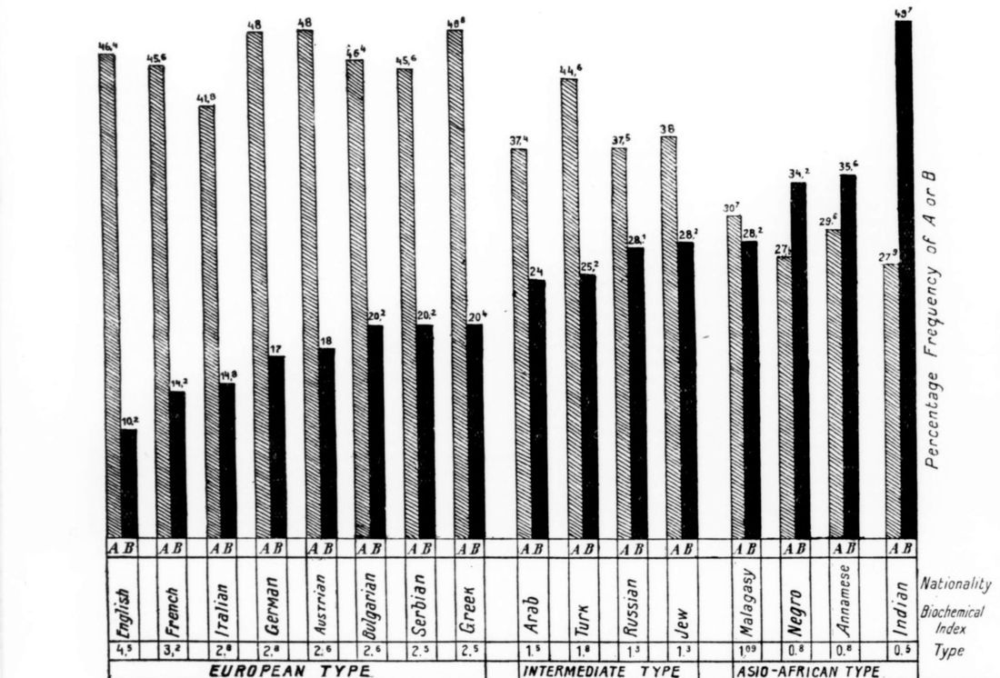

In June 1918, at a meeting of the Salonika Medical Society in northern Greece, two physicians read a paper that turned a test for transfusion into a test of nations. **[Ludwik Hirszfeld](kloom:e/ludwik-hirszfeld)**, a Polish serologist then serving as adviser to the Royal Serbian Army, and his wife **Hanka Hirszfeld**, a physician in its central bacteriological laboratory, had typed the blood of soldiers from every army on the **[Macedonian front](kloom:e/macedonian-front)**, and of some refugees, and found that the four blood groups came in different proportions in different peoples. [_The Lancet_](kloom:e/the-lancet) printed the paper on 18 October 1919 as "Serological Differences between the Blood of Different Races". It was the first study to show that blood-group frequencies differ between populations, and it gave the next twenty years a number to rank them by.

## How they typed a soldier

The method was **[Karl Landsteiner](kloom:e/karl-landsteiner)**'s, which the frame on his ABO groups tells: a person's serum carries antibodies against the A or B property their own red cells lack, so two test sera, one that clumps A cells and one that clumps B cells, sort anyone into four groups. The Hirszfelds wrote out their technique in a paragraph:

| Step | What they did                                                                                                                 |
| ---- | ----------------------------------------------------------------------------------------------------------------------------- |
| 1    | A few drops of blood from the ball of the finger into saline and citrate: 9 parts normal saline to 1 part 2.5% sodium citrate |
| 2    | A drop of that mixture in a small test tube with a drop of each test serum, both checked first against known cells            |
| 3    | Read for clumping after no less than half an hour, "as particularly Group B is but slowly agglutinated"                       |
| 4    | Several sera for each people, but the same set of sera, all from Serbian donors, for every people                             |

Clumping with the anti-A serum alone means group A, with the anti-B alone group B, with both AB, with neither O. The plate draws the four outcomes. The Hirszfelds warned of the error the test invites: weakly reacting cells meeting a weak serum can pass for group O.

## The race index

They examined 500 to 1,000 people of each nation and tabulated sixteen. Two rows were not their own: the German figures were quoted from memory of earlier work, and the Austrian ones were Landsteiner's from Vienna. By our arithmetic the people they typed themselves number 7,900, which matches their "about 8000 cases". Most were soldiers, chosen because unrelated men would not skew a group's frequency; the Jews were Sephardic refugees in Monastir, and 200 of the Greeks were refugees from Asia Minor and Thrace. (A 2013 review calls all 8,000 "prisoners", which the paper does not support.)

| People   | A    | B    | AB  | O    | Number | Index printed | Index, our arithmetic |
| -------- | ---- | ---- | --- | ---- | ------ | ------------- | --------------------- |
| English  | 43.4 | 7.2  | 3.0 | 46.4 | 500    | 4.5           | 4.55                  |
| French   | 42.6 | 11.2 | 3.0 | 43.2 | 500    | 3.2           | 3.21                  |
| Serbs    | 41.8 | 15.6 | 4.6 | 38.0 | 500    | 2.5           | 2.30                  |
| Arabs    | 32.4 | 19.0 | 5.0 | 43.6 | 500    | 1.5           | 1.56                  |
| Russians | 31.2 | 21.8 | 6.3 | 40.7 | 1,000  | 1.3           | 1.33                  |
| Annamese | 22.4 | 28.4 | 7.2 | 42.0 | 500    | 0.8           | 0.83                  |
| Indians  | 19.0 | 41.2 | 8.5 | 31.3 | 1,000  | 0.5           | 0.55                  |

_Seven of the sixteen rows of their Table II, in per cent. The index is theirs; the last column is ours._

Treating AB as A and B meeting by chance, they added it to each: the English carry A in 43.4 + 3.0 = 46.4% and B in 7.2 + 3.0 = 10.2%. "In order to designate these relationships by a number we will call the proportion of A to B the biochemical race-index": 46.4 ÷ 10.2 ≈ 4.5 for the English, 27.5 ÷ 49.7 ≈ 0.55 for the Indians. Our arithmetic agrees with their printed index everywhere but the Balkans, where their table gives about 2.3 and their figure prints 2.5 to 2.6. They called an index of 2.5 or more "European", 1 to 2 "intermediate" and 1 or less "Asio-African", and proposed two "biochemical races", A arising in northern Europe and B in India, mixing where they met.

## Race serology

The idea spread fast. William Schneider counts more than a thousand articles in the 1920s and 1930s reporting the groups of over 1.3 million people. In Germany the anthropologist **[Otto Reche](kloom:e/otto-reche)** and the naval surgeon Paul Steffan founded the German Society for Blood Group Research in 1926, and in 1928 a journal of "racial physiology". The search for "Aryan blood" largely failed on its own terms: the state preferred measuring skulls and noses, and no blood group could identify a Jew. Hirszfeld distanced himself in 1938: "I would like to separate myself from those who link the blood types to the mystique of race." Under German occupation he was dismissed as a "non-Aryan", and in February 1941 he, Hanka and their daughter were forced into the **[Warsaw Ghetto](kloom:e/warsaw-ghetto)**, where he fought typhus and taught medicine in secret. They escaped in 1942 and survived in hiding; their daughter died of tuberculosis.

## Gradients, not races

The Hirszfelds' own table held the answer. Every group appeared in every people, and the index fell smoothly from west to east rather than in steps. When **[Arthur Mourant](kloom:e/arthur-mourant)** gathered the tests of half a million people in 1954, his maps drew frequencies as shaded contours across continents. In 1972 **[Richard Lewontin](kloom:e/richard-lewontin)** apportioned human variation at seventeen genetic markers, blood groups among them: 85.4% lay within populations, 8.3% between populations of one "race", and 6.3% between races. An index describes a crowd, never a soldier: one English soldier in ten carried B. The last frame of this trail, on segregated blood, shows the same mistake made in a blood bank.
