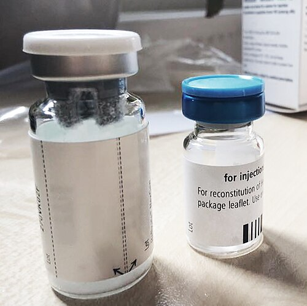

An issue of _Nature_ in November 1984 carried the answer to the pool, though no one could yet take it from a vial. Two companies had each cloned the gene for **[factor VIII](kloom:e/factor-viii)**, the clotting protein missing in **[hemophilia](kloom:e/haemophilia)** A. From **[Genentech](kloom:e/genentech)**, in South San Francisco, Jane Gitschier and her colleagues described the gene itself: 186,000 base pairs, cut into 26 coding pieces, or exons, by stretches of non-coding DNA as long as 32,400 base pairs. William Wood's team there reported clones carrying the protein's complete code, 2,351 amino acids, and had used them to make active factor VIII in cultured mammalian cells; it corrected the clotting time of plasma from people with hemophilia. From **[Genetics Institute](kloom:e/genetics-institute)**, in Cambridge, Massachusetts, John Toole and his colleagues reported their own copy and its predicted protein, a single chain of relative molecular mass 267,039. We have read these papers only in their abstracts.

## Made in hamster cells

Factor VIII is a large protein, and it was made in animal cells, which add the sugars and other finishing that human proteins carry; **[Chinese hamster ovary cells](kloom:e/chinese-hamster-ovary-cell)** are prized for doing it much as human cells do. The gene, at 186,000 base pairs, was too large to carry whole, so the clones held a copy of the factor's messenger RNA, the code with its non-coding stretches already removed. The first recombinant factor VIII on the market, Baxter's Recombinate of 1992, came from such hamster cells and drew on Genetics Institute's work. The cells are grown in fermenters, and the factor is purified from the culture and freeze-dried. No donor's plasma goes into the factor, but the first products still used proteins from blood in their making; the first made with no human or animal protein added at any step, Baxter's Advate, came in 2003.

## How it is given

The powder is dissolved in the water from its second vial and injected slowly into a vein over several minutes, at home or in a clinic. The dose is reckoned from a rule of thumb in the World Federation of Hemophilia's guidelines: each international unit (IU) of factor VIII per kilogram of body weight raises the level in the blood by about 2 IU per deciliter, where 100 IU/dL is normal. So the dose in IU is the weight in kilograms, times the rise wanted, times 0.5. A worked example, for an invented patient: a man of 70 kg with severe hemophilia, under 1 IU/dL of his own, has bled into a knee, and the guidelines' higher-dose practice for a joint aims at a peak of 40 to 60 IU/dL.

| Step                              | By our arithmetic                         |
| --------------------------------- | ----------------------------------------- |
| Rise wanted                       | 50 IU/dL                                  |
| Dose                              | 70 kg × 50 × 0.5 = 1,750 IU               |
| Given (two 1,000 IU vials)        | 2,000 IU, so a peak of about 57 IU/dL     |
| Peak checked                      | 15–30 minutes after the infusion          |
| After 12 hours (half-life ≈ 12 h) | about 28 IU/dL                            |
| After 24 hours                    | about 14 IU/dL, and perhaps a second dose |

Prevention works the same way. Infusions of 25 to 40 IU/kg three or four times a week try to keep the level from falling under 1 IU/dL between doses, the line between severe and moderate disease. The plate draws three such doses a week on a log scale, the falls straight lines at a half-life of twelve hours. The long weekend gap dips below the line.

## What followed

About a fifth to a third of people with severe hemophilia A make antibodies, _inhibitors_, that destroy infused factor. For them, and then for others, **[emicizumab](kloom:e/emicizumab)** (Hemlibra) changed the arithmetic. It is not factor VIII but an antibody with two different arms, one holding activated factor IX and the other factor X, bringing them together as factor VIII would. It is injected under the skin, weekly or less often, with a half-life of about four weeks. In the HAVEN 1 trial of 109 men with inhibitors, the bleeding rate was 2.9 a year with it against 23.3 without prophylaxis, 87 per cent lower; the US Food and Drug Administration approved it in November 2017 for people with inhibitors and in October 2018 for everyone with hemophilia A. Factor VIII built to last longer followed, among them efanesoctocog alfa, approved in 2023 for weekly use, and so did drugs that block or lower the body's own anticoagulants (concizumab and marstacimab in 2024, fitusiran in 2025).

Gene therapy tried to remove the need for any of it. **[Valoctocogene roxaparvovec](kloom:e/valoctocogene-roxaparvovec)** (Roctavian), a modified virus (AAV5) carrying a factor VIII gene, given in one infusion, was approved in Europe in August 2022 and in the United States in June 2023. As of October 2026 it is gone: in February 2026 its maker, BioMarin, withdrew it from the market after failing to find a buyer, saying the decision had nothing to do with its safety or efficacy. The trail began with a family's inheritance and a queen; it ends with a factor made by hamster cells, an antibody that stands in for it, and a gene therapy that worked and did not sell. Its anchor, Judith Pool's cold precipitate, is where the factor was first caught in a bag.
