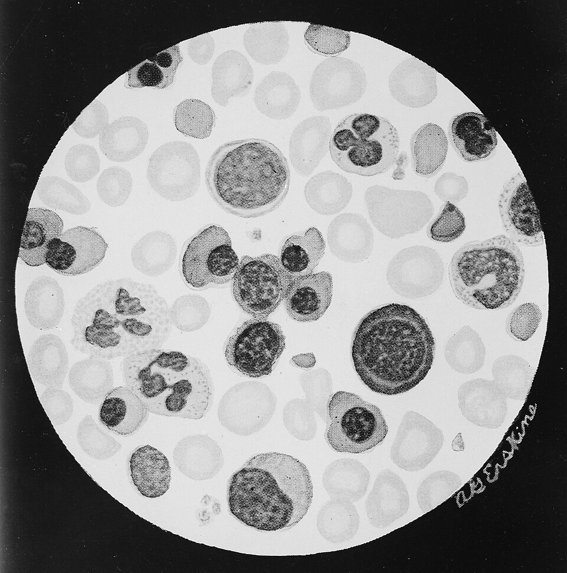

In July 1939 **[Philip Levine](kloom:e/philip-levine-physician)**, a serologist at the Newark Beth Israel Hospital in New Jersey, and Rufus Stetson reported "an unusual case of intra-group agglutination" in the _Journal of the American Medical Association_. A woman had given birth to a stillborn child and was given a transfusion of her husband's blood, which matched hers in the ABO groups. She had a severe reaction to it. Her serum clumped her husband's red cells, and those of about 80 per cent of donors who matched her by every group then known. She had never been transfused before. Levine and Stetson suggested that she had been immunized during the pregnancy by something in the baby's blood that the baby had inherited from its father, and that her antibody had then met the same thing in her husband's blood. They gave it no name.

## A serum from monkey blood

The name came from **[Karl Landsteiner](kloom:e/karl-landsteiner)**, discoverer of the ABO groups, now at the Rockefeller Institute in New York, and **[Alexander Wiener](kloom:e/alexander-s-wiener)**, a New York serologist. Looking for new blood groups, they injected rabbits with the red cells of the **[rhesus macaque](kloom:e/rhesus-macaque)** and found that the rabbits' serum, once stripped of its other antibodies, clumped the cells of about 85 per cent of the white people they tested. Their short note appeared in 1940 (Wikipedia's articles date the discovery to 1937 and 1939), and they called the property **[Rh](kloom:e/rh-blood-group-system)**, "to indicate that rhesus blood had been used for the production of the serum". Wiener and a colleague then found the matching antibody in patients who had reacted badly to repeated transfusions of correctly grouped blood. The Rh factor was the missing explanation for transfusion reactions that ABO matching could not prevent.

Rabbit sera proved weak and hard to make again, so for their 1941 paper in the _Journal of Experimental Medicine_ Landsteiner and Wiener turned to guinea pigs, and set the method out step by step:

| Step   | Landsteiner and Wiener, 1941                                                                                                                                                                                                                                   |
| ------ | -------------------------------------------------------------------------------------------------------------------------------------------------------------------------------------------------------------------------------------------------------------- |
| Raise  | Inject large guinea pigs into the abdomen with washed rhesus red cells, the equivalent of 1 cc (later 2 cc) of whole blood; repeat after 5 days; bleed a week later                                                                                            |
| Choose | Make serial dilutions by halves and test each against known positive and negative cells; keep a serum that separates them over three or more dilutions; one or more of ten animals usually did                                                                 |
| Dilute | Use the serum at about 1 in 10, first absorbing any anti-A or anti-B with a little A and B blood                                                                                                                                                               |
| Test   | Two drops (0.1 cc) of diluted serum and one drop of a 2 per cent suspension of washed cells, in a tube 7 mm across, at room temperature                                                                                                                        |
| Read   | After 30 to 60 minutes, look at the base of the tube with a hand lens: a smooth round deposit is negative, a wrinkled, serrated or granular one positive; read again at 2 hours, then shake and look under the microscope, with positive and negative controls |

Of 448 white people tested, 379, or 84.6 per cent, were Rh-positive and 69, 15.4 per cent, were Rh-negative. Sixty families with 237 children showed the factor inherited as a simple dominant: in six families where both parents were Rh-negative, all 29 children were Rh-negative too.

## Positive and negative

To be Rh-positive is to carry the antigen on your red cells; to be Rh-negative is to lack it. Unlike anti-A and anti-B, which people make without ever meeting A or B cells, an Rh-negative person makes anti-Rh only after meeting Rh-positive cells, in a transfusion or a pregnancy. The Rh factor is now known to be one antigen, D, of a whole system of them, and [Ronald Fisher](kloom:e/ronald-fisher) and Robert Race in Britain and Wiener in New York gave the system two rival notations, CDE and Rh–Hr, both still in use.

## The disease of the newborn

In 1941 Levine and his colleagues tied the factor to a disease of babies long known as erythroblastosis fetalis, now **[hemolytic disease of the newborn](kloom:e/hemolytic-disease-of-the-newborn)**. Speaking in London in December 1942, **[Patrick Mollison](kloom:e/patrick-mollison)** summed up their evidence: over 90 per cent of the mothers of affected babies were Rh-negative, against about 15 per cent of all women, and every affected baby tested was Rh-positive. The plate draws the mechanism as it is understood now. At a first birth a few of the baby's Rh-positive cells cross the placenta into an Rh-negative mother, and she begins to make anti-D. That child is usually spared. In a later pregnancy with another Rh-positive child her antibody, by then of the kind that crosses the placenta, coats the baby's red cells and they are destroyed. The baby becomes anemic and jaundiced and may suffer brain damage from bilirubin; its marrow, liver and spleen pour immature, nucleated red cells, erythroblasts, into its blood; the worst affected die before birth, swollen with fluid. A mother whose ABO group is incompatible with her baby's is partly protected, because her anti-A or anti-B destroys the baby's cells before they can immunize her.

Mollison also showed what to do. Rh-negative blood transfused into affected babies survived for ninety days or more, while Rh-positive blood was often destroyed within days, so such babies should be given Rh-negative blood.

## Two factors, two claimants

The monkey and the human turned out not to share one antigen. The rhesus serum and human anti-D differ, which was seen as early as 1942 and shown clearly in 1963. The monkey's antigen is now called LW, for Landsteiner and Wiener, while the name Rh stayed with the human one. Credit was argued over too. Levine and Wiener quarreled for decades over who found Rh; a hematologist writing in 1997 judged that Levine and Stetson first described it, and Landsteiner and Wiener named it. All three shared a Lasker Award in 1946.

The antibody that coats a baby's cells often failed to clump test cells in a tube, so many sensitized mothers looked clean. The next frame is the test that found it. Preventing the disease altogether had to wait for Rh immune globulin, a generation later.
