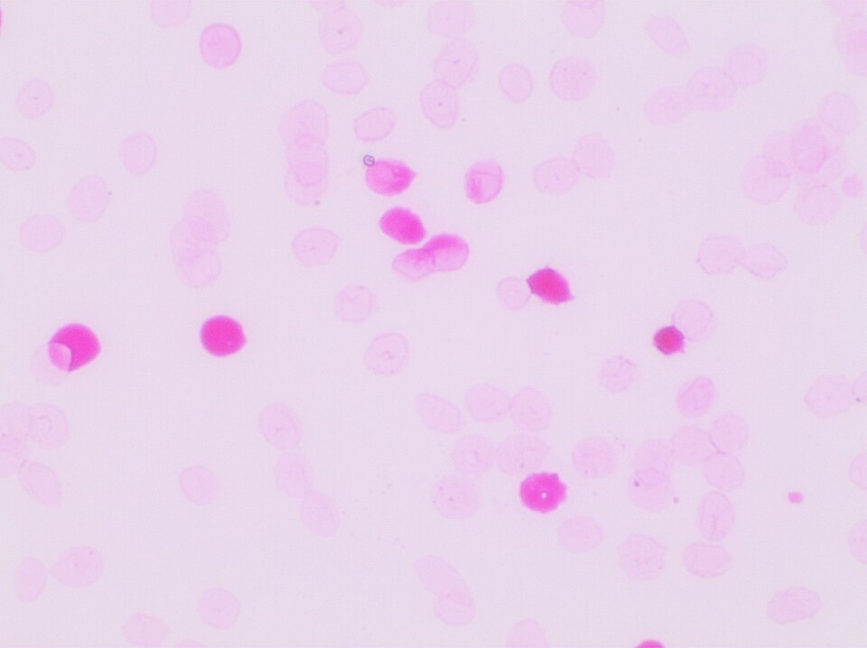

By the late 1950s it was understood how an Rh-negative mother harms her own Rh-positive baby, which the frame on the Rh factor tells: a few of the baby's red cells cross into her blood, usually at delivery, she makes antibody against them, the antigen called D, and in a later pregnancy that antibody crosses the placenta and destroys the next baby's cells. The disease, **[hemolytic disease of the newborn](kloom:e/hemolytic-disease-of-the-newborn)**, killed about 10,000 American babies a year, by the Lasker Foundation's figure. Two teams, working apart, set out to stop the mother being sensitized at all, and both chose the strangest possible tool: the antibody itself, given to her as a medicine. It became **[Rho(D) immune globulin](kloom:e/rho-d-immune-globulin)**, sold in the United States from 1968 as RhoGAM.

## Two routes to one idea

In Liverpool, the physician **[Cyril Clarke](kloom:e/cyril-clarke)** came to the problem through butterflies. Breeding swallowtails with the geneticist Philip Sheppard had taught him how genes interact, and his 1967 Lumleian Lecture traced the Rh work to it. Philip Levine had noticed in 1943 that a mother whose ABO group was incompatible with her baby's was protected against Rh sensitization, probably because her natural anti-A or anti-B destroyed the baby's cells before they could immunize her. A Liverpool family study of 1958 confirmed it, and the group asked whether they could imitate that protection by giving anti-D after delivery. **[Ronald Finn](kloom:e/ronald-finn)**, a young member of the team, put the idea to the Liverpool Medical Institution in 1960.

In New York, at Columbia-Presbyterian, the blood-bank physician **[John Gorman](kloom:e/john-gorman-physician)**, the obstetrician **[Vincent Freda](kloom:e/vincent-freda)** and William Pollack of Ortho Pharmaceutical reasoned from older immunology: Theobald Smith had found in 1909 that diphtheria toxin mixed with an excess of antitoxin did not immunize. Clarke judged that there was "no very great difference" between the two rationales.

## Testing it on men

Both teams first tried it on Rh-negative male volunteers. Liverpool injected Rh-positive cells tagged with radioactive chromium, then infused plasma rich in anti-D. Their first antibody, a "complete" one that clumps cells in saline, made matters worse: the treated men formed more antibody than the controls. An "incomplete" antibody, the kind that only the antiglobulin test detects, protected. New York ran its trial among volunteers at **[Sing Sing](kloom:e/sing-sing)** prison. Nine men were given 2 mL of Rh-positive blood into a vein once a month for five months; four of them had 5 mL of the antibody preparation in the muscle 24 hours before each dose. None of the four was sensitized; four of the five controls were. The Americans' preparation was a gamma-globulin fraction rather than plasma, which, Clarke wrote, carried no risk of jaundice and could be given as a simple injection, and Liverpool switched to it at once.

## The trial in mothers

From May 1964 Liverpool, Sheffield, Leeds, Bradford and Baltimore treated alternate Rh-negative women having their first baby, choosing only those at high risk. To find them they counted the baby's cells in the mother's blood by the **[Kleihauer–Betke test](kloom:e/kleihauer-betke-test)**, devised in 1957, which strips adult hemoglobin from red cells with acid and leaves the acid-resistant fetal hemoglobin to take a stain. A woman qualified with five or more fetal cells in 50 low-power fields, about 0.25 mL of fetal blood by the team's estimate, and a baby who was Rh-positive and ABO-compatible with her. The treated women had 5 mL of gamma-globulin within 36 hours, and babies born at weekends, when no one could reach the mothers in time, made many of the controls. At six months 19 of 78 controls had made anti-D, and none of 78 treated women for certain. By July 1967 the centres' pooled figures stood as below.

| Group   | Women | Made anti-D | Share |
| ------- | ----: | ----------: | ----: |
| Control |   599 |          75 |   13% |
| Treated |   628 |           1 |  0.2% |

Clarke's table prints the control total as 559, but its rows add to 599, which the grand total of 1,227 confirms; the shares are by our arithmetic.

## Counting the baby's cells

The test still decides the dose. The steps, as the British guideline of 2009 and Kleihauer's original method give them:

| Step     | What is done                                                                                        |
| -------- | --------------------------------------------------------------------------------------------------- |
| Film     | Dilute the mother's EDTA blood 1 in 2 or 1 in 3 in saline; spread thin films, cells touching        |
| Controls | Adult blood, and adult blood with 1% cord blood, treated alike                                      |
| Fix      | Ethanol, 5 minutes (80%, in the original)                                                           |
| Elute    | Citrate-phosphate buffer, 5 minutes at 37 °C: adult cells empty to ghosts                           |
| Stain    | Hematoxylin, then erythrosine: fetal cells stain deep pink                                          |
| Screen   | Count fetal cells in 25 low-power fields; ten or more means quantify                                |
| Count    | At ×400, with a Miller square, survey at least 10,000 ghosts and count every fetal cell beside them |

The volume of fetal red cells is then the fetal count over the adult count, times 2,400 mL, a factor that assumes 1,800 mL of maternal red cells, fetal cells 22% larger and only 92% of them staining. With invented numbers: 30 fetal cells among 10,000 ghosts gives 7.2 mL. That is within the 15 mL of red cells that one 300 µg dose of RhoGAM suppresses, by its 2025 label, but more than the 4 mL that Britain's standard 500 IU dose covers, so a British mother would need more. Women with sickle-cell trait or thalassemia carry their own fetal hemoglobin and can fool the count.

## Licensed

The Division of Biologics Standards approved RhoGAM in 1968, and on 29 May, at Holy Name Hospital in Teaneck, New Jersey, Marianne Cummins became the first to receive it. The AABB's timeline dates commercial introduction to 1967. The antibody still comes from people: Rh-negative donors immunized on purpose, whose plasma is fractionated. Given at 28 weeks and again after birth, it holds sensitization to about 0.1–0.2%. Where it is not given, the disease remains: the obstetrician Gerard Visser, quoted in Columbia's 2018 account, put the toll at 300,000 children dead or disabled every year. The next frame asks a different question about where blood should come from: whether it should be bought at all.
