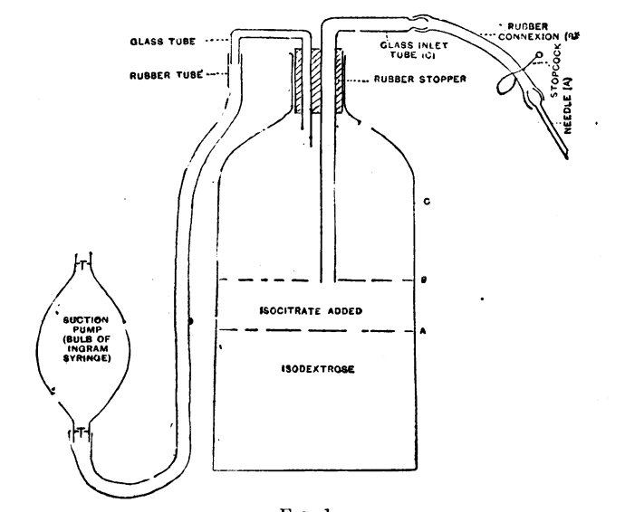

Before an attack on the Western Front in late 1917, an American medical officer at a British **[casualty clearing station](kloom:e/casualty-clearing-station)**, a field hospital just beyond the reach of the enemy's guns, laid in "a store of twenty pints of blood". He was **[Oswald Hope Robertson](kloom:e/oswald-hope-robertson)**, a captain in the US Army's medical reserve, serving with an American base hospital and working at the clearing stations of the British Third Army. In the rush of an attack such a station could not spare the time, the hands or the donors for a transfusion done in the usual way, with a donor found and bled beside each patient. Robertson's answer was to collect the blood days or weeks before it was wanted and keep it on ice. His report, in the _British Medical Journal_ of 22 June 1918, describes the store and what it did. The US Army's official history of its blood program calls it, in effect, the world's first blood bank.

## A solution from the Rockefeller

Robertson had come to France from the **[Rockefeller Institute for Medical Research](kloom:e/rockefeller-university)** in New York, where he had begun work in the laboratory of **[Peyton Rous](kloom:e/francis-peyton-rous)**. In 1916 Rous and J. R. Turner published how to keep red cells alive outside the body. Human blood kept with citrate alone, which stops it clotting, began to break down in about a week; with sugar added the cells stayed whole. Their recipe: "Three parts of blood are caught in a mixture of 2 parts of isotonic sodium citrate solution (3.8 per cent) in water, and 5 parts of isotonic dextrose solution (5.4 per cent)," kept in the ice box. Human cells kept this way stayed intact for four weeks. Rabbits bled of a third or more of their blood and given back rabbit cells kept for two weeks did as well as if the cells were fresh, while cells kept past about three weeks, though still intact, vanished from the circulation within days.

## The procedure

Robertson's paper gives the whole method, down to the needle:

| Step     | What Robertson did                                                                                                                                                                                      |
| -------- | ------------------------------------------------------------------------------------------------------------------------------------------------------------------------------------------------------- |
| Donors   | Group IV only, in the Moss numbering then used: our group O. Chosen from patients with trivial or nearly healed wounds; anyone with a history of malaria, trench fever or syphilis was excluded         |
| Solution | 850 c.c. of 5.4% dextrose and 350 c.c. of 3.8% sodium citrate, autoclaved separately at 105–110 °C for half an hour, in a two-liter bottle marked at each level                                         |
| Bleeding | A blood-pressure cuff at 50–60 mm as tourniquet, a little novocaine, a needle of 1.5 mm bore, gentle suction from a rubber bulb; the donor opens and closes his hand until the 500 c.c. mark is reached |
| Storage  | The bottle is swirled, labeled with date, quantity and donor, and set in an ice box made of two packing cases, sawdust between them, lined with tin                                                     |
| Settling | Four to five days; the clear fluid above the cells grows by 150–200 c.c. a day. A pink tint rising from the cells means they are breaking up, and the blood is thrown away                              |
| Giving   | The fluid is siphoned off, the cells made up to 1,000 c.c. with gelatin in salt solution, filtered through gauze, warmed in water at 106–107 °F, and pumped in over at least ten minutes per 500 c.c.   |

His figure shows the bleeding bottle. Group O cells, he wrote, are not clumped or broken by anyone's blood, so no agglutination test was needed at the bedside. The citrate was the reason for the settling. By our arithmetic each bottle held about 13 grams of sodium citrate, more than twice the 5 grams that Richard Lewisohn, in New York, had found an adult could safely be given, and most of it went out with the fluid drawn off. What was left with the cells, Robertson said, was no more than an ordinary citrated transfusion carried. The plate lays the steps out, from the marked bottle to the warmed one.

## Twenty-two transfusions

He gave 22 transfusions of stored blood to 20 men, with blood kept for up to 26 days, most of it for ten days to two weeks. They were cases of hemorrhage, shock and sepsis, chosen as men likely to die without blood but with some chance with it. Eleven were sent on to the base in good condition. Nine died: one, profoundly anemic, just after his transfusion, four within two days of **[gas gangrene](kloom:e/gas-gangrene)**, and four more of it within six. There were no reactions but one man's brief shivering, and the improvement in color, pulse and blood pressure was "quite as striking" as after fresh blood. His twenty pints served fourteen transfusions and ran out on the third day of the fighting, after which every transfusion again meant finding a donor. Bottles carried six to eight miles by ambulance over rough roads came through without harm. There was no comparison group, so the paper shows that stored blood could be given safely near the front, not how many men it saved.

Robertson does not name the attack. The Army's history places his work during the **[Battle of Cambrai](kloom:e/battle-of-cambrai-1917)**, in November 1917; Wikipedia's articles on transfusion and blood banks say his blood was gathered for the Third Battle of Ypres. Cambrai was the Third Army's battle, which fits his paper.

The trail from here, _Blood at war_, follows military blood from Robertson's ice box to today. On the main spine, the next frame shows the first civilian blood banks, in the 1930s.
