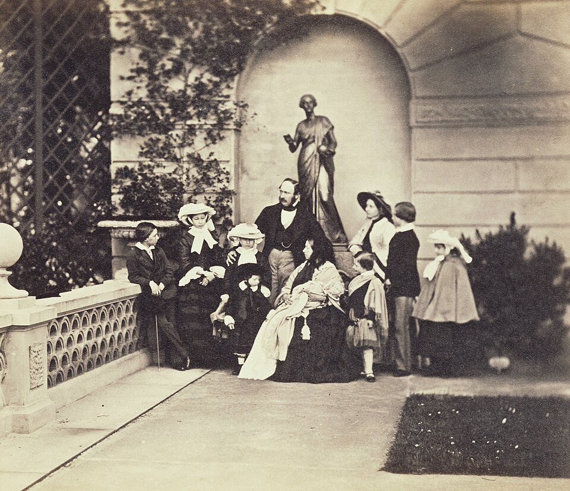

On 7 April 1853 **[Queen Victoria](kloom:e/queen-victoria)** gave birth at Buckingham Palace to her eighth child and fourth son, **[Prince Leopold](kloom:e/prince-leopold-duke-of-albany)**. He was a delicate child, found early to have **[hemophilia](kloom:e/haemophilia)**, and grew up with physicians in permanent attendance. He could not follow his brothers into the army, became his mother's unofficial secretary, married, and fathered a daughter. In March 1884, at Cannes, he slipped, hurt his knee and struck his head, and died early the next morning, aged thirty, most likely of bleeding inside the skull. He was the first born of nine of Victoria's male descendants known to have had the disease, and none of her ancestors is known to have had it.

## A disease that skips

Hemophilia is an inherited disorder in which the blood lacks one of its clotting proteins, so that a cut, a knock or a strained joint goes on bleeding. Physicians knew its pattern long before they knew its cause. In 1803 John Conrad Otto of Philadelphia described "a hemorrhagic disposition existing in certain families": the bleeders were men, and the trait came down to them through healthy women. Today we say why. The gene for the missing protein lies on the X chromosome. A woman has two, and one good copy is enough to clot normally, so she is a _carrier_; a man has one X, from his mother, and if it carries the fault he has the disease.

The photograph was taken at Osborne in 1857, the year Victoria's last child, Beatrice, was born: the queen, Prince Albert and their nine children. Nothing in it shows which of them carried the gene.

## The pedigree, worked

The plate draws the family the way a geneticist would: squares for men, circles for women, a filled square for a man with hemophilia, a half-filled circle for a carrier. Every line of it follows from two rules, set out here as the chance for each child.

| Parents                                      | Each son                 | Each daughter            |
| -------------------------------------------- | ------------------------ | ------------------------ |
| a carrier mother and an unaffected father    | one chance in 2 to bleed | one chance in 2 to carry |
| an unaffected mother and a father who bleeds | never affected           | always a carrier         |

By our arithmetic, a carrier with four sons has one chance in sixteen that none of them bleeds, and one in four that exactly one does, as happened to Victoria: of Edward, Alfred, Arthur and Leopold, only Leopold. With five daughters, the chance that at least one carries the gene is 31 in 32. Two were proved carriers by their sons, Alice and Beatrice; whether Helena was is still unknown. Leopold could not pass the gene to his posthumous son, but his daughter Alice was certain to carry it, and her son Rupert bled to death after a car accident in 1928, aged twenty.

The second rule also says what Victoria's granddaughter Alix of Hesse risked. As a daughter of a carrier she had an even chance of carrying the gene herself, so any son of hers had, before he was born, one chance in four of having hemophilia. She married Nicholas II of Russia, took the name **[Alexandra](kloom:e/alexandra-feodorovna-alix-of-hesse)**, and after four daughters bore a son, **[Alexei](kloom:e/alexei-nikolaevich-tsarevich-of-russia)**, in 1904. He had the disease, and his mother's dependence on the faith healer Grigori Rasputin, whom she believed could stop his bleeding, became part of the story of the dynasty's fall. Beatrice's daughter, as Queen of Spain, had two sons with hemophilia; both died after car accidents in the 1930s. The last of the nine, Prince Waldemar of Prussia, died in 1945.

## Reading the bones

There are two kinds of hemophilia, which a mixing test separated in 1947 and a British team, in 1952, traced to different proteins: hemophilia A, the lack of factor VIII, and the rarer **[hemophilia B](kloom:e/haemophilia-b)**, the lack of **[factor IX](kloom:e/factor-ix)**, about one boy in forty thousand. Victoria's descendants were treated too early, and the last of them died too soon, for anyone to say which they had.

The answer came from Yekaterinburg, where the Romanovs were shot on 17 July 1918. Nine bodies had been exhumed in 1991; in the summer of 2007 searchers found 44 fragments of bone and teeth some seventy meters away, from a boy of twelve to fifteen and a young woman. Evgeny Rogaev's group in Moscow and at the University of Massachusetts first confirmed from their DNA whose bones they were. Then, from about a hundred trillionths of a gram of DNA a reaction, they used the **[polymerase chain reaction](kloom:e/polymerase-chain-reaction)** to copy every working part of the genes for factors VIII and IX in short overlapping pieces, about 210 pairs of primers in all, and sequenced the copies.

The Empress Alexandra's DNA carried one change, an A read as a G three letters before the fourth coding stretch of the factor IX gene, on one of her two X chromosomes. Alexei had only the changed copy; one of his sisters carried it too, Anastasia by the Russian analysis and Maria by the American one. Put into cells, the changed gene was spliced wrongly in 99.98 percent of its messages, making a truncated factor IX, and three patients with the same change in hemophilia registries had 1 percent of normal factor IX or less. The "royal disease", reported in _Science_ in October 2009, was severe hemophilia B.

The next frame turns from blood that will not clot to a substance found in the liver that stops it clotting.
