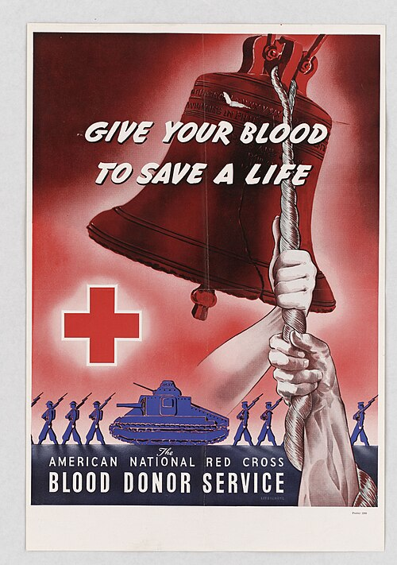

In December 1941, a few days after Pearl Harbor, a Detroit mother named Sylvia Tucker went to her local Red Cross donor center to give blood for the war. The supervisor turned her away: "Orders from the National Offices," he said, "barred Negro blood donors at this time." She wrote to Eleanor Roosevelt, offering to have her blood put in a container labeled "Negro Blood" and given to "some Negro mother's son." The **[American Red Cross](kloom:e/american-red-cross)** was collecting blood for the Army and the Navy, and it was the armed forces that had asked for the exclusion. For most of the war, and for some years after it, the nation's blood was sorted by the color of the donor's skin.

## The policy, as the record shows it

| Date            | What happened                                                                                                 |
| --------------- | ------------------------------------------------------------------------------------------------------------- |
| 1940            | Blood for Britain collects in New York hospitals; its donations and plasma are kept apart by race             |
| Feb. 1941       | A Red Cross pilot program to make dried plasma for the armed forces excludes Black donors at their insistence |
| Nov. 1941       | The national blood donor service begins, and keeps the exclusion                                              |
| Jan. 1942       | The Red Cross announces it will take Black donors' blood, but process it separately                           |
| 1948 or 1950    | The Red Cross stops segregating blood (it says 1948; the historian of the policy says 1950)                   |
| 1958            | Louisiana requires blood for transfusion to be labeled with the donor's race                                  |
| late 1960s–1972 | Arkansas, then Louisiana, repeal their laws                                                                   |

The dates come from the National Library of Medicine's account of **[Charles R. Drew](kloom:e/charles-r-drew)**, from the historian **[Thomas A. Guglielmo](kloom:e/thomas-a-guglielmo)**, and from a Louisiana law review of 1958. The end date is disputed. In 2021 the Red Cross said it had "discontinued the practice of segregating blood" in 1948; Guglielmo writes that "it was not until 1950 that the Red Cross stopped requiring the segregation of so-called Negro blood," the year, Undark reports, that racial designations came off donors' records. Whether commanders in the field ever kept the bloods apart was argued during the war and after.

## What a unit was tested for

Nothing in the laboratory asked about race. Whole blood was grouped for ABO and, from the war years, for Rh, and crossmatched against the patient. Plasma, the war's main product, was pooled: Red Cross technical staff reported on 1,354 pools of six to sixty donors each, and in 99.7% of them the anti-A and anti-B titers were below 1:40. Pooling "suppressed" the agglutinins, which was why the National Research Council's transfusion committee had said in 1940 that pooled plasma needs no typing. Segregation added nothing to that chain but a second set of pools and a label. The plate draws the two rigs, identical but for the tag.

Population differences in blood are real, as the Hirszfelds' 1919 table on race serology had shown: the Army's own history of the program gives the Rh factor in about 87% of white people and 95% of Black people, its figures then. But a difference in frequency is handled by typing each unit. A Black donor and a white donor of the same group are interchangeable; two white donors of different groups are not. In the Army's official history of the program, published in 1964, our search of its text found the word "Negroes" only under the Rh factor, and the donor policy not at all.

## Drew's objection

Drew, a surgeon from **[Howard University](kloom:e/howard-university)**, was the leading American expert on banked blood. He had been medical director of Blood for Britain and assistant director of the 1941 pilot, and under its rules he could not have given blood to it. He said there was no scientific evidence of any difference between the blood of the races, and that the policy insulted Black Americans. Accepting the **[Spingarn Medal](kloom:e/spingarn-medal)** of the **[NAACP](kloom:e/naacp)** in 1944, he said: "It is fundamentally wrong for any great nation to willfully discriminate against such a large group of its people," and that "on the battlefields nobody is very interested in where the plasma comes from when they are hurt."

The sources disagree on whether he left the Red Cross over it. Wikipedia's article says he resigned in protest in 1942. The National Library of Medicine says there is no evidence that the policy was his reason: he returned to Howard in April 1941, eager to rejoin his family and build its surgery department.

Others protested louder. Civil rights groups, unions, churches and scientific societies condemned the policy; pupils at a Harlem junior high school, with their science teachers, tested a Black and a white classmate's blood, found no difference, and published it. Many Black Americans refused to give: about a tenth of the population, they made up less than 1% of wartime donors. Nazi Germany, the enemy, also forbade transfusion across its racial lines.

## How Drew died

On 1 April 1950 Drew fell asleep at the wheel near Burlington, North Carolina, on the way to a clinic at Tuskegee. The car rolled, crushing his chest. A story grew that he bled to death because a white hospital refused him. It is not true. At Alamance General Hospital, which had segregated wards but one emergency room, three white physicians transfused him and telephoned Duke for advice; his companions and the hospital's witnesses said so. The accounts differ on how long he lived, half an hour or several hours. The historian Spencie Love traced the legend to real people who did die for want of care in segregated hospitals, and whose stories became attached to his.

This trail began with the four humors, blood as a juice to be balanced; it ends with blood that every test said was the same, kept apart anyway.
