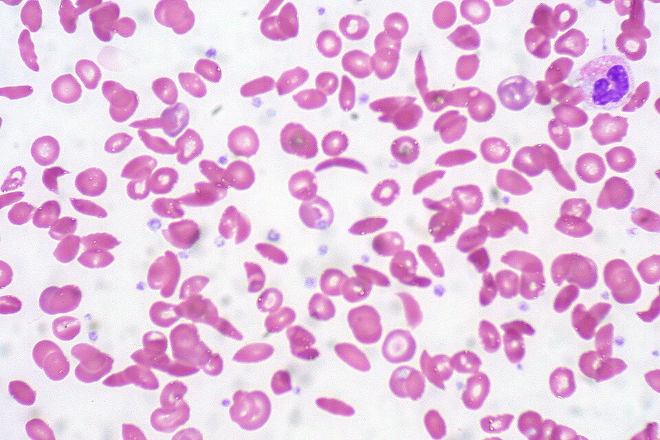

In December 1904 a twenty-year-old dental student from Grenada, Walter Clement Noel, was admitted to the Presbyterian Hospital in Chicago with anemia. The intern who looked at his blood under the microscope, Ernest Irons, saw red cells unlike any he knew: "peculiar elongated and sickle-shaped". His chief, the physician **[James B. Herrick](kloom:e/james-b-herrick)**, published the case in 1910 and did not pretend to understand it. "Whether the blood picture represents merely a freakish poikilocytosis," he wrote, "or is dependent on some peculiar physical or chemical condition of the blood, or is characteristic of some particular disease, I cannot at present answer." Noel finished his studies, went home to practice dentistry in Grenada, and died of pneumonia in 1916. The disease named from his cells is **[sickle cell disease](kloom:e/sickle-cell-disease)**, and in 1949 it became the first disease traced to a change in a single kind of molecule.

## Cells that change shape

By the 1940s two things were known. The cells change shape only when oxygen is short: they turn from discs to crescents, and given oxygen or carbon monoxide again they turn back. And the tendency runs in families. In 1949, as **[Linus Pauling](kloom:e/linus-pauling)** and his colleagues summarized it, about 8 per cent of Black Americans carried the trait, and about one in forty of those had the severe anemia, from the excessive destruction of their red cells. Since the change followed the gas bound to the hemoglobin inside the cell, Pauling's group at Caltech asked whether the hemoglobin itself was different.

## Separating the molecules by charge

A protein in water carries charges on its surface, more positive or more negative depending on the acidity of the water. At one pH, its _isoelectric point_, the charges balance and it does not move in an electric field. Above that pH it carries a net negative charge and moves towards the positive electrode; below it, the other way. In 1937 the Swedish chemist **[Arne Tiselius](kloom:e/arne-tiselius)** described an apparatus for _moving-boundary electrophoresis_ that measures the movement: protein solution and buffer meet in a glass cell, a current runs through both, and an optical scan draws each moving protein as a peak. Pauling, with **[Harvey Itano](kloom:e/harvey-itano)**, S. J. Singer and Ibert Wells, used a modified version of it:

| Step           | Pauling, Itano, Singer and Wells, 1949                                         |
| -------------- | ------------------------------------------------------------------------------ |
| Blood          | from patients not transfused in the previous three months                      |
| Hemoglobin     | freed of cell membranes, diluted to about 0.5 g per 100 mL                     |
| Buffer         | dialyzed against it for 12 to 24 hours at 4 °C                                 |
| Forms compared | bound to carbon monoxide; and oxygen-free, kept with dithionite under nitrogen |
| Run            | 4.8 to 8.4 volts per centimeter, for 6 to 20 hours                             |
| People         | 15 with the anemia, 8 with the trait, 7 without either                         |

The result was plain at pH 6.9, in phosphate buffer. There "the sickle cell anemia carbonmonoxyhemoglobin moves as a positive ion, while the normal compound moves as a negative ion". Their isoelectric points differed by 0.22 to 0.23 of a pH unit (6.87 against 7.09 for the carbon monoxide forms), which by their titrations meant two to four more positive charges on each sickle molecule. The plate draws the cell and their four traces. Blood from people with the trait gave two peaks, normal and sickle, the sickle about 40 per cent. Pauling's paper called it "a clear case of a change produced in a protein molecule by an allelic change in a single gene", and its title named a new idea: _a molecular disease_.

## One gene, two copies

The same year James Neel and E. A. Beet worked out the inheritance, and Pauling's group, which had reached the same view, found it fitted their proportions. A person with one copy of the sickle gene and one normal copy has the trait: both hemoglobins, usually without symptoms. A person with two sickle copies has the disease. When both parents carry the trait, each child has a one-in-four chance of the disease, one in two of the trait, and one in four of neither.

What the change was came from Cambridge. **[Vernon Ingram](kloom:e/vernon-ingram)**, working beside Max Perutz at the Cavendish Laboratory, compared the two proteins by electrophoresis and chromatography. By 1957 he and his colleagues had shown that the two hemoglobins differ in a single amino acid in each of the β chains: at position 6, valine in place of glutamic acid. Glutamic acid carries a negative charge at that pH and valine none, so by our arithmetic each molecule, with two β chains, loses two negative charges, inside Pauling's two to four. It was the first time a disease had been traced to one substituted amino acid.

## Why the gene stayed

A gene that kills children should grow rare, and this one is common where **[malaria](kloom:e/malaria)** is. The British geneticist J. B. S. Haldane had suggested that a gene harmful in two copies might spread if one copy protected against an infectious disease. **[Anthony Allison](kloom:e/anthony-clifford-allison)**, an Oxford graduate student who had grown up in Kenya, found on an expedition in 1949 that more than one person in five on the Kenyan coast carried the trait, and returned in 1953 to test the idea that it protected them. He deliberately infected adult volunteers of the Luo people with malaria, and counted the parasites in children naturally infected in Buganda; the carriers had fewer. His results of 1954, from nearly 5,000 East Africans, showed the trait common where malaria was intense, and later studies refined his finding to "relatively protected from dying of malaria". As of 2021, about 7.7 million people lived with sickle cell disease, some 80 per cent of them in sub-Saharan Africa, where, without care, an estimated half or more of children born with it die before the age of five. Why the sickle molecules stick together only when they have given up their oxygen needed hemoglobin's shape, which is the next frame.
