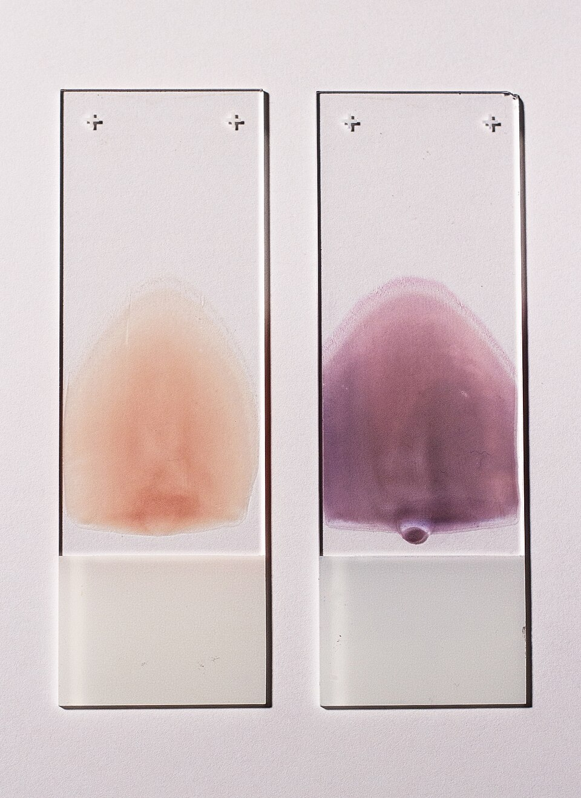

A count of white cells says how many there are; it cannot say which kinds. Under an unstained microscope most of them look alike, grey and granular. The young German physician **[Paul Ehrlich](kloom:e/paul-ehrlich)** made them tell themselves apart, and he did it with the new synthetic dyes of the coal-tar industry, the **[aniline](kloom:e/aniline)** colours. His doctoral thesis at Leipzig in 1878 was on the theory and practice of histological staining, and in it he named the mast cell, whose granules took up a basic dye. At the Charité in Berlin, in papers from 1878 to 1880, he sorted the white cells of the blood by which dyes their granules took.

## Acid, basic and neutral

Ehrlich's principle, as he and Adolf Lazarus set it out in _Die Anaemie_ (1898; in English as _Histology of the Blood_, 1900), was chemical: each part of a cell has its own affinity. Nuclei take basic dyes, such as **[methylene blue](kloom:e/methylene-blue)**; some granules take acid dyes, such as eosin. Ehrlich also mixed the two kinds into "neutral" stains, and a third sort of granule, with an equal affinity for both, took the neutral compound itself. So the granules divided the cells into families: coarse granules that took the acid dye, the eosinophils; granules that took the basic dye, the mast cells or basophils; and fine granules that took the neutral mixture, the neutrophils, with their many-lobed nuclei. His "triacid" stain of orange G, acid fuchsin and methyl green coloured nuclei greenish, red cells orange, eosinophil granules copper red and neutrophil granules violet, and was finished in five minutes at most.

It worked only on a dry film. Ehrlich spread a drop between two very thin cover glasses, pulled them apart, let the film dry in the air in ten to thirty seconds, and fixed it on a copper plate heated at one end by a Bunsen flame, at about 110 °C for half a minute to two minutes for ordinary stains. Typing "several hundred cells", he wrote, took a practised observer under a quarter of an hour.

## Romanowsky and Wright

In 1891 Dmitri Romanowsky found that methylene blue left to age, mixed with eosin, stained the chromatin of malaria parasites a purple neither dye gave alone; the **[Romanowsky stain](kloom:e/romanowsky-stain)** and its variants followed. In 1902 **[James Homer Wright](kloom:e/james-homer-wright)**, pathologist at the Massachusetts General Hospital, published "a rapid method" that anyone could use. He steamed methylene blue in half-per-cent sodium bicarbonate for an hour to "polychrome" it, precipitated it with eosin, dried the precipitate and dissolved it in methyl alcohol. The alcohol fixed the film as it stained, so the "troublesome fixation of the blood by heat" was gone. **[Wright's stain](kloom:e/wrights-stain)** became the American routine, and in 1951 the US Army issued it as a powder from the supply table.

## Making and staining a film

The Army's _Methods for Medical Laboratory Technicians_ (TM 8-227, 1951) set out the **[blood film](kloom:e/blood-smear)**, as its technicians made it:

| Step   | What was done                                                                                                  |
| ------ | -------------------------------------------------------------------------------------------------------------- |
| Glass  | Slides washed, soaked in 95% alcohol, polished and flamed; grease spoils the spread                            |
| Drop   | Wipe away the first drop from the finger; put a small drop of the second near the end of a slide               |
| Spread | Hold a second slide at 30° on the first, draw it back into the drop, then push it forward in one steady stroke |
| Dry    | Air-dry; label in pencil on the thick end; stain within 24 hours                                               |
| Fix    | Cover with Wright's stain (0.3 g in 3 ml glycerol and 97 ml methyl alcohol) for 1 minute                       |
| Stain  | Add phosphate buffer drop by drop until a greenish metallic scum forms; leave 2 to 5 minutes, found by trial   |
| Wash   | Float off the scum with water until the film is lavender pink, 5 to 10 seconds, keeping the slide level        |

The slower the stroke, or the steeper the angle, the thicker the film, and the photograph shows the tongue shape of such a wedge film, unstained and stained. Well stained, the red cells were buff, the neutrophil granules lilac, the eosinophil granules bright red and the basophil granules deep blue. The manual preferred Ehrlich's old cover-glass method for differential counts, because the slide's stroke pushed the large white cells to the edges.

## The hundred-cell count

The **[differential count](kloom:e/white-blood-cell-differential)** was made with a mechanical stage, moving across and up and down the well-spread part of the film so that no field was counted twice, until one hundred white cells had been classified, unknown ones included. Each cell is then one per cent. The manual insisted on a total white count made at the same time, because only the two together give the absolute numbers. An invented tally, with a total count of 7,500 per µL:

| Cell                  | Tally | Per cent | Per µL, by our arithmetic | Normal per cent (1951) |
| --------------------- | ----: | -------: | ------------------------: | ---------------------: |
| Segmented neutrophils |    60 |       60 |                     4,500 |                  56–62 |
| Band neutrophils      |     4 |        4 |                       300 |                    4–6 |
| Lymphocytes           |    28 |       28 |                     2,100 |                  20–30 |
| Monocytes             |     5 |        5 |                       375 |                    4–8 |
| Eosinophils           |     2 |        2 |                       150 |                    1–3 |
| Basophils             |     1 |        1 |                        75 |                 0–0.75 |

The film and the count kept their weaknesses. The Air Force's laboratory course of 1978 noted that proficiency surveys found wide variation "among technicians reporting observations from identical blood smears", and put it down less to the stain than to the reader. Ehrlich's method had another future too: the idea that a dye could choose one cell and not another led him, thirty years later, to a drug that would choose a microbe. The next frame on the bench goes back to the red cells, and to Wintrobe's tube.
