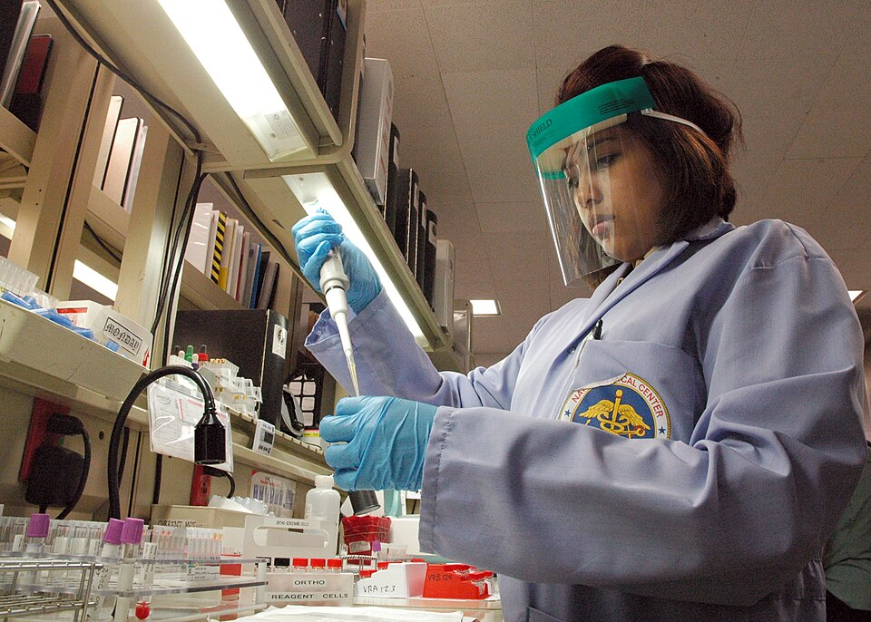

Before any unit of blood left the bank, someone at a bench had typed it, typed the patient, and mixed the two in a small glass tube to see whether they quarreled. The reagents were antisera and known red cells, the instruments a rack of small tubes, 75 mm long, a pipette, a water bath, a small centrifuge and a light, and the reading was made by eye. US military manuals show the work as the services taught it: the Army's _Methods for Medical Laboratory Technicians_ (TM 8-227) of 1951, and the Air Force's course for laboratory technicians of 1978, with the Army's later correspondence subcourse on immunohematology.

## Typing: cells, then serum

The red cells were typed against antisera, which the 1951 manual also named by the donors' group: anti-A serum, from group B people, was "B serum". For the tube method a technician made a suspension of about 2 per cent, one drop of citrated blood in about 1 ml of saline. One drop of anti-A and one of anti-B went into two labeled tubes, one drop of cells into each, and a drop of saline to discourage false clumping; the tubes were spun at 1,000 rpm for 2 minutes, shaken gently in a good light, and negatives checked under the microscope. The serum was then tested the other way, against known A and known B cells, and the two answers had to agree: in **[ABO](kloom:e/abo-blood-group-system)** terms, a group A person's cells clump with anti-A and his serum clumps B cells. Where they disagreed, the unit was held until the difference was explained.

The **[Rh](kloom:e/rh-blood-group-system)** type came from a separate test. In 1951 the Army Medical Service Graduate School supplied an anti-Rh₀ "slide" serum that clumped the cells of 85 per cent of white people. One small drop went with one large drop of whole blood on a slide warmed to 37 °C; [agglutination](kloom:e/agglutination-biology) came within 30 to 60 seconds and was complete in three minutes, and every negative was rechecked in a tube. For mass typing of troops on slides the manual set a team of three, X, Y and Z, who could type 60 to 90 people an hour, each sample twice with sera from different bottles, the slides held 30 minutes so that weak subgroups of A were not missed.

## The crossmatch in 1951

The **[crossmatch](kloom:e/cross-matching)** came last, after the donor had been chosen by group. In the 1951 manual it was two tubes: the major side, the recipient's serum with the donor's cells (RS/DC), and the minor side, the donor's serum with the recipient's cells (DS/RC), each a drop of serum and a drop of 2 per cent cells. Because some Rh antibodies did not act in saline, the cells were suspended in serum, plasma or 20 per cent bovine albumin. The tubes were spun 1 to 2 minutes at 500 to 800 rpm, read, put in a 37 °C water bath for 30 minutes, spun and read again over a concave mirror. There was no antiglobulin phase. Agglutination or hemolysis of the donor's cells meant the donor was "not suitable".

## The full crossmatch

By the 1970s a complete crossmatch had three phases, saline, high-protein and antihuman globulin, because each finds antibodies the others miss. The antiglobulin reagent is the Coombs serum whose story is told in the frame on the [Coombs test](kloom:e/coombs-test); here it is one step among eight. The Army's later subcourse gave this one-tube procedure:

| Step | What was done                                                                                                   |
| ---- | --------------------------------------------------------------------------------------------------------------- |
| 1    | Two drops of the recipient's serum in a labeled tube                                                            |
| 2    | One drop of a 2 to 5 per cent saline suspension of the donor's cells, from a sealed segment of the bag's tubing |
| 3    | Immediate spin; look for hemolysis and agglutination; grade and record                                          |
| 4    | Add 2 to 3 drops of 22 to 30 per cent albumin; incubate 15 to 60 minutes at 37 °C                               |
| 5    | Spin at once; read, grade and record                                                                            |
| 6    | Wash the cells three or four times with saline; decant completely; add 1 to 2 drops of antiglobulin serum       |
| 7    | Spin; read, grade and record                                                                                    |
| 8    | To every negative tube add one drop of known antibody-coated ("sensitized") cells; spin; they must clump        |

Washing matters because free globulin neutralizes the reagent, and step 8 proves the reagent was still working: if the coated cells, the check cells of the bench, do not clump, the test is void and is repeated. The same subcourse lists low-ionic-strength saline, LISS, as a medium that speeds the binding of antibody. The patient's serum was screened for unexpected antibodies at the same time, and where that screen was negative, the standards of the **[AABB](kloom:e/aabb)**, the American Association of Blood Banks, founded in 1947, accepted the immediate spin alone. The Air Force course warned that "a properly performed crossmatch procedure can take 1 hour or more", and gave a table for emergencies: at 5 minutes or less, group-specific blood went out uncrossmatched, and the full test began anyway.

## Reading, and what goes wrong

Each reading was graded by tipping the tube until the cell button lifted off. The subcourse's scale:

| Grade | What is seen                             |
| ----- | ---------------------------------------- |
| 4+    | one solid clump                          |
| 3+    | several large clumps                     |
| 2+    | medium clumps, clear background          |
| 1+    | small clumps, turbid reddish background  |
| W+    | tiny clumps, turbid reddish background   |
| 0     | negative: a smooth suspension, no clumps |
| H     | hemolysis, to be read as positive        |

A mixed field, small clumps among many free cells, meant something else again, such as one of the rare weak subgroups of A.

The errors were well known. **[Rouleaux](kloom:e/rouleaux)**, red cells stacked like coins in serum rich in protein, look like clumps; a drop of saline disperses them and leaves true agglutination. Cold autoagglutinins clump a patient's cells in his own serum; the cells were washed and the test repeated at 37 °C, where they usually lose their hold. But the worst errors were not serological at all: the Air Force course said experience had shown "that most errors in blood banking are either clerical errors or misidentification of patient or donor", and required the patient's details on the request form before a tube of his blood was drawn. The Navy photograph, from 2009, shows a corpsman still confirming a donor's type by hand. The frames on the gel card and the laboratory information system show what the machines later took over.
