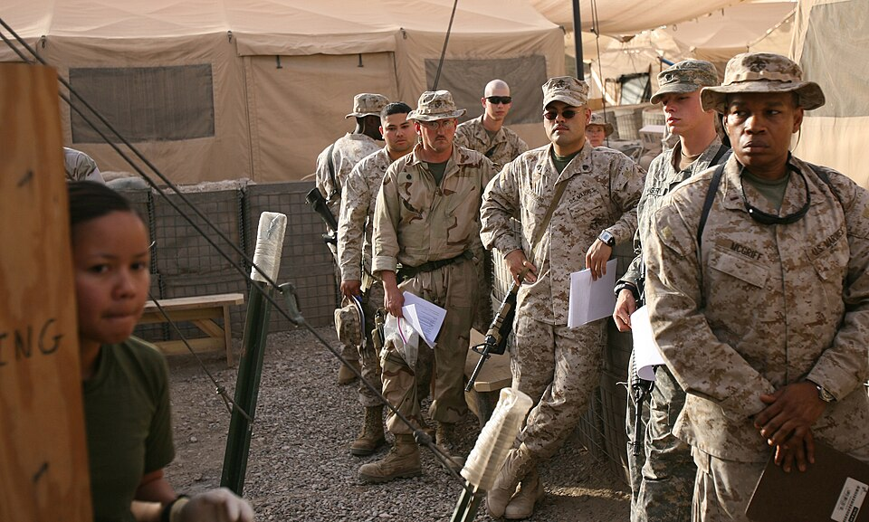

On 13 April 2006, after an insurgent attack in Al Anbar Province, Marines, sailors and soldiers lined up outside the surgical company at Camp Taqaddum with their paperwork in their hands. They were the blood bank. The officer in charge told the photographer that people often turned up within five minutes of the call going out, and that since his unit took over the hospital on 3 March it had used the emergency donation system seven times, once on four days out of five. This was the _walking blood bank_: **[whole blood](kloom:e/whole-blood)** drawn from screened volunteers at the moment a casualty needed it, and given warm, within hours, without ever going into a refrigerator.

## Why fresh blood came back

It had never really gone. In 2006 David Kauvar, John Holcomb and their colleagues, reviewing every blood product given to American casualties in the **[Iraq War](kloom:e/iraq-war)** from March to December 2003, wrote that military doctors had used fresh whole blood in every combat operation since the First World War. They used it most when massive transfusions emptied the stored supply. In **[Baghdad](kloom:e/baghdad)** the 31st Combat Support Hospital went further: from October 2004 its surgeons gave warm fresh blood to the sickest patients on purpose, as part of a transfusion protocol built around it, giving stored red cells and plasma one to one while the donors were called in.

The reason was clotting. A badly wounded man bleeds out the factors and **[platelets](kloom:e/platelet)** that stop bleeding, and stored red cells carry neither. Platelets keep only five days at room temperature, too short for the flight from the United States, so every platelet transfused in the theatre had to be collected there; the forward surgical teams in the **[war in Afghanistan](kloom:e/war-in-afghanistan-2001-2021)** often had none at all. A unit of fresh whole blood brought working platelets, plasma and red cells together, in about 63 mL of anticoagulant against roughly 279 mL in the equivalent made up from three stored components.

## The drill

The practice was written down by the Joint Trauma System as a clinical practice guideline, first in 2006 and revised in 2012 and 2018. The 2018 version's emergency collection procedure runs, in short:

| Step                | What is done                                                                                            | The numbers                                                             |
| ------------------- | ------------------------------------------------------------------------------------------------------- | ----------------------------------------------------------------------- |
| Decide              | A physician orders fresh blood only when stored products are missing, too slow or not working           | Shock or coagulopathy, such as an INR above 1.5                         |
| Call donors         | From the pre-screened roster: low-titre group O first, then donors of the casualty's own group          | Screened within 90 days first, then within a year, then past donors     |
| Screen at the cot   | A questionnaire, then temperature, pulse, blood pressure and hemoglobin                                 | ≤37.5 °C; pulse 50–100; systolic 90–180; Hb ≥13.0 g/dL men, ≥12.5 women |
| Type                | Donor and casualty typed on a card; the blood group on a dog tag is never trusted                       | About 4 percent of tags were found wrong                                |
| Collect             | A 16-gauge needle in the elbow vein, a cuff at 40–60 mm Hg, the bag on a trip scale                     | 450 mL weighs 585 g; one unit per donor, two only in extremity          |
| Test                | Sample tubes spun and run on rapid kits for HIV, hepatitis B and C, malaria and syphilis                | 2 red-top, 4 purple-top tubes; spun 5 minutes at 4,000 rpm              |
| Issue and follow up | Labelled, and if low-titre O marked so; samples sent home for licensed testing; recipients tested again | Used within 24 hours warm; recipients retested at 3, 6 and 12 months    |

The plate draws the collection: the bag on its beam, tipping when it reaches 585 grams, and the six tubes drawn beside it. The guideline recommends four staff to screen and bleed eight to ten donors.

## What the numbers showed

The study most often cited is Philip Spinella's of 2009. Of 354 American casualties transfused at combat hospitals in Iraq and Afghanistan between January 2004 and October 2007, the 100 given warm fresh whole blood with stored red cells and plasma were compared with 254 given stored components including apheresis platelets. The groups were alike in injury severity, and 95 of the 100 were alive at 30 days against 209 of the 254, 95 percent against 82. Each unit of fresh blood was independently associated with better survival.

The authors named the limits themselves: the study was retrospective, so patients were not assigned at random, and unmeasured differences between the groups could not be ruled out. Renal failure was commoner in the fresh-blood group, 8 percent against 3. A study of 369 massively transfused patients in Baghdad found no difference in survival between fresh whole blood and apheresis platelets; one of 488 transfused patients at six forward surgical teams in Afghanistan, which had no platelets, found fresh blood better than red cells and plasma alone. Even the blood's group is remembered differently. A 2025 guideline recalls walking-bank blood as almost always matched to the casualty's group; at those surgical teams, 46 of the 94 recipients had been given uncrossmatched group O.

The risks were real. Among about 10,000 fresh whole blood transfusions in Iraq and Afghanistan, the 2018 guideline counts one infection with **[hepatitis C](kloom:e/hepatitis-c)**, one with HTLV, and one death from **[transfusion-associated graft-versus-host disease](kloom:e/transfusion-associated-graft-versus-host-disease)** that may have come from a fresh unit, in which a donor's living white cells attack the recipient. The rapid tests were not licensed for screening donors, which is why the samples went home. Fresh whole blood was never approved by the Food and Drug Administration, and the guideline reserves it for a casualty who will otherwise die. The search for a safer universal whole blood, tested in advance and kept cold, is the next frame.
