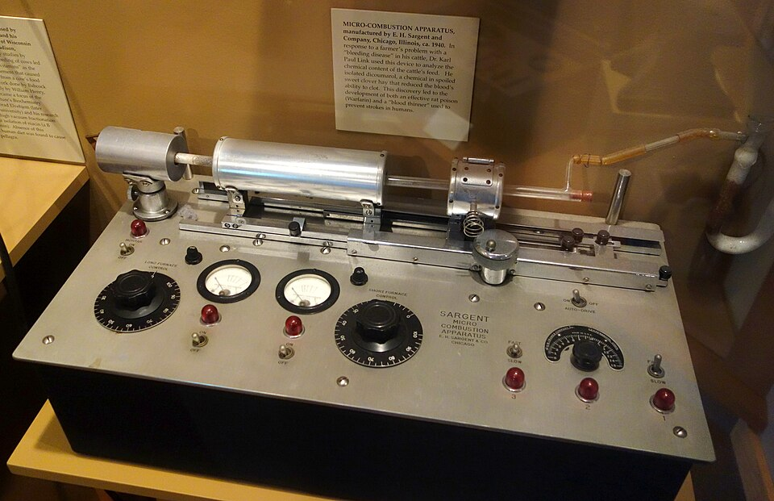

On a Saturday afternoon in February 1933, in a blizzard, a farmer from near Deer Park, Wisconsin, drove some 190 miles to Madison with what he hoped would be evidence. He had been told to take it to the university's agricultural experiment station; the state veterinarian's office was shut, and chance brought him to the biochemistry building and to **[Karl Paul Link](kloom:e/karl-paul-link)**. He carried a dead heifer, a milk can of her blood that would not clot, and about 100 pounds of spoiled sweet clover hay, the only hay he had. His name was Ed Carlson. That is how Link told it in 1959, in a lecture he opened by warning that his story "need not be told in exactly the same manner each time"; in Wisconsin, he said, it had become a kind of legend. Wikipedia's article on Link spells the farmer Carson. The documented part begins with what Link's laboratory did next.

## A disease of the hay

The disease was new in the 1920s, on the prairies of North Dakota and Alberta. Cattle that ate spoiled hay of **sweet clover** lost the power to clot over about fifteen days and then bled, inside or from a small wound, and died in thirty to fifty. The veterinarians Frank Schofield in Canada and Lee Roderick in North Dakota traced it to hay that had gone bad and showed it could be reversed by good hay and a transfusion of fresh blood from a healthy cow. Roderick, in papers of 1929 and 1931, showed that the sick cattle lacked active _prothrombin_. Link could only repeat their advice to Carlson: stop feeding the hay, and transfuse.

## The rabbit assay

Nothing chemical showed whether an extract held the poison, so the laboratory had to measure it in animals, which took five years to get right. Howell's method for prothrombin was too imprecise, the clotting time of whole blood too variable, and rabbits differed widely in how they responded to the standard dose of 50 grams of spoiled hay. In 1938 Link's student Harold Campbell adapted Armand Quick's one-stage method, the test the trail's frame on the **[prothrombin time](kloom:e/prothrombin-time)** describes. As Link set it out:

| Step     | Campbell's bioassay, 1938                                                  |
| -------- | -------------------------------------------------------------------------- |
| Animals  | rabbits from a colony bred and reared to be susceptible                    |
| Prepare  | fast the rabbit 24 to 36 hours before feeding it anything under test       |
| Dose     | feed the hay, extract or fraction under test                               |
| Bleed    | draw blood and test the plasma promptly                                    |
| Test     | the one-stage clotting time of _diluted_ plasma, at 12.5 and 8.34 per cent |
| Read     | against the same rabbit's own normal plasma                                |
| Standard | each rabbit's response to 50 grams of spoiled hay                          |

By our arithmetic those dilutions are one part plasma in eight and one in twelve. Comparing every animal with itself removed much of the variation between rabbits. One rabbit, known as Bess Campbell, served for about 200 assays over five years.

At dawn on 28 June 1939, after working all night, Campbell saw crystals on a microscope slide: about 6 milligrams of the agent. The Wisconsin Historical Museum keeps the micro-combustion apparatus the laboratory used to analyze it, the kind of instrument that burns a few milligrams and weighs the carbon dioxide and water that come off. Campbell's analyses gave C₁₉H₁₂O₆. Mark Stahmann extracted 1.8 grams more, Charles Huebner worked out the structure, two molecules of 4-hydroxycoumarin joined by a CH₂ bridge, and on 1 April 1940 they made it from scratch and found it identical. The plate draws it. It was named **[dicumarol](kloom:e/dicoumarol)** (dicoumarol internationally). Sweet clover is full of _coumarin_, the sweet smell of new-mown hay, which does not touch clotting; molds in damp hay turn it into dicumarol.

## From rats to a president

The **[Wisconsin Alumni Research Foundation](kloom:e/wisconsin-alumni-research-foundation)**, which funded the work, released dicumarol for clinical trials in 1940 and 1941. Link's laboratory made over a hundred relatives, and in 1946–48 his student L. D. Scheel found number 42, made by Miyoshi Ikawa in 1942–43, far more potent in rats and dogs. In 1948 Link proposed it as a rat poison and named it **[warfarin](kloom:e/warfarin)**, from the foundation's initials and the "-arin" of coumarin. It killed slowly, so rats never learned to shun the bait. Who pressed for the patent, filed in 1945, is told differently: Link's own story makes the push his, while a 2005 _Journal of Biological Chemistry_ account says Link thought it too toxic to patent and Stahmann wrote the application.

Warfarin, like dicumarol, works by starving the liver of active **[vitamin K](kloom:e/vitamin-k)**, which it needs to finish clotting factors II, VII, IX and X; the factors are made but cannot work. The block was found in 1978 to be on the enzyme that recycles vitamin K, so vitamin K is the antidote; the plate draws that cycle under the molecule, its blocked step struck through. Link had shown that in January 1939, when a bull down and bleeding from spoiled hay was saved with a vitamin K concentrate made from alfalfa. In April 1951 a man just inducted into the Army (the Navy, in other accounts) swallowed 567 mg of warfarin rat bait over five days, was treated at a naval hospital with transfusion and vitamin K, and recovered. Trials followed, and warfarin sodium, sold as Coumadin, was approved for patients in 1954.

On 29 September 1955 Link received a card from a former Wisconsin man working at **[Fitzsimons Army Hospital](kloom:e/fitzsimons-army-medical-center)** in Denver, where **[Dwight D. Eisenhower](kloom:e/dwight-d-eisenhower)** lay after his heart attack: "The President is getting one of your drugs and it's not Dicumarol." The 2005 account says it was dicumarol; Link's own story, which the Science History Institute follows, says warfarin. Warfarin is still dosed by the prothrombin time, reported as the INR and checked every one to four weeks. The trail's next frame turns to the opposite trouble, blood that cannot clot for want of a factor, and what its treatment cost.
