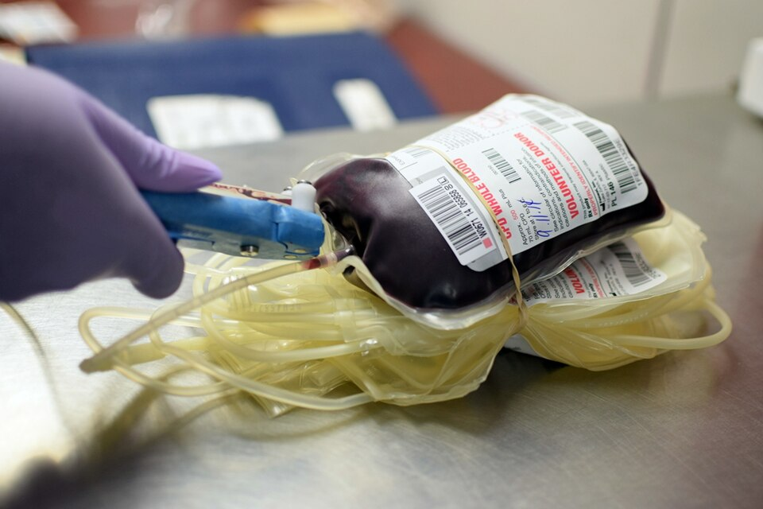

In April 2016 the Armed Services Blood Program began sending American forces in Iraq and Afghanistan **[whole blood](kloom:e/whole-blood)** from donors at home, fully tested to the Food and Drug Administration's standards, of group O and with low levels of the antibodies anti-A and anti-B, and kept cold. Until then the only whole blood given in those wars had come from walking blood banks. At the same time the **[75th Ranger Regiment](kloom:e/75th-ranger-regiment)** set up a walking blood bank of its own, the Ranger O Low Titer programme, or ROLO: every Ranger of group O was identified, and his plasma was tested so that, if it was low in those antibodies, his blood could be drawn in the field and given to a casualty of any group. Titre testing of Rangers had begun in May 2015, and by January 2017 2,237 soldiers had been tested.

## What low titre means

Group O red cells carry neither A nor B, so they can go into anyone. Group O plasma is another matter: it carries anti-A and anti-B, and a large dose of a strong one can destroy a group A or B recipient's red cells. A unit of whole blood brings its donor's plasma with its cells, so the plasma's antibodies have to be measured, and the measure is a **[titre](kloom:e/titer)**: how far the plasma can be diluted and still clump the cells it is aimed at. The usual method, a manual titration in test tubes, is done by hand:

1. Make doubling dilutions of the donor's plasma in saline down a row of tubes, carrying 100 µL from each tube to the next: 1 in 1, 1 in 2, 1 in 4 and on to 1 in 2,048.
2. Add 50 µL of a 3 percent suspension of group A₁ red cells to each tube to measure anti-A, and do a second row with group B cells for anti-B.
3. For the military's test, spin at once, without incubating: the immediate-spin method, which in saline measures chiefly the IgM antibodies.
4. Read each tube by eye and grade the clumps, from 4+ (one solid clump) through 3+, 2+ and 1+ to none.
5. The titre is the reciprocal of the last dilution that still gives 1+.

The plate draws a worked example, with grades we invented to show the reading:

| Dilution, 1 in | 1   | 2   | 4   | 8   | 16  | 32  | 64  | 128  | 256 | 512 |
| -------------- | --- | --- | --- | --- | --- | --- | --- | ---- | --- | --- |
| Grade          | 4+  | 4+  | 3+  | 3+  | 2+  | 2+  | 1+  | weak | 0   | 0   |

The last 1+ is at 1 in 64, so the titre is 64, and under the military's threshold of 256 the donor is low titre. The test is coarse. Each step is a doubling, two readers may differ by a tube, and proficiency schemes count a laboratory's answer acceptable if it is within one step of the commonest one. A donor's titre can also change: among the Rangers, 69.5 percent qualified on their first test and more on later ones.

## Back into hospitals

Civilian trauma centres followed. In 2016 Mark Yazer and colleagues at the **[University of Pittsburgh](kloom:e/university-of-pittsburgh)** reported giving up to two units of cold-stored, uncrossmatched group O whole blood to 47 bleeding men, without a reaction; their low-titre threshold, later reported, was under 50. In April 2018 the **[AABB](kloom:e/aabb)**, whose standards most American blood banks are accredited against, changed its standards to allow low-titre O whole blood for patients of unknown group, leaving each transfusion service to set its own threshold. Thresholds still differ. In a survey of ten large American blood collectors published in 2026, six used under 200, two under 256 and one each under 150 and under 100, and seven titred by hand in tubes. The number of American trauma centres transfusing the blood rose from 298 in 2022 to 382 in 2024, at a median of about two units a patient.

## What the trials found

As of October 2026, the evidence is mixed. Observational studies had suggested that whole blood saved lives, and two randomised trials reported in the **[New England Journal of Medicine](kloom:e/the-new-england-journal-of-medicine)** in 2026 tested it before hospital. In England, across ten air ambulance services, death or massive transfusion within 24 hours occurred in 48.7 percent of 314 patients given up to two units of whole blood and 47.7 percent of 302 given red cells and plasma. In the United States, across 44 air medical bases, 30-day mortality was 25.9 percent with whole blood and 20.5 percent with components, a difference that was not statistically significant; blood stored 15 to 21 days did as well as fresher blood. Neither trial found whole blood better.

Its practical case stands: one cold bag, given without a crossmatch, in place of three products kept three ways. In 2025 the military began shipping tested group A whole blood to its larger field hospitals, expecting that low-titre O, drawn from the 45 percent of Americans who are group O, would run short in a large war. The trail began at the first blood depot, in 1917, with blood from group O donors kept on ice; a century later the armies had come back to it.
