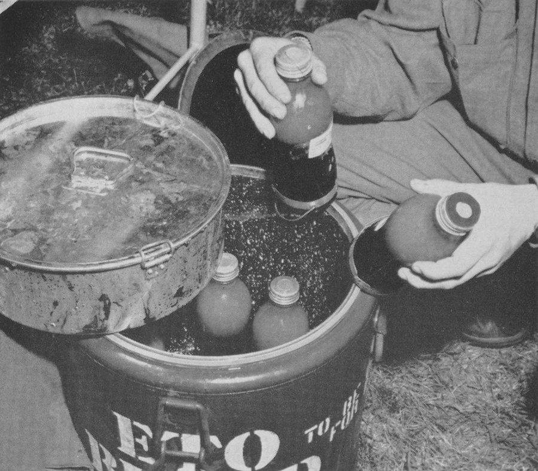

When the United States went to war in December 1941, its plan for the wounded was plasma. In April 1941 the National Research Council's subcommittee on blood substitutes had recommended it to the Army and the Navy, for reasons that were sound at the time: plasma needed no typing or crossmatching, dried plasma kept for years without refrigeration, and drug firms could make it in bulk. Whole blood then had a dating period of six to eight days, there were no field refrigerators for it, and no airlift could carry it overseas. The frame on Blood for Britain tells how plasma was made. By the end of the war the Army was flying more than a thousand pints of whole blood a day across the Atlantic.

## The surgeon's case

The argument came from the Mediterranean. **[Edward Churchill](kloom:e/edward-delos-churchill)**, a Harvard surgeon, took up his duties as surgical consultant in North Africa on 7 March 1943. In the official history by **Douglas B. Kendrick**, who ran the Army's blood and plasma programme until November 1944, Churchill was briefed before he left and asked to find out two things: with plasma at hand, was whole blood really needed, and if so, how could it be supplied? Churchill's memorandums answered the first. Plasma, he wrote, was wrongly called a blood substitute: it was a fraction of blood. It could restore a wounded man's blood pressure, but a man whose red cells had bled away could not get enough oxygen to his tissues, and his pressure fell again when surgery began. Whole blood was the agent of choice for most battle casualties, and the only one that would prepare a badly wounded man for the operation that would save him. Plasma was first aid. The Mediterranean theatre then built its own bank, drawing blood from soldiers in the theatre; between February and July 1944 it sent 16,574 units to the Fifth Army.

## From Normandy, a request

In Britain the theatre's chief surgeon, **[Paul Hawley](kloom:e/paul-ramsey-hawley)**, had a blood bank built at Salisbury, run by the 152d Station Hospital. It took only group O blood, from volunteer soldiers of the supply services, preserved it in the British glucose–citrate solution, kept it refrigerated and dated it for 21 days. By D-day a daily 4,000-pound airlift to France had been arranged for blood, **[penicillin](kloom:e/penicillin)** and other biologicals. After the **[Normandy landings](kloom:e/normandy-landings)** the bank could not keep up. By the end of July the armies wanted about 1,000 pints a day and the bank's donors gave about 650. On 2 August Hawley radioed The Surgeon General, who had refused before, asking for 1,000 pints a day by air. The first 258 bottles left on 21 August 1944, reached Prestwick in Scotland, and were in France on 27 August.

## The chain, step by step

The procedure was improvised from the plasma programme's donor centres, run by the **[American Red Cross](kloom:e/american-red-cross)**. Blood was drawn into **[Alsever's solution](kloom:e/alsevers-solution)**, a citrate–dextrose–saline preservative, and flown by the **[Air Transport Command](kloom:e/air-transport-command)**. Kendrick's history sets out the steps:

| Step       | What was done                                                                                                                                                                        |
| ---------- | ------------------------------------------------------------------------------------------------------------------------------------------------------------------------------------ |
| Screen     | a drop of the donor's blood in saline onto dried high-titre group O serum: clumping meant A, B or AB; a drop in copper sulphate that sank meant haemoglobin of 12.3 g/100 mL or more |
| Bleed      | about 500 mL, in some five minutes, into a chilled 1,000-mL vacuum bottle holding 500 mL of Alsever's solution; a sample tube for confirming the group and a syphilis test           |
| Hold       | refrigerated at the centre, six bottles to a carton                                                                                                                                  |
| Fly        | by Air Transport Command planes, unrefrigerated for the 16 to 24 hours of the crossing                                                                                               |
| Distribute | refrigerated again at Prestwick, then by air to France in iced marmite cans; direct to Paris from 15 October                                                                         |
| Expire     | 21 days after collection                                                                                                                                                             |

The unrefrigerated flight alarmed the theatre. Its chief surgical consultant, **[Elliott Cutler](kloom:e/elliott-cutler)**, objected in Washington in August 1944 that this was no time to experiment on the American soldier. Tests had shown that blood in Alsever's solution came through flights to Prestwick and back with little haemolysis. The Surgeon General's office first promised it 30 days of life; Kendrick's history corrects that to 21. The bottles were chosen partly because they were already being made: bottles for the newer British acid–citrate–dextrose (ACD) solution would have taken three or four months. From 1 April 1945 the airlift changed to ACD, 100 mL (later 70 mL) of it (2.0 g citric acid, 8.0 g sodium citrate and 27.0 g dextrose to the litre) in a 600-mL bottle, packed 24 bottles to an insulated box with 19 pounds of ice and re-iced about every 48 hours. The Navy had been flying blood in ACD to the Pacific since November 1944.

| Month (1944–45)    |  Pints |
| ------------------ | -----: |
| August (from 21st) |  3,581 |
| September          | 15,811 |
| October            | 16,884 |
| November           | 22,769 |
| December           | 26,290 |
| January            | 28,847 |
| February           | 25,268 |
| March              | 30,510 |
| April              | 24,407 |
| May (to 10th)      |  6,738 |

## What it came to

The Army's final report counts 201,105 pints flown to Europe by 10 May 1945. The Red Cross's history counts 205,907; Kendrick thought some blood collected for the airlift was never flown. The Navy's airlift from San Francisco through Guam carried 181,555 units to the Pacific by September 1945, by Red Cross figures. Of the 316,799 pints that passed through the European bank, about 15 percent were lost, to outdating, haemolysis, breakage, failed refrigeration and one plane crash that destroyed 1,146 bottles. Kendrick warned that his numbers were sometimes in conflict and trusted only their trends. Of blood drawn from soldiers whose identity tags said group O, 5.96 percent was not.

The theatre's general board drew the rule that later planners used: one pint for each wounded man, about 500 pints a day for a field army in action. Kendrick drew another: flying blood unrefrigerated "was a highly successful expedient," but every future programme needed constant refrigeration. The Red Cross collected this blood under a rule that labelled it by the donor's race, which the frame on segregated blood tells. In September 1945 the programme was shut down, and the next frame, on Korea, shows it built again.
