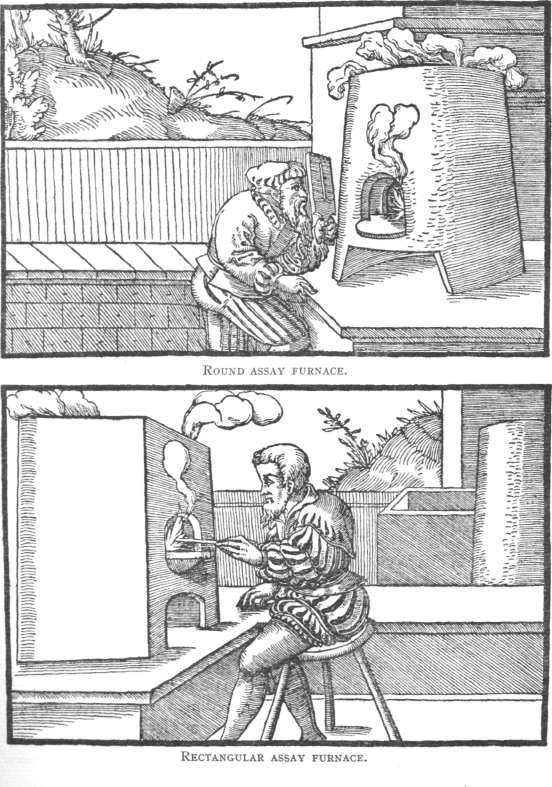

In 1527 a young Saxon physician took the post of town doctor in **[Joachimsthal](kloom:e/jachymov)**, in the mountains of Bohemia. The town was eleven years old and already held thousands of people, all there for **[silver](kloom:e/silver)**: its coins, the Joachimsthalers, gave their name to the thaler and so to the dollar. The doctor was Georg Bauer, who wrote as **[Georgius Agricola](kloom:e/georgius-agricola)**, the Latin for his surname, "farmer". By his own account he spent every hour his patients left him in the mines and the smelting works, and in reading everything the Greeks and Romans had written about them. He left about 1530, and from about 1533 until his death in 1555 he was town physician, and four times mayor, of Chemnitz in Saxony. Wikipedia's article on his book says he spent nine years in Joachimsthal; his translators, and Wikipedia's article on him, give three to six.

## The book

His great work, [_De re metallica_](kloom:e/de-re-metallica), "On the nature of metals", in twelve books, was finished by 1550 but waited for its woodcuts, and appeared in Basel in 1556, from the press founded by Johann Froben, a year after its author died. It runs from finding a vein to surveying, pumps and hoists, assaying, smelting and parting, and ends with salt, soda, alum, sulfur and glass. In his preface Agricola promised to leave out "all those things which I have not myself seen, or have not read or heard of", and the 292 woodcuts, drawn by Blasius Weffring in Joachimsthal and cut in Basel, show the work as it was done. It was the standard book on mining for nearly two centuries. Of the alchemists who promised gold he was politely skeptical: their language was obscure, and since "we do not read of any of them ever having become rich by this art", he wrote, "I should say the matter is dubious."

## Weighing the silver

Book VII is on assaying: finding out, from a small sample, how much metal a whole ore will give. Its method was the fire assay, and at its heart was **[cupellation](kloom:e/cupellation)**. The assayer weighed the crushed ore and melted it with six to sixteen times its weight of **[lead](kloom:e/lead)**, which must itself hold no silver: Agricola recommends the lead of Villach, in Carinthia. The molten lead dissolved the silver and gold out of the ore, and the rock floated off as slag. Then the lead went into a cupel, a small thick dish of bone ash or beech ash, in a furnace with air playing over it:

> 2 Pb + O₂ → 2 PbO

Lead burns to lead oxide, litharge, which melts at about 888 °C and, being liquid, soaks into the porous ash of the cupel or goes off as fume. Silver and gold do not burn, and as the last of the lead goes they "gleam in their varied colours", Agricola writes, and settle as a bead in the bottom of the cupel. It took about three quarters of an hour. The best cupels, he says, were of burnt deer horn alone, the driest ash of all; most assayers of his day used beech.

His weights did the arithmetic. The assayer's "lesser" weights copied the miner's great ones, a hundredweight, fifty pounds, twenty-five and so on, but the lesser hundredweight weighed only a drachma, a few grams. So whatever the bead weighed on the lesser scale, the same weight of silver would come from a real hundredweight of ore. A worked assay, with invented numbers:

| Step                         | What happens                 | Weight                                |
| ---------------------------- | ---------------------------- | ------------------------------------- |
| Ore, weighed out             | the lesser "hundredweight"   | one drachma                           |
| Lead added, melted, slag off | the lead takes up the silver | about 12 times the ore                |
| In the cupel                 | 2 Pb + O₂ → 2 PbO            | about 13 times the ore, as litharge   |
| The bead                     | silver left behind           | the lesser half-ounce: 1/3,200 of ore |

By our arithmetic, lead oxide weighs 223 for every 207 of lead, so the cupel must drink up about thirteen times the ore's weight of litharge. The lesser hundredweight holds 3,200 half-ounces, so a bead that balances the lesser half-ounce means the ore is one part in 3,200 silver: about 310 grams to the tonne, from a bead of about a milligram. Every hundredweight dug from the vein would hold half an ounce of silver.

## The Hoovers

The first English translation came out in London in 1912, made by a mining engineer and his wife: **[Herbert Hoover](kloom:e/herbert-hoover)**, later President of the United States, and **[Lou Henry Hoover](kloom:e/lou-henry-hoover)**, a geologist and Latinist. They worked on it in "night hours, weekends, and holidays" for about five years, and their footnotes traced Agricola's Latin, which he had stretched to name German mining words the Romans never had, back to the practice it described. Of the assayer's weights they noted that the scheme was "simpler than the modern English 'assay ton'", which was built on the same idea. They were less kind to the first German translation of 1557: "a wretched work, by one who knew nothing of the science."

Agricola wrote as the alchemists' confidence was fading and a new question was being put to matter. The next frame is Robert Boyle's, who asked what the elements really were.
