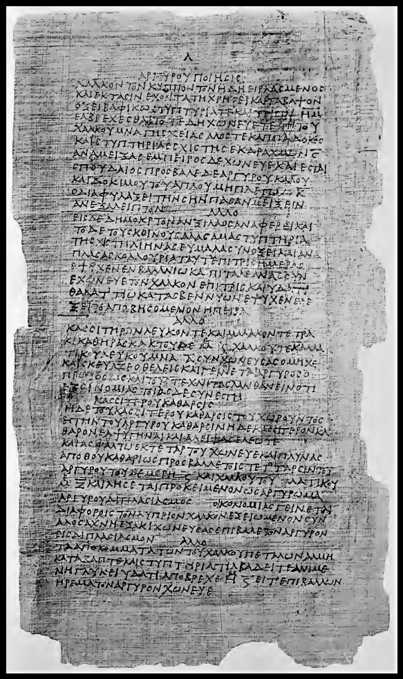
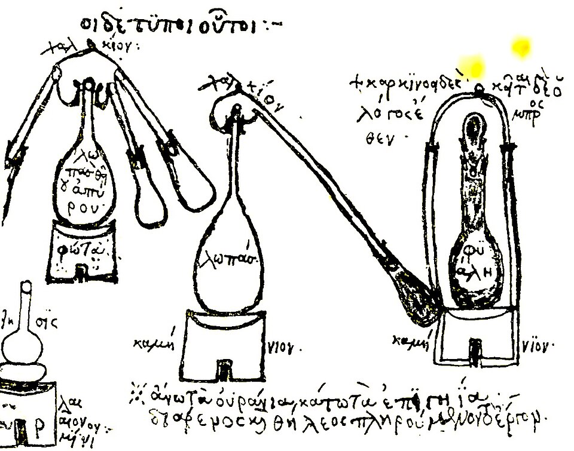

In Roman Egypt, around AD 300, the Greek-speaking workshops of the Nile valley had a craft and a theory. The craft was colouring and alloying metals, dyeing wool and faking gems. The theory was Aristotle's: elements that could turn into one another. Where the two met, **[alchemy](kloom:e/alchemy)** began, and with it the apparatus that chemistry still uses to boil a liquid and catch what rises.

## Recipes for fakes

The oldest chemical books that survive on papyrus are two Greek codices, found near Thebes in the 1820s and sold by the Swedish-Norwegian vice-consul at **[Alexandria](kloom:e/alexandria)**, Johann d'Anastasi. One went to Leiden, as **[Leyden papyrus X](kloom:e/leyden-papyrus-x)**, and one to Stockholm, the **[Stockholm papyrus](kloom:e/papyrus-graecus-holmiensis)**, which was published only in 1913. They were written around the end of the third century, perhaps by the same scribe. Leyden X holds 111 recipes, Stockholm 154: alloys that look like gold or silver, gems from coloured glass and stone, and dyes.

They are frank about being fakes. One Leiden recipe makes _asem_, a silvery alloy, "which will deceive even the artisans". Another, "the doubling of asem", melts 40 drachmas of copper and 40 of tin with 8 of real asem; by our arithmetic, the finished lump is less than a tenth asem. The dye recipes colour wool purple with alkanet root and archil, a lichen, rather than with sea snails, and one strengthens the colour with gall-nut and "a little copperas", iron sulfate, the pair that makes ink.

Whether these are alchemy is disputed. Marcellin Berthelot, who published the Greek alchemists in the 1880s, thought the papyri had escaped the emperor Diocletian's burning of books on making gold, around 290, and read them as the practical half of a secret art. William Jensen, introducing Earle Caley's translations in 2008, finds no mysticism in them at all: they are jewellers' and dyers' recipe books, in a tradition that runs back to the Assyrian glassmakers' tablets and on to the craft books of medieval Europe.

## Zosimos and Maria

Alchemy with its theory attached is in **[Zosimos of Panopolis](kloom:e/zosimos-of-panopolis)**, who wrote around 300 and is the first alchemist whose writings survive, in fragments copied into Byzantine collections. He called his art the study of "the composition of waters, movement, growth, embodying and disembodying, drawing the spirits from bodies and bonding the spirits within bodies", wrote to a woman, Theosebeia, and quoted his predecessors. The one he quoted with most respect was **[Mary the Jewess](kloom:e/mary-the-jewess)**, who probably worked in Alexandria between the first and third centuries and is known only through him and later writers.

Zosimos credits her with the _tribikos_, a still with three arms, and gives her instructions. In Berthelot's French, in our translation: make three tubes of rolled copper, about the thickness of a bronze pan for cakes and a cubit and a half long, and a wider copper vessel for the head; seal the joints with flour paste; fit strong glass vessels to the ends of the tubes "so that they do not break from the heat of the water". The plate draws it from that description: a clay flask of sulfur on a furnace, the copper head, and three arms falling to three receivers. Zosimos also credits her with the _kerotakis_, a sealed vessel in which vapours rose onto a sheet of copper at the top, a "simple two chambered reflux device" in the chemist Andrea Sella's words.

The water bath called the bain-marie, "Mary's bath", carries her name, and Sella, writing in 2009, gives it to her on Zosimos's word. But the name is medieval Latin, _balneum Mariae_, first found around 1300 in the Catalan physician Arnald of Villanova; water baths were known to Greek writers long before Mary. That she invented the bath is a later attribution.

## What a still does

A still separates by boiling. Heat the flask, and what boils most easily leaves first as vapour. The vapour rises into the head, which is cooler, condenses on its walls, and runs down the arms into the receivers, leaving behind whatever boils only at a higher heat. Sublimation is the same trip for a solid that turns straight to vapour and back.

**[Pliny the Elder](kloom:e/pliny-the-elder)**, two centuries before Zosimos, described one such trip. To get quicksilver, the liquid metal **[mercury](kloom:e/mercury-element)**, heat the red mineral **cinnabar** in pans with a lid; what gathers on the lid is "like silver in colour, and similar to water in its fluidity". In modern terms the fire breaks the mineral apart:

| Step                  | What happens                         |
| --------------------- | ------------------------------------ |
| Heat cinnabar in air  | HgS + O₂ → Hg + SO₂                  |
| Mercury boils, 357 °C | vapour rises; sulfur dioxide escapes |
| Vapour meets the lid  | it condenses to liquid mercury       |

By our arithmetic, from the atomic weights (mercury 200.6, sulfur 32.1), 86 percent of cinnabar's weight is mercury. Mercury was the alchemists' favourite substance: a metal that is liquid, that vanishes into vapour and comes back, and that dissolves gold. Heated with copper and tin, it went into the fake silvers of the Leiden papyrus.

The Greek books were copied in Byzantium and translated into Arabic, and it was in Arabic that alchemy next grew. Before that frame comes a quieter chemistry from the same ingredients as the dyers': the ink of the scriptoria.
