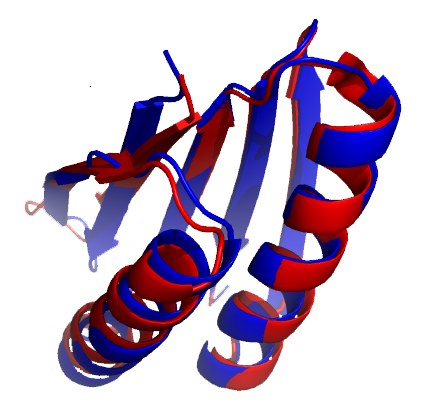

A protein is a chain of amino acids, and it works only once the chain has folded into its own shape. **[Christian Anfinsen](kloom:e/christian-b-anfinsen)** unfolded an enzyme, ribonuclease, in solution and watched it fold back, unaided, into the same working form. He shared the Nobel Prize in Chemistry in 1972 for showing that the sequence alone decides the shape. So the shape ought to be computable from the sequence. How chemists first read protein shapes from X-rays, from Pauling's helix to Kendrew's myoglobin, is the protein-structure frame's story; this one is about computing them, which took another fifty years.

## Levinthal's arithmetic

In 1969 the molecular biologist **Cyrus Levinthal** pointed out why a protein cannot find its shape by trying them all. The argument is now called **[Levinthal's paradox](kloom:e/levinthals-paradox)**, and it is usually told with round numbers. Suppose each of 100 amino acids in a chain can take any of 3 positions. By our arithmetic:

| Step                                   | Working                      |             Result |
| -------------------------------------- | ---------------------------- | -----------------: |
| Shapes of the chain                    | 3¹⁰⁰                         |         5.2 × 10⁴⁷ |
| Time to try them all, one a picosecond | 5.2 × 10⁴⁷ ÷ 10¹² per second | 5.2 × 10³⁵ seconds |
| The same in years                      | ÷ 3.16 × 10⁷ seconds a year  |   1.6 × 10²⁸ years |

The universe is about 10¹⁰ years old. Yet small proteins fold in milliseconds or less. So a protein does not search; each local piece of the chain settles quickly and steers the rest, down what chemists now draw as a funnel of falling energy. The counts vary with the telling. The Nobel committee's account of 2024 gives about 10⁴⁷, as here; Wikipedia's article counts three positions for each of two angles per amino acid, which gives 3²⁰⁰, about 10⁹⁵; and an estimate in one of Levinthal's own papers of 1969 was 10³⁰⁰. Every version makes the same point.

## A blind test

Prediction needed an honest judge. In 1994 John Moult and Krzysztof Fidelis founded **[CASP](kloom:e/casp)**, the Critical Assessment of protein Structure Prediction. Every two years, crystallographers and NMR spectroscopists hold back structures they have just solved, and predictors send in their models blind. A model is scored by the _global distance test_, roughly the percentage of its backbone atoms that land close to where the experiment put them. For the hardest targets, those with no known relative, the best scores stayed below 40 through 2016.

Some tried brute force, simulating every atom of the chain as the computational chemistry frame describes. In 1998 Duan and Kollman followed a miniprotein of 36 amino acids for a microsecond and watched it reach a nearly native fold; in 2010 Shaw and his colleagues folded several small proteins in simulations a millisecond long. The Nobel committee's account judged that such simulation would not scale to larger proteins in the foreseeable future, though it showed that the chemists' force fields were good enough.

Then it moved. In 2018 **[DeepMind](kloom:e/google-deepmind)**, the London company led by **[Demis Hassabis](kloom:e/demis-hassabis)**, entered a network that predicted the distances between amino acids, and scored about 60 on the hardest targets. For CASP14, in 2020, a team led by **[John Jumper](kloom:e/john-m-jumper)** rebuilt it. **[AlphaFold](kloom:e/alphafold)** 2 replaced the earlier network's image-like convolutions with an architecture in the style of the transformer. Its trunk, the _Evoformer_, passes information back and forth between an alignment of related sequences from many species and a table of every pair of amino acids, using attention, the transformer's mechanism for weighing which inputs matter. A second module then moves each amino acid as a small rigid triangle until the chain takes shape. It had learned from the structures in the **Protein Data Bank** released up to 30 April 2018.

Its median score across CASP14 was 92.4, a level usually compared with experimental accuracy. Its backbone atoms were a median 0.96 ångström from the experiment, against 2.8 for the next best method. Not everyone called the problem solved: a third of its predictions fell short of that accuracy, and it predicts the folded shape without saying how a chain gets there.

## Two hundred million shapes

In July 2021 DeepMind published the method and its code, and with the European Bioinformatics Institute opened a database of predicted structures. A year later it held about 200 million, nearly every protein whose sequence was known. As of 30 September 2026 the database's front page offers "over 260 million" predictions, while the same page describes its latest release as "over 200 million entries". **AlphaFold 3**, announced in May 2024, predicts proteins together with DNA, RNA and small molecules, using a diffusion model to place the atoms; its code was offered for non-commercial use, on request, that November.

The reverse problem, a sequence for a shape nobody has seen, was **[David Baker](kloom:e/david-baker-biochemist)**'s. His group's program Rosetta, begun in 1999, designed Top7 in 2003: 93 amino acids in a fold found in no natural protein, whose crystal structure matched the design. The Nobel Prize in Chemistry for 2024 went half to Baker, "for computational protein design", and half to Hassabis and Jumper, "for protein structure prediction".

That ends the chemistry of life. The next segment is chemistry now, and it begins with a hole in the sky.
