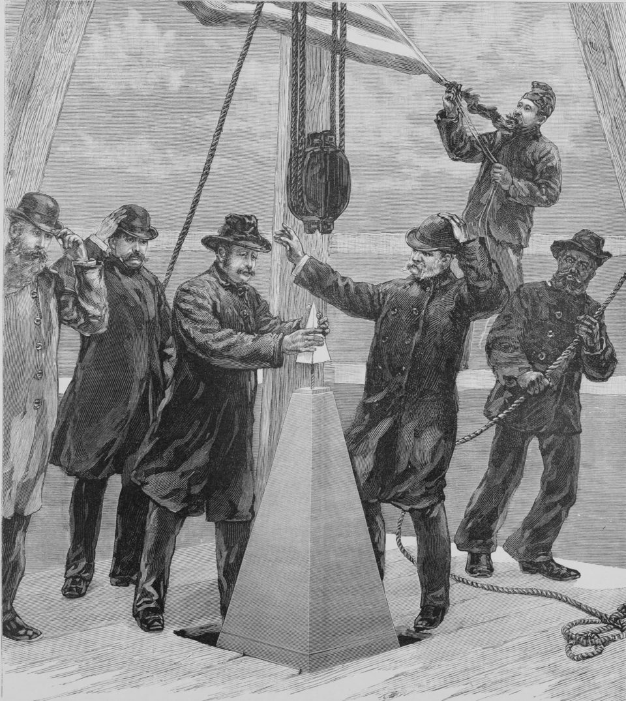

**[Aluminum](kloom:e/aluminium)** is the most abundant metal in the Earth's crust and is never found as metal. It holds its oxygen hard. Its oxide, alumina, melts only at about 2,070 °C, too hot to electrolyze, and a solution of its salts in water gives up hydrogen at an electrode, not metal. For sixty years after its discovery aluminum was made a few kilograms at a time, and cost about as much as silver. In 1886 two men of twenty-two, one in Ohio and one in France, found how to make it by the ton with electricity, and the metal of a monument's tip became kitchen foil.

## The silver from clay

The Danish physicist **[Hans Christian Ørsted](kloom:e/hans-christian-orsted)** made the first impure lump in 1825, and Friedrich Wöhler a purer powder two years later, both by letting potassium take chlorine from aluminum chloride. In 1854 the French chemist **[Henri Sainte-Claire Deville](kloom:e/henri-etienne-sainte-claire-deville)** changed potassium for sodium, which was cheaper, and **[Napoleon III](kloom:e/napoleon-iii)**, hoping for light armor for his army, paid for large-scale trials at Javel in 1855. Deville's preface of 1859 thanks the Emperor for them. The reaction is AlCl₃ + 3 Na → Al + 3 NaCl: by our arithmetic, every kilogram of aluminum used up 2.6 kilograms of sodium, itself made at great cost. Ingots were shown at the Paris exhibition of 1855 as "silver from clay". By August 1856 Deville and his partners sold the metal at 300 francs a kilogram, and in 1859 he wrote that this was "a little dearer than silver", though four times cheaper for the same volume, since aluminum is so light.

A story says that the Emperor served his most honored guests with aluminum cutlery and the rest with gold. Wikipedia's history of aluminum calls it reputed; Deville's book, which does thank the Emperor, does not tell it.

On 6 December 1884, as _Harper's Weekly_ drew it, the **Washington Monument** was finished with a pyramid of aluminum, 100 ounces of it, about 2.8 kilograms, cast in Philadelphia by William Frishmuth, the largest piece of the metal yet cast. It was put on display at Tiffany's in New York before it went up. An analysis in 1934 found it 97.87 per cent pure.

## A woodshed at Oberlin

**[Charles Martin Hall](kloom:e/charles-martin-hall)** heard his professor at Oberlin College, Frank Jewett, say that whoever made aluminum cheaply would make a fortune, and said he would be the one. He had tried reducing alumina with carbon and failed. After graduating he worked in a woodshed behind his family's house, with batteries he built himself; by the American Chemical Society's account a pound of zinc went into them for every ounce of aluminum. He found that molten **[cryolite](kloom:e/cryolite)**, sodium aluminum fluoride, dissolves more than a quarter of its weight of alumina at about 1,000 °C, and passed a current through the solution. His first tries in a clay crucible put a gray deposit on the negative electrode: silicon, dissolved out of the clay. Lined with graphite, the crucible gave, on 23 February 1886, a few silvery globules of aluminum.

**[Paul Héroult](kloom:e/paul-heroult)** had been granted a French patent for the same process on 23 April. Hall filed in America on 9 July, and won his priority there with his family's testimony and two postmarked letters to his brother. How much his sister Julia, a chemist too, did beside him is disputed. The two men were born in 1863 and both died in 1914, and the **[Hall–Héroult process](kloom:e/hall-heroult-process)** still makes the world's new aluminum. Hall's Pittsburgh Reduction Company, later Alcoa, began production in 1888, and by 1894 the price had fallen to 50 cents a pound.

## Counting the electrons

In the cell, alumina splits into ions in the cryolite. At the carbon lining underneath, each aluminum ion takes three electrons, Al³⁺ + 3e⁻ → Al, and the liquid metal pools on the bottom, since it is denser than the bath. At the carbon blocks above, the oxide ions give up their electrons and burn the carbon away: overall, 2 Al₂O₃ + 3 C → 4 Al + 3 CO₂. Faraday's law of electrolysis says what that costs. By our arithmetic, with aluminum 26.98 and a mole of electrons carrying 96,485 coulombs:

| For one kilogram of aluminum   | Worked out                     | Amount         |
| ------------------------------ | ------------------------------ | -------------- |
| Moles of aluminum              | 1,000 g ÷ 26.98 g              | 37.1           |
| Charge                         | 37.1 × 3 × 96,485 C            | 10.7 million C |
| The same, in ampere-hours      | ÷ 3,600                        | 2,980 Ah       |
| Energy, at an assumed 4 volts  | 10.7 million C × 4 V           | 11.9 kWh       |
| Carbon burned from the anodes  | ¾ mole of C per mole of Al     | 0.33 kg        |
| Carbon dioxide from the anodes | the same moles, at 44 g        | 1.22 kg        |
| Alumina consumed               | ½ mole of Al₂O₃ per mole of Al | 1.89 kg        |

A modern cell carries 100,000 to 300,000 amperes, the Wikipedia article says, at under 5 volts. At 300,000 amperes, by our arithmetic, one cell makes at most 2.4 tonnes of aluminum a day.

| Route                               | kWh per kg |
| ----------------------------------- | ---------: |
| Remelting scrap (5% of primary)     |        0.8 |
| Thermodynamic minimum               |       6.23 |
| Faraday's charge at 4 V, by our sum |       11.9 |
| A typical smelter                   |      15.37 |

The article gives the minimum as 6.23 kWh and common practice as 15.37. The rest goes as heat, which keeps the bath molten. The same article on recycling says that remelting scrap takes about 5 per cent of that energy: the electrons are paid for once, when the oxygen is taken away, and a can melted down never needs them again.

Hall's first cell failed because silicon came out of the clay. The next frame is that element, purified further than anything else we make.
