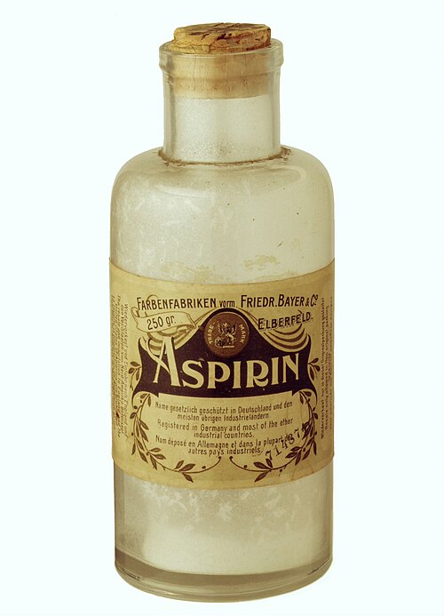

On 10 August 1897 **[Felix Hoffmann](kloom:e/felix-hoffmann)**, a chemist in the pharmaceutical laboratory of the dye makers Friedr. **[Bayer](kloom:e/bayer)** & Co. at Elberfeld, wrote up a white crystalline acid that tasted sour but did not burn. Bayer sold it from 1899 as **[Aspirin](kloom:e/aspirin)**, and it became, as the historian Walter Sneader put it, "the most widely used drug in history". Who deserves the credit is still argued over, and so, in a smaller way, is how far back its story goes.

## Willow, meadowsweet and a sore stomach

Willow bark was an old remedy for fever, though how old is disputed: Wikipedia's article on aspirin says that Hippocrates prescribed it, while its article on aspirin's history says that translations of Hippocrates never mention willow. The documented modern story starts in 1763, when Edward Stone, a clergyman at Chipping Norton, reported to the Royal Society that powdered willow bark had cured about fifty sufferers from "ague". Chemists then took the bark apart. Salicin was crystallized from it in 1828 and 1829, and in 1838 Raffaele Piria made from it a stronger acid, **[salicylic acid](kloom:e/salicylic-acid)**, which was also found in meadowsweet, _Spiraea_. The German name of the acid, _Spirsäure_, gave aspirin its middle; the _a_ is for the acetyl.

By the 1890s salicylic acid, given as sodium salicylate, was the standard drug for rheumatism, at doses of several grams a day. It worked, and it was hard to take: it irritated the stomach and caused nausea and ringing in the ears. The search at Bayer was for a salicylate without those faults, and the firm had already made drugs by acetylation, phenacetin among them.

## Capping a phenol

Salicylic acid carries two acidic groups on its benzene ring: a carboxylic acid, –COOH, and beside it a phenol, –OH. Hoffmann heated it with acetic anhydride, which moves an acetyl group, CH₃CO–, onto the phenol's oxygen and leaves acetic acid behind. The plate draws the change. His American patent, filed in 1898, gives the recipe: fifty parts of salicylic acid and seventy-five of acetic anhydride, heated for about two hours at 150 °C under a reflux condenser. With molar masses from the atomic weights (C 12.01, H 1.01, O 16.00), by our arithmetic:

|                  | Formula   | Molar mass | Parts | Moles of parts |
| ---------------- | --------- | ---------: | ----: | -------------: |
| salicylic acid   | C₇H₆O₃    |     138.12 |    50 |          0.362 |
| acetic anhydride | (CH₃CO)₂O |     102.09 |    75 |          0.735 |
| aspirin          | C₉H₈O₄    |     180.16 |  65.2 |          0.362 |
| acetic acid      | CH₃COOH   |      60.05 |  21.7 |          0.362 |

C₇H₆O₃ + (CH₃CO)₂O → C₉H₈O₄ + CH₃COOH, one molecule of each. The recipe uses twice the anhydride it needs, so every molecule of salicylic acid meets one, and the most it can give is 65.2 parts of aspirin from 50: a kilogram of salicylic acid makes at most 1.30 kilograms, or about 2,600 tablets of 500 milligrams. The patent also gives the test that tells the two apart. Iron(III) chloride turns a solution of salicylic acid violet, because it binds the free phenol; a solution of true acetylsalicylic acid stays uncolored, because the phenol is capped. Hoffmann used it to argue that an "acetylsalicylic acid" described by Karl Kraut had been something else. Charles Gerhardt had made an impure form in 1853.

## Hoffmann or Eichengrün?

The story of Hoffmann making the drug for his rheumatic father first appeared in print in 1934, in a footnote to a history of chemical industry. In 1949 **[Arthur Eichengrün](kloom:e/arthur-eichengrun)**, a Bayer chemist who had left the firm in 1908, published a different account: that Hoffmann had synthesized the compound on his instructions without knowing why, that the pharmacologist **[Heinrich Dreser](kloom:e/heinrich-dreser)** had shelved it, and that Eichengrün had had it tested by doctors in secret. He had first set this down in 1944, in a letter from the Theresienstadt concentration camp, where he was held as a Jew.

In 1999 Sneader argued in a lecture in Edinburgh, and in the _BMJ_ in 2000, that Eichengrün was telling the truth: the 1934 footnote was wrong on checkable points, and the dates in the laboratory records fit Eichengrün's account. Bayer answered in a press release in September 1999. The credit, it said, went back to Hoffmann's notebook entry of 1897, not to 1934; Hoffmann was Eichengrün's colleague and equal, not his subordinate; Eichengrün had joined the firm eighteen months after him and was still on probation in August 1897; Hoffmann's name is on the American patent; and Eichengrün's own chapter in the firm's 1918 history gave aspirin to Hoffmann. Sneader read the same chapter as simply silent on Eichengrün's role. The two accounts have not been reconciled.

Eleven days after aspirin, on 21 August 1897, Hoffmann acetylated morphine. It had been done in London in 1874, but Bayer tested the product and sold it from 1898 as **[Heroin](kloom:e/heroin)**, a cough medicine it advertised as free of morphine's habit. It was not.

## How it works

For seventy years nobody knew. In 1971 **[John Vane](kloom:e/john-vane)** in London showed that aspirin blocks the making of prostaglandins, signaling molecules behind inflammation, pain and fever, and he shared the Nobel Prize in Physiology or Medicine for it in 1982. The enzyme it stops, cyclooxygenase, is stopped the way salicylic acid was changed in Hoffmann's flask: aspirin hands its acetyl group to a serine in the enzyme's active site, and the enzyme stays blocked.

Aspirin was a purer form of an old remedy. The next frame is a drug with no remedy behind it at all, Paul Ehrlich's Salvarsan, found by testing hundreds of new compounds made for the purpose.
