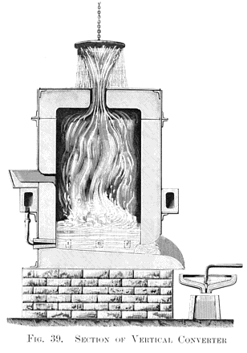

Iron comes out of the blast furnace full of carbon, and what it is good for depends on how much carbon it keeps. **[Pig iron](kloom:e/pig-iron)**, as the furnace gives it, holds about 4 per cent, with some silicon: it melts easily and casts well, and it snaps under a hammer. Take nearly all the carbon out and it is soft, tough wrought iron. In between lies **[steel](kloom:e/steel)**, strong and springy, which in the 1850s was made in small crucibles and cost about £40 a ton. **[Henry Bessemer](kloom:e/henry-bessemer)** found a way to make it by the ton in twenty minutes, by blowing cold air through molten iron, and with no fuel at all.

| Metal        | Carbon, by weight  | Its character                  |
| ------------ | ------------------ | ------------------------------ |
| Wrought iron | under about 0.1%   | soft, fibrous, forges well     |
| Steel        | about 0.02–2.1%    | strong, tough, can be hardened |
| Cast iron    | over about 2.1%    | melts easily, brittle          |
| Pig iron     | typically 3.8–4.7% | the blast furnace's product    |

Wikipedia's article on steel puts wrought iron under 0.1 per cent carbon; its article on wrought iron says under 0.05.

## Iron without fuel

Bessemer was an inventor of machines, not a metallurgist. In his telling, the work began in December 1854, after trials of a spinning shell at Vincennes for **[Napoleon III](kloom:e/napoleon-iii)**, when he resolved to make a stronger metal for guns. On 13 August 1856 he read a paper to the British Association at Cheltenham, on "The Manufacture of Malleable Iron and Steel without Fuel". An ironmaster at breakfast, he recalled, promised a friend "some good fun" at the speaker's expense. The Times printed the paper in full the next morning. (Wikipedia's article on Bessemer gives 24 August; the autobiography's dates, a Tuesday journey and a paper in The Times of 14 August, fit the thirteenth.)

The paper describes a firebrick cylinder three feet across and five high, with five clay nozzles near the bottom for the blast. Molten iron was run in, the metal boiled and was "tossed violently about", and after fifteen or twenty minutes a great flame roared from the mouth. Bessemer had assumed that crude iron held about 5 per cent of carbon, and that carbon "cannot exist at a white heat in the presence of oxygen" without burning. The burning was the fuel: his apparatus turned 7 hundredweight of pig iron into malleable iron in thirty minutes, where a puddling furnace made 4½ in two hours.

In America, **[William Kelly](kloom:e/william-kelly-inventor)**, an ironmaster at Eddyville, Kentucky, wrote to _Scientific American_ that he had blown air through iron for years, and won a priority patent in 1857. The claim is still argued; Kelly's process seems to have been the less developed.

## Where the heat comes from

Bessemer's paper says the carbon burned to "carbonic acid gas", carbon dioxide. It does not, inside the metal. Henry Marion Howe, writing the _Encyclopædia Britannica_'s article on iron and steel in 1911, explains that the carbon burns there only to carbon monoxide, which by itself would not keep the charge hot enough, and that the heat of the process was set by the pig iron's silicon, about 1¼ per cent. By our arithmetic, from standard enthalpies of formation (carbon monoxide −110.5, carbon dioxide −393.5, quartz −910.9 kJ per mole), for a tonne of pig iron of 4 per cent carbon and 1¼ per cent silicon, a composition we chose as typical:

| What burns   | Reaction          | From one tonne of pig iron    | Heat released |
| ------------ | ----------------- | ----------------------------- | ------------: |
| Silicon      | Si + O₂ → SiO₂    | 12.5 kg, into 26.7 kg of slag |        405 MJ |
| Carbon       | 2 C + O₂ → 2 CO   | 40 kg, into 93 kg of gas      |        368 MJ |
| At the mouth | 2 CO + O₂ → 2 CO₂ | the flame, in the open air    |        942 MJ |

Kilogram for kilogram, silicon gives three and a half times the heat of carbon burned to monoxide, and all of it stays in the metal. Seven-tenths of carbon's heat escapes in the flame the blower watched to judge the end of the blow. The oxygen for all of it, 68 kilograms, comes from about 225 cubic meters of air. The heat has to rise as the carbon goes: iron with 4 per cent of carbon is liquid near 1,150 °C, and pure iron melts at about 1,540 °C. The plate draws that climb on the iron–carbon diagram.

## The phosphorus problem

The first licensees failed, and the press called the process "a brilliant meteor". British pig iron held phosphorus, which made the steel brittle and would not burn out. Bessemer's own trials in London, he wrote later, had happened to use gray iron from Blaenavon in Wales, and a lining of clay rather than sand, and he found success again only with Swedish charcoal iron, free of phosphorus. Robert Mushet's _spiegeleisen_, a manganese-rich iron added at the end, cured the brittleness left by oxygen, and by 1858 Bessemer was making steel in Sheffield.

The fix for phosphorus came from **[Sidney Gilchrist Thomas](kloom:e/sidney-gilchrist-thomas)**, a police-court clerk who studied chemistry at night, and his cousin Percy Gilchrist, a chemist at the Blaenavon works. Burned phosphorus is an acid oxide, and a lining of sandstone lets it go back into the iron. They lined the converter with burned dolomite and added lime, whose base holds it in the slag as calcium phosphate. Patented in 1878, the basic process made Europe's phosphoric ores into steel, and in it, Howe notes, phosphorus replaced silicon as the fuel. The slag was sold as fertilizer. The slower **[open-hearth furnace](kloom:e/open-hearth-furnace)**, heated by gas and easier to control, had overtaken the converter in Britain by the 1890s, and oxygen blown in place of air replaced both in the twentieth century. The [Bessemer process](kloom:e/bessemer-process) had cut the price of steel from about £40 a ton to £6 or £7.

Smelting, in the first frame, used carbon to take oxygen from an ore. The converter ran it backwards, blowing oxygen in to burn out the carbon smelting had left. The next frame is a metal that carbon could not win at all: aluminum.
