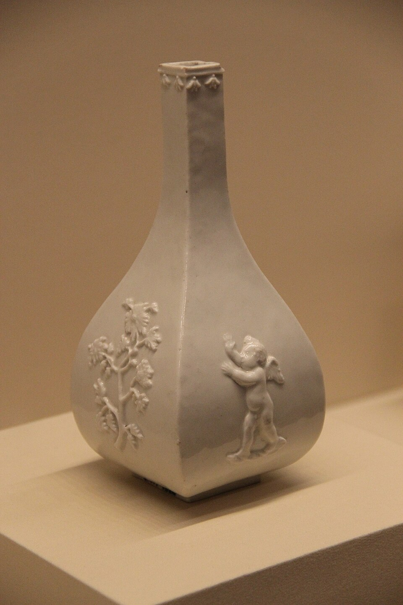

Around 1700 a young apothecary's apprentice in Berlin let it be known that he could make gold. **[Johann Friedrich Böttger](kloom:e/johann-friedrich-bottger)** fled Prussia when its king took an interest, and was caught by a worse one. **[Augustus II the Strong](kloom:e/augustus-ii-the-strong)**, Elector of Saxony and King of Poland, was always short of money, and he kept Böttger under guard in Dresden and in the fortress of Königstein to make it for him. Alchemists who failed a prince could hang for it: a Leipzig handbill of 1709 announces the hanging of one. Böttger never made gold. What he made, with a mathematician's help, was the first true **[porcelain](kloom:e/porcelain)** made in Europe.

## White gold

Porcelain had come from China for centuries, and in the sixteenth and seventeenth centuries Portuguese and Dutch ships brought it home in quantity. Europeans prized it for being white, translucent and hard, and for not cracking in sudden heat. Nobody in Europe could make it. The best imitations, from Florence in the 1570s to France in Böttger's day, were soft-paste: clay mixed with ground glass, which gave the whiteness and the glow but none of the strength.

Augustus had a man working on it. **[Ehrenfried Walther von Tschirnhaus](kloom:e/ehrenfried-walther-von-tschirnhaus)**, a mathematician and a member of the French Academy, had built great burning lenses and mirrors, one with lenses of 50 and 26 centimeters, that focused the sun hot enough, by his accounts of what they melted, to reach about 1,600 °C. With them he had melted a shard of Chinese porcelain in 1694, and he had found that chalk and quartz, which his lenses could not melt apart, would flow when ground together. In 1704 Augustus set him to watch over Böttger, and by 1707 the alchemist was working on porcelain.

## The notebook page

When the secret was found is disputed. In 1962 a page of a laboratory notebook dated 15 January 1708 turned up in the factory's archives: a series of firings of clay from Colditz with **[alabaster](kloom:e/alabaster)**, calcium sulfate, as the flux, in different proportions, each result graded in Latin in the margin. It is usually taken to be in Böttger's hand; some say his physician's. By then the recipe was known. Paul Wildenstein, one of Böttger's assistants, told in 1736, nearly thirty years later, how at the end of December 1707 Böttger showed the king a small unglazed teapot, pulled it white-hot from the kiln and threw it into a pail of cold water, and it did not crack.

Tschirnhaus died on 11 October 1708. On 28 March 1709 Böttger wrote to the king that he could make "good white porcelain" with its glaze and painting, and for decades that date was taken as the invention's. Nicholas Zumbulyadis, writing in 2010, reads the memorandum as a defensive letter to a government tired of waiting for gold. The factory opened in Dresden in January 1710 and moved that June to the Albrechtsburg castle at Meissen, where **[Meissen porcelain](kloom:e/meissen-porcelain)** is still made. In 1719, the year Böttger died, two of its own men said that the invention had been Tschirnhaus's, and historians still argue over how to share the credit. Wikipedia's article on Böttger names the clay as kaolin from Schneeberg; the 1708 page names Colditz.

## What the kiln does

The heart of porcelain is **[kaolinite](kloom:e/kaolinite)**, a white clay mineral, Al₂Si₂O₅(OH)₄. Fired, it loses water from about 550 °C, becomes a disordered solid, and above about 1,050 °C begins to rebuild itself into **[mullite](kloom:e/mullite)**, 3Al₂O₃·2SiO₂, and free silica. Near 1,400 °C the mullite grows as fine interlocking needles. By our arithmetic, from the formula weights:

3 Al₂Si₂O₅(OH)₄ → 3Al₂O₃·2SiO₂ + 4 SiO₂ + 6 H₂O

| From 100 g of pure kaolinite | Grams | What it becomes                    |
| ---------------------------- | ----: | ---------------------------------- |
| Water, driven off as steam   |    14 | nothing: it leaves the kiln        |
| Mullite                      |    55 | needle crystals, the strength      |
| Silica left over             |    31 | glass, once the flux has melted it |

The flux is what melts: in China a feldspar-rich rock, _petuntse_; at Meissen, in Böttger's time, alabaster, until feldspar and quartz replaced it. It turns the spare silica into glass that fills the spaces between the needles. The glass makes porcelain translucent; the mullite, which barely expands when heated, is why the teapot survived the pail of water. Early Meissen was fired to as much as 1,400 °C in wood-fired kilns, about 200 degrees hotter than soft-paste.

That was why China could not be copied. It took the right clay, which most of Europe did not know it had, a flux, and a kiln far hotter than a potter's: the laboratory furnaces of Glauber and of Kunckel, the chemist who had chased Brand's phosphorus, could not reach it. Europe learned how China did it only afterwards: the word _kaolin_ comes from the reports of the Jesuit François Xavier d'Entrecolles, who described porcelain-making at Jingdezhen in 1712.

Late in 1709 Böttger wrote the king a poem: the king would yearn for golden fruit, and the alchemist's hand could offer only crystals. He died in 1719, aged 37. The trail returns to its anchor, Robert Boyle and _The Sceptical Chymist_.
